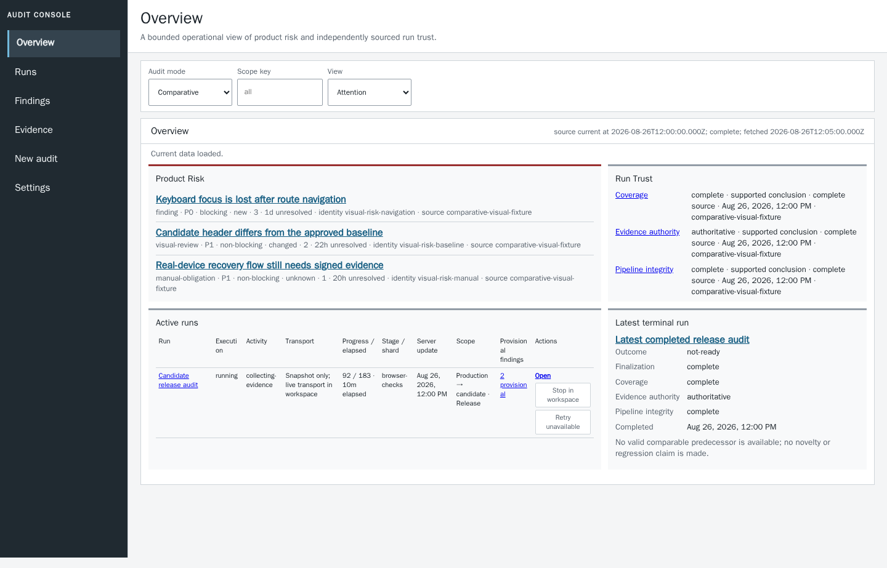
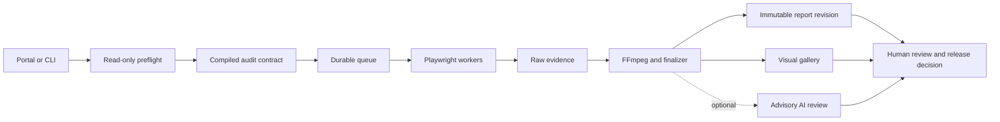

<div align="center">

# Quitting7oh Audit Console

**Release decisions backed by browser evidence—not a mysterious green check.**

A Docker-first visual, functional, accessibility, and performance audit system for
[quitting7oh.org](https://quitting7oh.org), built with Playwright, TypeScript, and FFmpeg.

[](package.json)
[](package.json)
[](tsconfig.json)
[](docs/DOCKER.md)
[](docs/ASSERTION_LEDGER.md)

[Quick start](#quick-start) · [Choose an audit](#choose-an-audit-mode) · [How it works](#how-it-works) · [Commands](#command-reference) · [Documentation](#documentation)

</div>



## What this is

This repository audits the quitting7oh experience in two complementary modes:

| Mode | Use it for | Result authority |
| --- | --- | --- |
| **Single-site Audit** | Inspect one Preview or Production origin against standalone Product Oracles | Advisory site health, coverage, visual review, and evidence integrity |
| **Comparative Audit** | Compare `https://quitting7oh.org` with `https://beta.quitting7oh-org.pages.dev` | Portal runs are review evidence; a fresh sharded run is required for release signoff |

Every check declares a stable audit ID, user promise, expected behavior, severity,
release-blocking policy, performed steps, observations, findings, and required
evidence. The result is a reviewable record—not a test count stripped of context.

### Highlights

- **183 explicit audit contracts**: 81 feature and cross-cutting checks plus 102 generated route checks.
- **Reproducible browsers**: pinned Chromium, Firefox, and WebKit runtimes inside Docker.
- **Evidence matched to the assertion**: action-and-response video, relevant screenshots, or structured data.
- **Durable execution**: queue-backed Single-site workers and an independent finalizer survive browser disconnects and container replacement.
- **Human-readable review**: searchable reports, a visual gallery, bounded logs, traces, network observations, and Playwright output.
- **Fail-closed release truth**: incomplete execution or missing required evidence cannot become green.
- **Optional AI review**: bounded, advisory evidence analysis that can never override a deterministic failure.
- **Extensible test plugins**: reviewed manifests connect audit definitions to allowlisted Playwright specs.

## Quick start

### Prerequisites

- Docker Engine or Docker Desktop with Compose v2
- Node.js `24.15.0` or newer
- npm `11.6.2` (the version pinned by `packageManager`)

The supported browser runtime is Docker. Do not use host-installed Playwright
browsers for release evidence.

### Install and launch

```sh
git clone https://github.com/patrick-hudson/ai-mobile-testing.git
cd ai-mobile-testing
npm ci
cp .env.example .env
npm run portal
```

Open [http://127.0.0.1:4173](http://127.0.0.1:4173).

`npm run portal` builds and starts the complete stack: the audit console, two
durable Single-site workers, and one finalizer. The first build downloads the
pinned Playwright image and may take a few minutes.

> [!IMPORTANT]
> Starting only the `portal` Compose service does not provide a complete
> Single-site runtime. Use `npm run portal` so the workers and finalizer start too.

### Run your first audit

1. Open **New Audit** and choose **Audit one site**.
2. Enter an HTTP(S) origin and identify it as **Preview** or **Production**.
3. Select **Check site and preview coverage**. Preflight is read-only and creates no run.
4. Review the compiled Product Oracle, browser targets, coverage gaps, and evidence authority.
5. Choose `FULL` for the complete profile or narrow the selection for a `TARGETED` run.
6. Launch, then follow queueing, browser execution, media processing, report publication, and final disposition in the run workspace.

## Choose an audit mode

### Single-site Audit

Use Single-site mode to audit exactly one deployment without inventing a second
origin. It compiles independently observable one-origin expectations, exposes
comparison-only exclusions, and records missing executable coverage as a gap.

- `FULL` selects the complete default Single-site profile with no plugin, audit,
  area, target, or route narrowing.
- `TARGETED` selects a subset. A healthy targeted run is not a whole-site approval.

The final report keeps these dimensions separate:

| Dimension | Values | What it means |
| --- | --- | --- |
| **Site Health** | `HEALTHY`, `FINDINGS`, `INCOMPLETE` | Deterministic outcome for the automated scope; always advisory |
| **Scope** | `FULL`, `TARGETED` | Whether the complete versioned profile or a subset ran |
| **Coverage** | `COMPLETE`, `GAPS`, `UNKNOWN` | Whether standalone oracles, cases, routes, and targets were available |
| **Manual acceptance** | `NOT_REQUIRED`, `OUTSTANDING`, `FAILED_OR_BLOCKED`, `COMPLETE` | Whether human-only physical-device, assistive-technology, or design review is unnecessary, pending, unsuccessful, or complete |
| **Visual Review** | `UNCHANGED`, `CHANGED`, `REVIEWED`, absent, incompatible, unavailable | Same-site baseline comparison and explicit human disposition |
| **Evidence Authority** | Authoritative or non-authoritative | Whether deployment identity and certificate policy support trust |
| **Pipeline Integrity** | `complete`, `incomplete` | Whether collection, media processing, and immutable publication completed safely |

### Comparative Audit

Comparative mode runs the established release contract between:

- **Production baseline:** `https://quitting7oh.org`
- **Redesigned candidate:** `https://beta.quitting7oh-org.pages.dev`

A portal-launched comparison is useful review evidence, but it does not have the
isolated sharding and performance provenance required for final signoff. Create a
fresh run ID and use the sharded release command for authoritative evidence:

```sh
npm run audit:release:sharded
```

Visual and functional checks default to eight functional shards with one Playwright worker each.
They run through a pool of four containers, followed by Lighthouse and browser performance budgets
alone in a dedicated one-worker container. Every fresh blob is required before
the final checklist is merged.

## How it works



### Evidence contract

| Assertion type | Required evidence | Examples |
| --- | --- | --- |
| **Interaction** | Action-and-response video with named steps and rationale | Navigation, search, calculators, meeting actions |
| **Rendered static state** | Screenshot of the relevant state | Layout, theme, responsive shell, visual baselines |
| **Structured/data-only** | Machine-readable observations without decorative media | Redirects, headers, sitemap, network and contract checks |

Interaction video is validated rather than merely attached. FFmpeg rejects blank,
static, and blank-ending recordings. A leading browser-capture gap may be trimmed
only when later interaction exists over sustained page content and the derivative
independently passes every quality gate.

### Execution and publication

- The portal validates origins, targets, profiles, plugins, audit IDs, and areas against repository-owned allowlists.
- Single-site work is claimed from a durable Docker volume; one job is owned by one worker.
- Browser work and finalization are separate, so evidence processing can recover independently.
- Reports are published as digest-verified immutable revisions behind an atomic `current.json` switch.
- Stale refreshes keep the last sourced data visible and label its freshness and limitations.
- Missing required media, reports, or execution provenance produces `INCOMPLETE` or `UNAVAILABLE`, never an optimistic pass.

## Audit coverage

Five first-party plugins own the complete audit inventory:

| Plugin | Protects |
| --- | --- |
| `platform-routes-content` | Origins, redirects, route inventory, content, visual baselines, homepage, crisis paths, and SEO |
| `shell-navigation-theme-search` | Global shell, drawers, navigation, themes, breakpoints, and search |
| `calculators-sows` | Taper and SR-17 calculators, arithmetic, persistence, exports, SOWS, and sharing |
| `meetings` | Meeting timing, timezones, discovery, filters, history, joins, and failure states |
| `accessibility-responsive-performance-reliability` | WCAG, keyboard flows, reduced motion, responsiveness, performance, and resilience |

The suite covers availability, redirects, caching, assets, indexing, content
semantics, route parity, navigation, themes, search, crisis flows, calculators,
SOWS scoring, meeting discovery, accessibility, responsive behavior, performance,
layout stability, runtime errors, and explicit manual acceptance rows.

Browse every user promise and oracle in the
[generated assertion ledger](docs/ASSERTION_LEDGER.md).

## Browser and device coverage

The comparative default is a seven-project matrix:

| Environment | Target |
| --- | --- |
| Production | Mobile Chromium |
| Candidate | Mobile Chromium |
| Production | Desktop Chromium |
| Candidate | Desktop Chromium |
| Candidate | Mobile WebKit |
| Candidate | Tablet WebKit |
| Candidate | Desktop Firefox |

Single-site mode maps compatible checks onto neutral one-origin versions of the
default mobile Chromium, desktop Chromium, mobile WebKit, tablet WebKit, and
desktop Firefox targets.

Additional Docker-local profiles are opt-in through `AUDIT_TARGET_IDS`, including
reviewed iPhone/WebKit, Pixel/Chromium, Galaxy/Chromium, Edge-compatible Chromium,
and capability-gated branded Microsoft Edge profiles.

> [!NOTE]
> Playwright device emulation covers viewport, input, scale, user agent, and browser
> engine behavior in Linux. It is not physical iOS, Mobile Safari, Android Chrome,
> or real hardware. Those acceptance rows remain manual until a real-device adapter
> and evidence pipeline exist.

See the [browser and device target matrix](docs/DOCKER.md#browser-and-device-target-matrix)
for exact IDs and fidelity limits.

## Portal guide

| Route | Purpose |
| --- | --- |
| `/` | Product Risk overview, Run Trust, active work, and latest terminal run |
| `/new-audit.html` | Single-site or comparative launch configuration and preflight |
| `/runs.html` | Global run index |
| `/findings.html` | Global findings index |
| `/evidence.html` | Global evidence index |
| `/settings.html` | Credential status and runtime inventories |
| `/run.html?mode=<mode>&run=<id>` | Stable live workspace from queue through finalization |
| `/report.html?mode=<mode>&run=<id>` | Human-readable report |
| `/gallery.html?mode=<mode>&run=<id>` | Visual evidence workbench |

Filters, selections, inspector state, and run identity are URL-addressable.
Ordinary console and saved-view URLs never encode credentials, authorization
material, mutation bindings, or secret-like values. Prefer the in-page POST
exchange for authorization. The legacy compatibility endpoint
`/operator/bootstrap?token=...` is the sole exception: it accepts a short-lived
token, immediately redirects to a clean URL, and uses `no-store` behavior.

## Command reference

### Everyday workflows

| Command | Purpose |
| --- | --- |
| `npm run portal` | Build and start the complete portal, worker, and finalizer stack |
| `npm run audit:smoke` | Check the environment and critical recovery paths |
| `npm run audit:release` | Run the full profile in one audit container |
| `npm run audit:release:sharded` | Produce authoritative comparative release evidence |
| `npm run audit:candidate` | Run the release profile against candidate targets |
| `npm run audit:lighthouse` | Run the performance suite |
| `npm run portal:e2e` | Run Docker browser/API acceptance tests for the portal |
| `npm run portal:e2e:scale` | Run the canonical 2 CPU / 4 GiB gallery scale gate |
| `npm run validate` | Run registries, contracts, security self-tests, and type checking |

### Submit a Single-site job from the CLI

Keep the portal stack running, then use a second terminal:

```sh
docker compose exec portal node scripts/run-single-site.mjs \
  --queue-root /var/lib/ai-mobile-testing/jobs \
  --url https://beta.quitting7oh-org.pages.dev \
  --role preview \
  --scope FULL
```

For a targeted run, use `--scope TARGETED` with one or more of `--targets`,
`--plugins`, `--audits`, or `--areas`. Add `--ai-review <model-id>` only when
advisory AI review is wanted.

<details>
<summary><strong>Complete Single-site CLI contract</strong></summary>

```text
node scripts/run-single-site.mjs --queue-root <path> \
  (--launch <launch.json> | --url <origin> --role <preview|production> \
  [--certificate-policy strict|preview-bypass] [--scope FULL|TARGETED] \
  [--targets id,...] [--plugins id,...] [--audits id,...] [--areas name,...] \
  [--ai-review model-id] [--idempotency-key key])
```

The adapter performs preflight, repeats validation at launch, queues the job, and
returns. Execution and finalization continue asynchronously in the worker pools.

</details>

### Reproducible beta proofs

With the complete stack running:

```sh
npm run single-site:beta:smoke
npm run single-site:beta:targeted
npm run single-site:beta:full
npm run single-site:beta:baseline-follow-up
```

These commands submit named scenarios, follow durable state, verify publication,
and finish with exact report and gallery links. The baseline follow-up requires a
human to inspect and approve eligible source evidence first.

### Scale the worker pool

```sh
SINGLE_SITE_WORKER_REPLICAS=4 npm run portal
```

The supported range is 1–16. More replicas increase throughput across queued
jobs; they do not parallelize one job. Keep the finalizer at one replica.

### Update visual baselines

```sh
npm run audit:update-visuals
npm run portal:e2e:update-snapshots
```

Only update baselines after inspecting the rendered change. Follow either command
with the matching normal audit to prove the new expectations pass without update
mode.

## Configuration

Copy [`.env.example`](.env.example) to `.env` for local overrides. Common controls:

| Variable | Default | Purpose |
| --- | --- | --- |
| `PRODUCTION_URL` | `https://quitting7oh.org` | Comparative production origin |
| `CANDIDATE_URL` | `https://beta.quitting7oh-org.pages.dev` | Comparative candidate origin |
| `PORTAL_PORT` | `4173` | Loopback host port for the console |
| `PORTAL_MAX_CONCURRENT_RUNS` | `1` | Concurrent launches; server-capped at four |
| `SINGLE_SITE_WORKER_REPLICAS` | `2` | Durable worker replicas started by `npm run portal` |
| `AUDIT_WORKERS` | `3` | Playwright workers for ordinary container runs |
| `AUDIT_TARGET_IDS` | Default matrix | Exact comma-separated Docker-local target selection |
| `AUDIT_SHARD_TOTAL` | `8` | Functional partitions for sharded releases |
| `AUDIT_SHARD_CONCURRENCY` | `4` | Maximum shard containers running together |
| `AUDIT_SHARD_WORKERS` | `1` | Playwright workers in each functional shard |
| `AUDIT_SHARDED_RUN_ID` | Generated | Unique lowercase evidence-run ID; existing IDs are refused |
| `AUDIT_PREVIEW_TLS_BYPASS_ALLOWLIST` | `unset` in Compose; `https://beta.quitting7oh-org.pages.dev` in copied `.env.example` | Exact Preview origins eligible for non-authoritative bypass |
| `ANTHROPIC_MODEL` | `claude-sonnet-5` | Default advisory evidence-review model |
| `AI_REVIEW_DRY_RUN` | `0` | Validate AI-stage artifacts without an API request when set to `1` |

The [Docker operations guide](docs/DOCKER.md#operational-controls) documents the
complete set of supported controls, bounds, and resource tradeoffs.

## AI evidence review

AI review is optional, bounded, and advisory. It cannot turn failed deterministic
checks into passes or complete human acceptance.

When operator controls are locked, copy the root-derived unlock path printed in
the portal service log and paste either the full link or token into the **New
Audit** unlock form. The page exchanges it without navigation, immediately clears
the field, and receives only an HttpOnly session cookie. The append-and-open
bootstrap link remains supported.

Saved Anthropic credentials are AES-256-GCM encrypted in a project-scoped Docker
volume outside the repository and artifact tree. The browser sees only configured
status and a short one-way fingerprint. The key is not written to source, browser
storage, Compose configuration, image layers, run manifests, logs, reports, or
artifacts.

The execution identities are deliberately separate:

- `pwuser` runs Playwright and video processing;
- `aiworker` receives a selected key once over anonymous stdin and reviews bounded evidence;
- `reportworker` builds the checklist in private staging after the run tree is frozen;
- the root supervisor owns the credential vault, while none of the workers can read it.

Read [AI evidence review](docs/AI_REVIEW.md) for input limits, output contracts,
retry behavior, and security boundaries.

## TLS and network trust

TLS verification is strict by default. The Docker image includes the team's public
Netskope root CA; no private key is stored in this repository. Comparative runs
never allow browser-wide certificate bypass because the setting cannot be safely
confined to one origin after redirects and subresource loads.

Single-site Preview runs have a narrow development exception. `preview-bypass`
is accepted only when the deployment role is Preview and the exact normalized
origin appears in `AUDIT_PREVIEW_TLS_BYPASS_ALLOWLIST`. The resulting evidence is
always non-authoritative. Production remains strict.

See [certificate trust details](certs/README.md) and the
[TLS operations guide](docs/DOCKER.md#tls-trust-and-development-bypass).

## Visual baselines and human review

Same-site visual comparison requires an exact compatible identity: deployment
role, route, target, viewport, theme, audit definition, named capture state, and
rendering-contract fingerprint.

- A missing baseline is `absent`, not failed or unchanged.
- A rendering-contract mismatch is `incompatible`, not changed.
- An exact match is `UNCHANGED`; a difference is `CHANGED`.
- A reviewer may record accepted-change or known-defect disposition as `REVIEWED`.
- A disposition never erases a deterministic Finding or changes Site Health or Coverage.
- Baselines never advance automatically.

Approving evidence with an unresolved Finding requires a written waiver reason.
That accepts only the image as a baseline; it does not waive the Finding.

## Extend the suite

Plugins are reviewed repository-local packages. Their manifests connect canonical
audit definitions to exact allowlisted Playwright specs; the portal never accepts
an arbitrary command or test path from a browser client.

```sh
cp -R plugins/_template plugins/my-audit
# Edit plugin.json and tests, then:
npm run plugins:validate
npm run typecheck
docker compose --profile audit run --rm audit-smoke
```

Each test must assert a user-visible outcome and use the matching shared evidence
declaration:

- `interactionTest(..., interactionEvidence("action → response"), ...)`
- `staticTest(..., staticEvidence("relevant rendered state"), ...)`
- `structuredTest(..., structuredEvidence("machine-readable proof"), ...)`

Validation rejects unknown audit IDs, projects, paths, evidence modes, unsafe
manifest entries, silent coverage gaps, weak assertions, and missing executable
cases. Follow the complete [plugin authoring guide](docs/PLUGINS.md).

## Project structure

```text
ai-mobile-testing/
├── ai/                              # Optional advisory evidence review
│   ├── evidence-review.ts
│   └── types.ts
├── audit/                           # Audit definitions and runtime policy
│   ├── catalog.ts                  # Canonical audit catalog
│   ├── definitions.ts              # Generated registry loader and catalog merge
│   ├── targets.ts                  # Browser and viewport targets
│   ├── plugins.ts                  # Validated plugin registry
│   └── evidence-policy.ts           # Evidence requirements
├── certs/                           # Development CA and trust documentation
├── docker/                          # Container entrypoints and browser policy
├── docs/                            # Guides, plans, traceability, and learnings
│   ├── plans/
│   └── solutions/
├── fixtures/                        # Shared Playwright fixture and calibration corpus
│   ├── test.ts
│   └── visual-comparator-calibration/
├── plugins/                         # First-party suites and starter template
│   ├── _template/
│   └── <plugin-id>/
│       ├── plugin.json
│       └── tests/
├── portal/                          # Audit console server, UI, and acceptance tests
│   ├── public/                     # Browser-delivered console
│   ├── tests/                      # Portal Playwright coverage and baselines
│   └── server.mjs                  # Portal HTTP/API entrypoint
├── reporters/                       # Live, checklist, report, and archive builders
│   └── assets/                     # Self-contained archive runtime assets
├── scripts/                         # Runners, finalizers, generators, and self-tests
│   └── lib/                        # Reusable pipeline and report primitives
├── shared/                          # Contracts shared by portal and worker processes
├── tests/                           # Core Playwright audit specs and snapshots
│   └── __screenshots__/
├── artifacts/                       # Generated local evidence; Git-ignored
├── Dockerfile                       # Reproducible Playwright audit image
├── docker-compose.yml              # Portal, workers, finalizers, and audit profiles
├── package.json                    # Commands and toolchain contract
├── playwright.config.ts            # Core Playwright projects and reporters
└── playwright.merge.config.ts      # Shard-merge reporting configuration
```

### Directory responsibilities

| Path | Owns | Start here when you need to… |
| --- | --- | --- |
| `audit/` | Audit IDs, definitions, route inventory, target matrix, evidence policy, TLS rules, and generated registries | Add or change an audit promise, target, route, or execution rule |
| `tests/` | Core functional, content, accessibility, responsive, performance, and visual Playwright specs | Implement the executable proof for a catalog audit |
| `plugins/` | Versioned suite manifests and plugin-owned tests | Package an audit slice or create a new suite from `_template/` |
| `fixtures/` | The shared audit-aware Playwright fixture plus comparator calibration images | Declare evidence correctly or calibrate visual comparison behavior |
| `portal/` | HTTP APIs, console view models, static UI, gallery/review workflows, and portal acceptance tests | Change the operator experience, run lifecycle, or evidence review surface |
| `reporters/` | Playwright reporters, report models, live gallery publication, and portable archive assets | Change emitted reports, checklist data, or offline evidence bundles |
| `scripts/` | Release orchestration, workers, finalizers, generators, diagnostics, and executable self-tests | Change how audits launch, merge, publish, validate, or recover |
| `scripts/lib/` | Shared queue, lifecycle, release-truth, report-writing, and media-processing primitives | Reuse pipeline behavior across commands instead of duplicating it |
| `shared/` | Runtime contracts consumed by both the portal and background workers | Change cross-process run, route, target, gallery, or baseline data shapes |
| `ai/` | Optional advisory review of captured evidence | Change AI review prompts, inputs, outputs, or status handling |
| `docker/` | Container startup, Firefox policy, CA bootstrapping, and named-volume initialization | Change container runtime behavior or browser trust setup |
| `certs/` | The public development root CA and its scope documentation | Rotate or inspect the certificate trusted by audit containers |
| `docs/` | Operations guides, assertion ledger, test plan, traceability, implementation plans, and durable solutions | Understand a subsystem or record a decision beyond the README |
| `artifacts/` | Screenshots, videos, traces, reports, manifests, logs, and merged results generated by local runs | Inspect evidence from a run; do not hand-edit or commit this directory |

### Common change map

| Goal | Primary files | Validate with |
| --- | --- | --- |
| Add or revise an audit | `audit/catalog.ts`, owning `plugins/<plugin-id>/plugin.json`, matching `tests/*.spec.ts` | `npm run plugins:validate`<br>`npm run assertions:ledger:check`<br>`npm run typecheck` |
| Add a browser or viewport target | `audit/targets.ts` | `npm run targets:validate` |
| Create a plugin | `plugins/<plugin-id>/plugin.json`, plugin-owned tests | `npm run plugins:validate` |
| Change the audit console | `portal/public/`, `portal/server.mjs`, `portal/tests/` | `npm run portal:e2e` |
| Change evidence or reports | `reporters/`, `shared/`, related `scripts/` | Focused self-test, then `npm run validate` |
| Change container behavior | `Dockerfile`, `docker-compose.yml`, `docker/`, `certs/` | 1. `npm run tls:check`<br>2. `npm run docker:identity:self-test`<br>3. `docker compose --profile audit build --pull audit-smoke`<br>4. `npm run audit:smoke` |

### Artifact locations

| Run type | Location |
| --- | --- |
| Comparative portal run | `artifacts/runs/<run-id>/` |
| Terminal sharded release | `artifacts/sharded/<run-id>/` |
| Portal browser acceptance | `artifacts/portal-e2e/` |
| Single-site queue, finalizations, and copied baselines | Separate named Docker volumes |

Completed, failed, and stopped evidence can be purged from the run detail view.
Purge requires the exact phrase `PURGE <run-id>`, rejects active work and unsafe
mounts, and is unrecoverable. Preserve evidence that still needs review or archival.

## Validation and quality gates

```sh
npm run validate       # Registry, contract, security, evidence, and type checks
npm run audit:smoke    # Docker environment and critical audit paths
npm run portal:e2e     # Portal browser/API acceptance
```

The canonical gallery scale gate is Docker-only:

```sh
npm run portal:e2e:scale
```

It creates and recounts a 5,659-artifact, 1,241-logical-item, 110-video,
17,527-file corpus under exactly 2 CPUs and 4 GiB, then stores timings, resource
data, screenshots, network traces, and navigation video under
`artifacts/portal-e2e/`. Host-only measurements are informational.

## Troubleshooting

<details>
<summary><strong>The portal opens, but Single-site jobs do not start</strong></summary>

Start the complete stack with `npm run portal`. Running only `docker compose up
portal` omits the worker and finalizer services.

</details>

<details>
<summary><strong>Docker is short on memory</strong></summary>

Reduce shard concurrency before changing the eight-part coverage partition:

```sh
AUDIT_SHARD_TOTAL=8 \
AUDIT_SHARD_CONCURRENCY=2 \
AUDIT_SHARD_WORKERS=1 \
npm run audit:release:sharded
```

For portal work, keep `PORTAL_MAX_CONCURRENT_RUNS=1` and lower `AUDIT_WORKERS`.

</details>

<details>
<summary><strong>A Preview certificate fails</strong></summary>

Prefer installing the correct CA. For an explicitly confirmed Preview origin,
add its exact normalized origin to `AUDIT_PREVIEW_TLS_BYPASS_ALLOWLIST` and request
`preview-bypass`. The resulting evidence is diagnostic and non-authoritative.
Comparative and Production runs cannot use the exception.

</details>

<details>
<summary><strong>A sharded run ID already exists</strong></summary>

Choose a new 8–80 character run ID that begins with a lowercase letter or number;
the remaining characters may be lowercase letters, numbers, or hyphens. The exact
pattern is `^[a-z0-9][a-z0-9-]{7,79}$`. Existing directories are intentionally
refused so old evidence cannot leak into a new release decision.

</details>

For queue recovery, finalizer recovery, permissions, ownership, retention, and
container diagnostics, use the [full troubleshooting guide](docs/DOCKER.md#recovery-and-troubleshooting).

## Documentation

| Document | Read it for |
| --- | --- |
| [Concepts](CONCEPTS.md) | Shared glossary for audit entities, named processes, and status vocabulary |
| [Test plan](docs/TEST_PLAN.md) | Strategy, audit layers, profiles, evidence contract, and pass/fail rules |
| [Assertion ledger](docs/ASSERTION_LEDGER.md) | Every promise, oracle, source, target, and required evidence item |
| [Release process](docs/RELEASE_PROCESS.md) | Evidence run, triage, human acceptance, and go-live decision |
| [Docker operations](docs/DOCKER.md) | Runtime operations, targets, sharding, recovery, TLS, and configuration |
| [Plugin guide](docs/PLUGINS.md) | Manifest contract, validation, discovery, and adding audit suites |
| [AI review](docs/AI_REVIEW.md) | Advisory review inputs, outputs, security, and telemetry |
| [Requirements traceability](docs/REQUIREMENTS_TRACEABILITY.md) | Requirement-to-implementation and verification mapping |
| [Single-site completion evidence](docs/SINGLE_SITE_COMPLETION_EVIDENCE.md) | Proof ledger, accepted limitations, and completion receipts |
| [Trustworthy comparative visual release audits](docs/solutions/best-practices/trustworthy-comparative-visual-release-audits.md) | Durable guidance for trustworthy comparative release evidence and verdicts |
| [Responsive gallery hydration](docs/solutions/performance-issues/keep-background-gallery-hydration-from-starving-foreground-review.md) | Request scheduling, cancellation, and coalescing for responsive evidence review |
| [Certificate authority](certs/README.md) | Bundled Netskope CA scope and certificate details |

## Release philosophy

A browser exit code is diagnostic data, not release authority. Site health,
coverage, manual acceptance, visual review, evidence authority, and pipeline
integrity remain distinct so one kind of success cannot conceal another kind of
failure. A release decision still belongs to a human reviewer with complete,
traceable evidence.
