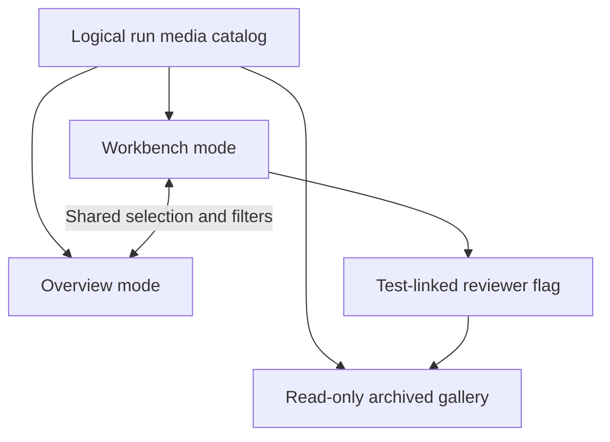
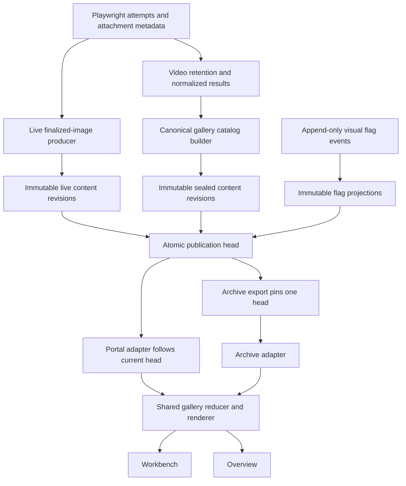
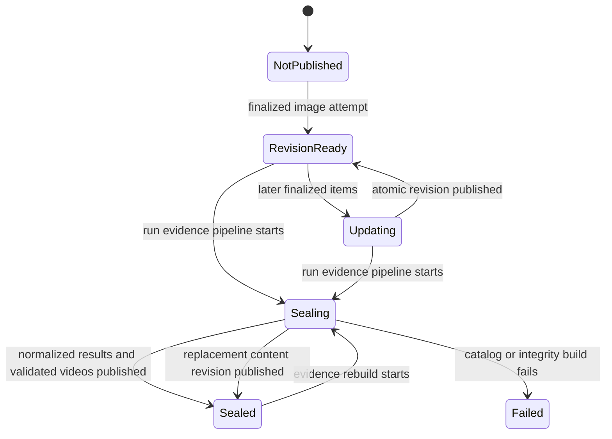
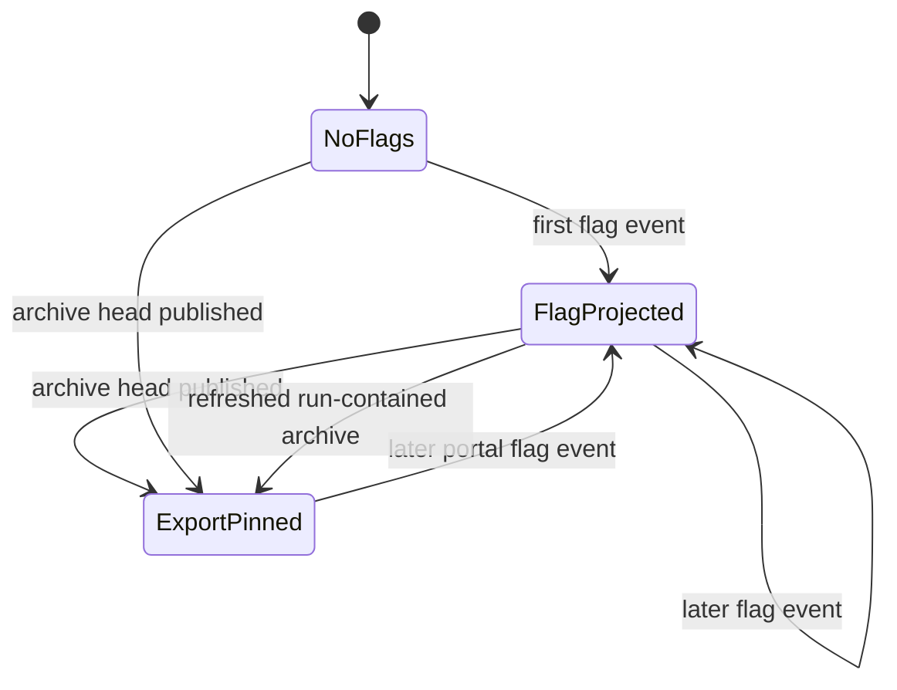
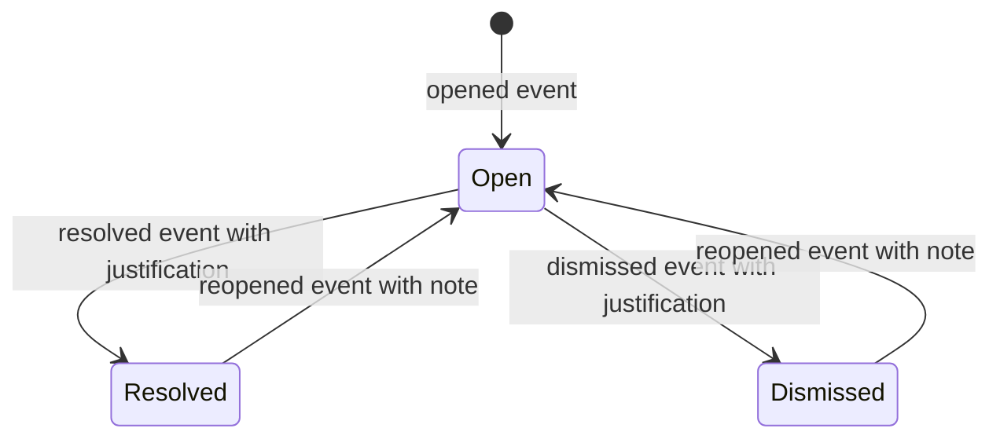

# Run Visual Evidence Gallery - Plan

## Goal Capsule

- **Objective:** Reviewers can inspect and triage all visual evidence from a run without opening individual artifact links, while the linked tests remain the authority for release readiness.
- **Means:** Provide one gallery shared by the live portal and archived report, with a test-queue workbench and a separate visual overview mode.
- **Product authority:** This work owns run-level image and video discovery, viewing, filtering, navigation, context, and reviewer flags.
- **Scope boundary:** This work does not redefine evidence capture policy, audit outcomes, release severity rules, browser targeting, or run storage lifecycle.
- **Open blockers:** None.

---

## Product Contract

### Summary

Build the gallery around a revisioned logical-media catalog generated from finalized test attachments after evidence validation.
One shared viewer and state machine will power the live portal workbench, its overview mode, and the archived report through surface-specific data adapters.

### Problem Frame

Visual evidence is currently nested inside individual audit details or exposed as paginated file links.
Reviewers must repeatedly open artifacts, reconstruct test context, and return to the report before inspecting the next item.
Large runs make that workflow slow and make visual patterns across tests difficult to notice.

### Key Decisions

- **Use one shared gallery experience.** (session-settled: user-directed — chosen over portal-only or report-only galleries: live and archived review must not drift.) Governs R1, R19, R20, R21.
- **Treat final test attachments as logical evidence.** (session-settled: user-directed — chosen over every stored file or an undeduplicated attachment list: reviewers need test evidence without storage noise.) Governs R2, R3, R4, R5.
- **Make the test queue the primary workspace.** (session-settled: user-directed — chosen over a media-only viewer or contact sheet: test context should remain visible during review.) Governs R6, R12, R13, R14.
- **Keep overview as a separate synchronized mode.** (session-settled: user-directed — chosen over a drawer or persistent top strip: pattern scanning should not reduce focused viewing space.) Governs R7, R8.
- **Keep test outcomes authoritative.** (session-settled: user-directed — chosen over mandatory media approval: media without a suspected problem does not need review.) Governs R16, R17, R18.
- **Prioritize attention while retaining suite structure.** (session-settled: user-directed — chosen over suite-only or capture-only ordering: reviewers should see likely problems first and still navigate by human and technical suites.) Governs R9, R10, R11.

The selected region relationship is directional rather than a styling specification:



<!-- ce-section: work-relationships -->
### How This Work Fits Together

This plan owns the per-run visual review experience within the larger testing platform.
The relationships below describe the current boundary and are not a committed roadmap.

- **Depends on:** Existing test attachments, execution context, validated-video retention, and final report data.
- **Shares:** Media validity and artifact-availability rules with the evidence pipeline.
- **Enables:** The same review experience for future browsers, devices, and execution providers.
- **Can proceed independently of:** Browser and device matrix expansion, new audit plugins, and test authoring changes.
- **Does not replace:** Audit details, the complete checklist, Playwright traces, raw artifact access, or run purge controls.

### Actors

- A1. **Reviewer:** Inspects run evidence, filters and navigates the gallery, flags suspected defects, and resolves or dismisses prior flags.
- A2. **Run evidence pipeline:** Supplies finalized test attachments, execution context, validated media, and final release state to both gallery surfaces.

### Requirements

**Logical media catalog**

- R1. The portal and archived report must consume the same logical media catalog for a run.
- R2. The catalog must represent each finalized image or video attachment once per test execution and attempt, collapsing duplicate storage copies without merging distinct test associations.
- R3. Baseline, actual, and diff attachments from one visual assertion must appear as one comparison item with selectable members.
- R4. The primary catalog must admit only finalized images and videos accepted by the current media-validity policy, with later availability changes represented per R24.
- R5. Generated posters, transient files, report copies, and other raw storage artifacts must remain outside primary counts and become visible only through an advanced raw-files view.

**Review surfaces and organization**

- R6. Workbench mode must provide a feature-suite and test queue, dominant media viewer, persistent context panel, local filmstrip, filters, and review actions.
- R7. Overview mode must provide a contact sheet of the current filtered sequence without replacing workbench mode.
- R8. Switching modes must preserve the selected item, filters, sort, suite position, and media playback position when applicable.
- R9. The default order must prioritize open reviewer flags, failed or blocked tests, flaky or review states, visual differences or warnings, and then remaining evidence.
- R10. Reviewers must also be able to sort by feature or plugin suite, technical Playwright suite, audit catalog order, and capture time.
- R11. Feature-suite grouping must use human-readable product areas while technical-suite grouping exposes the spec and nested test hierarchy.

**Navigation, filtering, and context**

- R12. Every item must display its audit ID and title, expected behavior, observed action or state, outcome, environment, route, browser or project, device class, viewport, attempt, capture rationale, and timestamp when that data exists.
- R13. The viewer must show the current item number, filtered total, suite position, media kind, and test status without obscuring the evidence.
- R14. Keyboard controls must support previous and next media, previous and next test group, video play or pause, information-panel toggle, fullscreen, and escape back to the prior gallery state.
- R15. Filters must support photos, videos, or both, plus test status, environment, feature suite, technical suite, browser or device target, reviewer-flag state, and free-text test search.

**Reviewer flags and release truth**

- R16. A reviewer flag must create an unresolved visual issue linked to the media item and its originating test, with reviewer identity, timestamp, and a required note.
- R17. Opening or not opening media must not approve, fail, or otherwise change a test outcome.
- R18. Resolving or dismissing a flag must retain the decision history and justification, while release impact continues to follow the linked test's existing severity and gating rules.

**Live runs, archived reports, and scale**

- R19. New finalized evidence may join an active gallery without moving the reviewer away from the current item, and newly prioritized items must be announced without silently reordering the visible selection.
- R20. The portal must support creating, resolving, and dismissing flags, while the archived report must expose the final flag state without mutation controls.
- R21. The completed report must preserve the same logical sequence, modes, filters, sorting, context, keyboard navigation, and final flag state as the completed portal run.
- R22. Catalog, context, and media loading must be asynchronous, bounded, cancellable, and visibly progressive rather than loading the entire run into the browser.
- R23. The viewer must load only the selected media and a bounded adjacent window, while videos retain seeking and metadata-first loading.
- R24. Missing or newly unavailable media must produce an understandable item-level state with retry or skip navigation rather than a broken link or stalled gallery.

**Accessibility**

- R25. Both modes must support keyboard-only review, visible focus, screen-reader announcements for selection and context changes, reduced-motion preferences, and touch controls without replacing keyboard behavior.

### Key Flows

- F1. Open an active run gallery
  - **Trigger:** A1 opens Visual Gallery from a running job.
  - **Actors:** A1, A2
  - **Steps:** The bounded catalog loads, finalized items become navigable, and later evidence enters the sequence without moving the current selection.
  - **Outcome:** A1 can inspect stable evidence while the run continues and sees a notice when new attention items arrive.
  - **Covered by:** R1, R4, R6, R19, R22, R24.

- F2. Review a completed run in workbench mode
  - **Trigger:** A1 opens the gallery from a completed run or report.
  - **Actors:** A1
  - **Steps:** A1 filters or sorts the queue, moves between test groups and media with the keyboard, and reads the selected item's test context.
  - **Outcome:** A1 can traverse the complete filtered sequence without opening separate artifact pages.
  - **Covered by:** R6, R9, R10, R11, R12, R13, R14, R15, R21, R23, R25.

- F3. Scan the run for visual patterns
  - **Trigger:** A1 switches from workbench mode to overview mode.
  - **Actors:** A1
  - **Steps:** The contact sheet shows the same filtered sequence, A1 selects a suspicious item, and the selection remains active when returning to workbench mode.
  - **Outcome:** A1 can spot repeated visual defects without losing detailed review context.
  - **Covered by:** R7, R8, R13, R15, R22, R25.

- F4. Flag and resolve suspected evidence
  - **Trigger:** A1 finds media that may show a defect.
  - **Actors:** A1
  - **Steps:** A1 records a flag and note, the issue links to the originating test, and a later reviewer resolves or dismisses it with justification.
  - **Outcome:** The test carries the unresolved or resolved visual issue without requiring approval of unrelated media.
  - **Covered by:** R16, R17, R18, R20.

- F5. Review an archived report
  - **Trigger:** A1 opens the completed report outside the live portal workflow.
  - **Actors:** A1
  - **Steps:** A1 uses the same viewer and filters to inspect final evidence and flag history without receiving mutation controls.
  - **Outcome:** Archived evidence remains understandable and portable without creating a second source of review truth.
  - **Covered by:** R1, R20, R21, R22, R23, R24, R25.

### Acceptance Examples

- AE1. Collapse storage duplicates
  - **Covers R2, R5.**
  - **Given:** One screenshot attachment exists in raw output, report evidence, and copied checklist storage.
  - **When:** A1 opens the primary gallery.
  - **Then:** The screenshot appears once under its test execution, while the advanced raw-files view can expose the stored copies.

- AE2. Preserve distinct test associations
  - **Covers R2, R12.**
  - **Given:** Identical image bytes were intentionally attached to two different tests.
  - **When:** A1 browses either test group.
  - **Then:** Each test retains a contextual gallery item even though the underlying file hashes match.

- AE3. Keep live navigation stable
  - **Covers R9, R19.**
  - **Given:** A1 is viewing item 18 while an active run finalizes a new failed-test screenshot.
  - **When:** The new item becomes the highest-priority unseen evidence.
  - **Then:** Item 18 stays selected and the gallery announces that a new attention item is available.

- AE4. Apply media filters to one sequence
  - **Covers R8, R13, R15.**
  - **Given:** A filtered suite contains photos, comparison groups, and videos.
  - **When:** A1 chooses Videos.
  - **Then:** Workbench and overview show the same video-only sequence and preserve the nearest valid selection.

- AE5. Handle rejected or missing media honestly
  - **Covers R4, R24.**
  - **Given:** A transient helper video was rejected by media validation or a referenced attachment becomes unavailable.
  - **When:** The gallery builds or refreshes its sequence.
  - **Then:** Rejected media is absent from primary counts and unavailable evidence produces a navigable error state rather than a dead artifact link.

- AE6. Keep review truth attached to the test
  - **Covers R16, R17, R18, R20.**
  - **Given:** A1 flags a candidate screenshot and supplies a note.
  - **When:** The gallery and report are refreshed.
  - **Then:** The originating test shows the unresolved issue, unrelated unviewed media remains neutral, and the archived report displays the final issue state read-only.

- AE7. Complete a filtered review without a mouse
  - **Covers R12, R13, R14, R23, R25.**
  - **Given:** A1 focuses the gallery and applies a test-status filter.
  - **When:** A1 navigates test groups and media, opens context, controls a video, and enters fullscreen using the keyboard.
  - **Then:** Focus remains visible, selection changes are announced, and every filtered item remains reachable.

### Success Criteria

- The current reference-run scale of 5,659 artifacts and 110 validated videos remains responsive without eager loading every artifact or media file.
- Automated acceptance proves that every eligible final attachment appears exactly once per logical test association in each filtered sequence.
- A keyboard-only reviewer can traverse, inspect, filter, flag, and exit the gallery without losing focus or context.
- Portal and archived report views reconcile to the same completed media counts, ordering inputs, context, and final flag state.
- No transient, rejected, missing, or unvalidated media is presented as usable evidence.

### Scope Boundaries

- The gallery does not require approval of every image or video and does not create a second release checklist.
- The gallery does not replace the complete audit report, Playwright traces, raw artifact access, manual physical-device evidence, or AI evidence review.
- The gallery does not edit, delete, recapture, or regenerate source evidence.
- The gallery does not expand browser targets, mobile operating-system coverage, test plugins, or capture policy.
- The archived report does not create or mutate reviewer flags.

### Dependencies and Assumptions

**Product Contract preservation:** Product Contract unchanged.

- Existing report data remains the authority for audit identity, execution context, evidence rationale, attempts, outcomes, and attachment metadata.
- Existing media validation remains the authority for whether a recorded video is eligible for review.
- Existing audit severity and release-gating rules remain the authority for the impact of an unresolved visual issue.
- Active-run evidence becomes gallery-eligible only after its attachment is finalized and safe to serve.
- Browser and device expansion may add new context values later without changing the gallery's logical review model.

### Sources and Research

- `portal/public/report.js` — current per-audit evidence rendering, local evidence paging, image loading, video controls, and posters.
- `portal/server.mjs` — bounded artifact paging, validated-media discovery, persisted run behavior, and existing manual-evidence mutation boundaries.
- `reporters/report-model.ts` — audit, execution, attempt, policy, finding, artifact, poster, and browser or device context available to reporting surfaces.
- `scripts/lib/video-retention.ts` — processed-video eligibility and quality authority.
- `docs/TEST_PLAN.md` — evidence policy and current manual physical-device boundary.
- `docs/REQUIREMENTS_TRACEABILITY.md` — report responsiveness, artifact safety, and run-lifecycle requirements that the gallery must preserve.

---

## Planning Contract

### Key Technical Decisions

- KTD1. **Generate one canonical logical-media catalog after evidence normalization.** (session-settled: user-directed — chosen over raw storage discovery or compact audit-detail projection: logical test evidence must not inherit storage duplication or truncation.) The report pipeline will normalize each source test and attempt before audit fan-out, then build the sealed catalog after video retention has removed rejected clips. `/api/runs/:id/artifacts`, `AuditManifest`, materialized audit copies, and compact audit details are not canonical gallery inputs. A video poster is never a logical item or primary-count member; it may render only as the selected owning video's nested preview, while its standalone stored file remains available only in advanced raw-files mode. Implements R1, R2, R4, R5.
- KTD2. **Separate logical item identity from stored blob identity.** A pure ID derivation will use source test identity, project, attempt or retry, and producer attachment key or comparison group. Shard ordinal is provenance, not identity, so repartitioning cannot orphan selections or flags. A content hash identifies reusable blobs and storage copies only. One item may carry multiple audit associations, and the context panel must display every associated audit ID and title. Audit-catalog sorting uses the lowest associated catalog ordinal as the primary key, then the sorted association-ID tuple and immutable item ID as deterministic tie-breakers. Implements R2, R3, R10, R12.
- KTD3. **Record comparison and capture context at the producer boundary.** New screenshot helpers will emit a small metadata record with comparison group, member role, capture time, route, observed state, and rationale. Routes retain the path and query-key names but remove credentials, query values, and fragments; observed-state and rationale text is producer-authored, length-capped metadata and is never populated by copying arbitrary page content. The builder will infer only known legacy Playwright and paired-visual names, leaving ambiguous captures separate. Implements R3, R11, R12.
- KTD4. **Publish one authoritative head over immutable bounded revisions.** A publication descriptor will pin `schemaVersion`, `contentRevision`, `flagRevision`, `orderRevision`, `exportRevision`, and phase. Catalog cursors will bind to the content revision and normalized filter, sort, and group query. Deltas will contain ID-based additions, changes, and tombstones. Every mutating code path will delegate its short publish transaction to the same container-side helper under a blocking Linux kernel `flock` on a contained per-run lock file; locks never expire, a paused owner retains the lock, process death releases it, and unsupported filesystems fail closed. The helper re-reads the expected head and flag revision while holding the lock, writes immutable data, then atomically renames the one head. The portal follows the current head; an archive pins one export head and labels parity as of its `exportRevision` and `exportedAt`, so a copied older archive is not presented as matching later portal mutations. Export revisions referenced by generated gallery HTML remain immutable until whole-run purge; only unexported portal/live revisions are eligible for bounded cleanup. Implements R19, R21, R22, R23, R24.
- KTD5. **Use one reducer-driven viewer with portal and archive adapters.** (session-settled: user-directed — chosen over separate portal and report viewers: live and archived review must not drift.) The reducer will own transport-free intent, mode, selection, comparison member, filters, grouping, sort, playback position, focus history, request generations, and completion acceptance. Adapters will own schema negotiation, transport cancellation, URL resolution, revision watch, availability, mutation capability, and error taxonomy. Portal reads use abortable requests. Direct-file archive query and detail chunks use one short-lived hidden iframe per request; each generated wrapper carries base64-encoded data and posts it with a one-time request token, the parent accepts only the expected `event.source` and token, and cancellation removes the iframe to abort its document load and parsing. Selected media cancellation clears the element source. Reducer generations remain a second line of defense against any completion already queued at cancellation time. Implements R1, R6, R7, R8, R14, R15, R20, R21, R22, R25.
- KTD6. **Admit active evidence only at a finalized lifecycle boundary.** A per-test producer will publish finalized screenshots after the attempt closes. Videos will remain absent or pending until the retention stage validates them. The sealed final catalog will be regenerated with the same ID derivation from normalized results, then replace the live evidence head. Flag or export refreshes will not transition the evidence lifecycle. Implements R4, R19, R21.
- KTD7. **Persist reviewer flags as append-only events outside release truth.** (session-settled: user-directed — chosen over mandatory media approval or checklist-status mutation: tests remain the release authority.) The history will use a monotonic event sequence, immutable event and flag IDs, previous-event references, idempotency results, expected flag revision, reviewer attribution label, note or justification, target item, and a minimal identity snapshot. Projections will carry a `throughEvent` watermark. V1 enables mutation only for the Docker portal published on host loopback and treats the supplied name as a local single-operator attribution label, not authenticated identity; any shared deployment must disable mutation until an authenticated server-side identity provider is configured. Flag events will never change audit, execution, run, or release fields. Implements R16, R17, R18, R20.
- KTD8. **Derive deterministic suite and attention ordering from catalog metadata.** (session-settled: user-directed — chosen over suite-only or capture-only ordering: reviewers need likely problems first without losing suite structure.) Ordering will use unresolved flag, test status, visual warning, chosen suite mode, attempt, nullable capture time, and immutable ID as a final tie-breaker. `orderRevision` is a deterministic hash of `contentRevision`, `flagRevision`, and the ordering-schema version rather than an independently persisted mutation dimension. A new flag may announce a pending order without silently reordering the frozen sequence. Implements R9, R10, R11, R19.
- KTD9. **Preserve unavailable items as navigable tombstones.** Once exposed, an item will keep its place and context when its blob disappears. Availability probes and media errors will update item state without deleting or reordering the logical item. Implements R19, R24.
- KTD10. **Enforce measurable large-run budgets.** Descriptor and query chunks will be at most 256 KiB, item detail at most 512 KiB, and cursor pages at most 100 rows. Cold first-usable metadata will be at most 1 MiB over at most three requests. The canonical benchmark profile gives the portal/Chromium test service 2 CPUs and 4 GiB memory. Cold first-usable uses 5 warm-up runs followed by 30 measured fresh browser contexts with browser cache and storage cleared; the interval is navigation start through a rendered selected item, usable queue, loaded context, and enabled controls. Next-item latency uses 10 warm-up transitions and 100 measured transitions from input dispatch through reducer selection commit, visible context update, and selected-media request start. The pinned Docker browser must reach first usable view within 2 seconds at p95, change selected item state within 200 ms at p95, retain at most 500 gallery DOM nodes, and grow heap by at most 25 MiB after 100 item traversals. Noncanonical resource profiles are recorded as informational and cannot satisfy the gate. Implements R22, R23.

### Assumptions

These unvalidated planning assumptions are visible because this plan is running non-interactively.

- A reviewer supplies a display name with each flag because the loopback-only v1 portal has no account or role system. The portal remembers it locally for workflow continuity, labels it as local attribution, and never presents it as authenticated identity.
- The archived gallery is a static run-bundle snapshot identified by `exportRevision` and `exportedAt`; a copied archive does not receive later portal mutations.
- The run-contained archive flag snapshot is refreshed atomically after a portal flag event, without rebuilding release truth.
- Direct `file://` review remains useful, so the small export descriptor is embedded in the generated gallery page and bounded query or detail chunks are cancellable iframe-loadable HTML wrappers rather than fetch-only JSON.
- Active-run parity means finalized screenshots may appear after an attempt closes, while videos appear only after post-run validation.
- The portal may write a visual-flag sidecar for discovered external sharded runs even though their execution lifecycle remains read-only.

### High-Level Technical Design

The catalog and client boundaries are shared, while transport and mutation capabilities differ by surface.



Catalog publication has explicit lifecycle states so partial or rejected evidence cannot look final.



Review and export revisions advance without reopening the sealed evidence lifecycle.



The client keeps selection stable across asynchronous catalog changes and surface switches.

```mermaid
stateDiagram-v2
  [*] --> Workbench
  Workbench --> Overview: switch mode
  Overview --> Workbench: select item
  Workbench --> ContextOpen: toggle context
  ContextOpen --> Workbench: Escape
  Workbench --> Fullscreen: enter fullscreen
  Fullscreen --> Workbench: Escape
  Workbench --> WorkbenchPendingRevision: newer catalog announced
  WorkbenchPendingRevision --> Workbench: accept or defer; preserve mode
  Overview --> OverviewPendingRevision: newer catalog announced
  OverviewPendingRevision --> Overview: accept or defer; preserve mode
```



Keyboard behavior is a shared contract rather than an adapter convention.

| Key | Gallery action | Scope and disabled behavior |
|---|---|---|
| Left / Right | Previous / next logical media item | Gallery focus only; announce sequence boundary instead of wrapping. |
| Up / Down | Previous / next test group | Gallery focus only; preserve the closest media member in the destination group. |
| `[` / `]` | Previous / next comparison member | Only for comparison items; announce member role and boundary. |
| Space | Play / pause selected video | Only while the viewer, not a native control, owns focus. |
| I | Toggle context panel | Restore focus to the invoking control when the panel closes. |
| F | Enter or leave viewer fullscreen | Announce the resulting state. |
| Escape | Unwind fullscreen, panel, overview-to-workbench, then gallery history | Apply one layer per key press and restore prior focus. |
| ? | Open shortcut help | A close returns focus to the prior gallery element. |

Global shortcuts are disabled inside editable controls, selects, dialogs that own Escape, and native media controls. Disabled actions leave selection unchanged and produce one polite live-region announcement; shortcut help exposes the same table in both portal and archive.

Responsive behavior keeps evidence primary without removing queue or context access.

| Viewport | Composition |
|---|---|
| At least 1024px | Queue, dominant viewer, and context panel may coexist; filmstrip remains adjacent to the viewer. |
| 768px to 1023px | Viewer remains primary; queue and context become independently toggled side panels; review actions remain visible. |
| Below 768px | Viewer and status strip remain primary; queue and context use independently opened full-height panels, review actions use a sticky bottom row, and the filmstrip scrolls horizontally. |

All interactive targets are at least 44 by 44 CSS pixels below 768px. Opening and closing a responsive panel moves focus to its heading and back to the invoking control, respectively; no breakpoint removes keyboard behavior.

Async states carry distinct meanings and recovery actions.

| State | Visible meaning | Controls retained | Primary recovery and announcement |
|---|---|---|---|
| Active run waiting | The run has not finalized eligible evidence yet. | Back to run, logs, refresh status | Continue watching automatically; announce the first admitted item. |
| Sealed with no eligible evidence | The run finished with no valid logical image or video. | Back to report, advanced raw files | Inspect test outcomes or raw files; announce the terminal empty state once. |
| Zero filtered results | Evidence exists but the current filters match nothing. | Filters, clear-all, back | Clear filters without resetting sort; announce zero of the unfiltered total. |
| Partially loaded catalog | A valid current window is usable while more metadata is pending. | Current navigation and filters whose facets are complete | Retry the failed window; announce progress without stealing focus. |
| Selected blob unavailable | Item context remains but its selected member cannot load. | Previous, next, member switch, context | Retry the member or skip; announce the affected member and retained position. |
| Terminal catalog error | No coherent descriptor or revision can be loaded. | Back to run or report, visible error detail | Retry from a fresh descriptor; never render mixed revisions. |
| Purged run | The run was removed while the gallery was open. | Already loaded read-only context and back navigation | Return to runs; disable further reads and all mutations. |

Flag state is a projection over immutable events rather than an overwritten record.



### Output Structure

```text
shared/
  gallery-contract.mjs
  gallery-contract.d.mts
reporters/
  gallery-model.ts
  live-gallery-reporter.ts
portal/public/
  gallery.html
  gallery.js
  gallery-core.js
  gallery.css
reporters/assets/
  gallery-archive.js
scripts/
  gallery-publish.mjs
  gallery-catalog-self-test.ts
  gallery-state-self-test.mjs
checklist/                           generated per run
  gallery.html
  assets/
    gallery-core.js
    gallery.css
    gallery-archive.js
  data/gallery/
    revisions/<exportRevision>/
      query-*.html
      item-*.html
```

Generated checklist paths illustrate the output contract. Source filenames may be adjusted if implementation finds a smaller structure that preserves the same boundaries.

### Sequencing and Integration Constraints

1. Define catalog identity, metadata, comparison grouping, and fixture contracts before adding any viewer behavior.
2. Generate final catalog assets during the existing report-rebuild stage, after video processing and normalized results.
3. Add live image publication and revision APIs without weakening the sealed final catalog gate.
4. Add flag persistence before enabling reviewer controls so portal and archive projections share one history model.
5. Build the shared reducer and renderer against adapter conformance fixtures before integrating either surface.
6. Complete portal and archive wiring before scale, accessibility, and Docker acceptance.

### System-Wide Impact

- **Evidence lifecycle:** The report pipeline gains a second bounded index alongside audit summary data. Live records and flag events are authoritative inputs; catalog chunks and projections are replaceable views. The video-retention manifest remains the authority for video eligibility.
- **Portal API:** New catalog, detail, delta, availability, and flag routes must keep same-origin mutation checks, loopback-only default exposure, real-path containment, bounded response sizes, cancellation behavior, and mutation quotas. Shared deployments keep flag mutation disabled until authenticated reviewer identity exists.
- **Run persistence:** `visual-flags.json` and live catalog revisions become durable run sidecars and must be removed by the existing whole-run purge operation.
- **Archived reports:** The checklist gains a gallery entry point and cancellable iframe-loadable catalog chunks. Existing audit details and raw downloads remain available.
- **Sharded execution:** Each shard must publish isolated live records. The merge stage must create one final catalog without duplicate logical associations.
- **Release truth:** Flag events and gallery availability must not modify deterministic release calculation or conceal missing required evidence.

### Risks and Mitigations

| Risk | Consequence | Mitigation |
|---|---|---|
| Hash-based deduplication merges distinct tests | Evidence loses test context | Key logical identity by execution and attempt; use hashes only for blobs and storage copies. |
| Live offsets shift when priority items arrive | Reviewers skip items or lose selection | Use revisioned cursors, immutable IDs, and reviewer-accepted reordering. |
| The live producer exposes unvalidated video | Rejected or white helper clips reappear | Publish video only from the post-retention sealed catalog. |
| Report and portal clients diverge | Archived review behaves differently | Share reducer, renderer, fixtures, and adapter conformance tests. |
| Flag writes race between reviewers or a rebuild process | History is lost or state regresses | Use the shared kernel lock, expected-head comparison, expected revision, and idempotency. |
| A large overview exhausts the browser | Gallery repeats the existing evidence-log failure | Window metadata, virtualize thumbnails, observe viewport, and abort stale loads. |
| Report refresh exposes mixed generations | Counts, details, and flags disagree | Write immutable revision directories and atomically switch one publication head through a serialized per-run writer. |
| Portal and report duplicate contract logic | Identity, cursor, and flag projections drift | Use one runtime-neutral contract module and run producer and portal conformance tests against it. |
| Static archive cannot answer exact queries | Totals or ordering become provisional | Load a complete compact query index through bounded cancellable iframe documents, while details and media remain lazy. |
| Persisted labels or notes contain markup | Stored script executes in portal or archive | Encode generated archive payloads as base64 JSON, validate decoded schemas, and render all untrusted strings through text-only or attribute-safe DOM APIs. |
| Flag history is abused as unbounded storage | Run disk use and rebuild latency grow without limit | Enforce field lengths, per-run event and byte caps, and a per-client mutation rate before accepting an event. |

---

## Implementation Units

### U1. Canonical gallery model and capture metadata

- **Goal:** Create the authoritative logical-media model from finalized attempt attachments with complete test associations and comparison metadata.
- **Requirements:** R1, R2, R3, R4, R5, R11, R12; F2, F3; AE1, AE2, AE5.
- **Dependencies:** None.
- **Files:** `shared/gallery-contract.mjs` (new), `shared/gallery-contract.d.mts` (new), `reporters/gallery-model.ts` (new), `reporters/report-model.ts`, `scripts/rebuild-report.ts`, `reporters/checklist-reporter.ts`, `fixtures/test.ts`, `tests/visual-regression.spec.ts`, `scripts/gallery-catalog-self-test.ts` (new), `package.json`.
- **Approach:**
  1. Normalize each `ReportTestInput` into source-test and attempt records before the current audit-ID loop or materialization fan-out.
  2. Retain source test ID, full title path, audit associations, project identity, shard provenance, and attachment occurrence keys.
  3. Define shared schema validation, stable ID derivation, deterministic ordering, cursor-query normalization, and flag projection in one runtime-neutral contract module.
  4. Create immutable logical item, comparison group, member, blob, suite, and nullable context records under KTD2 and KTD3.
  5. Materialize each blob once and attach alternate storage locations without merging items across tests or attempts.
  6. Exclude posters and non-media derivatives from primary items while keeping poster data on its owning video.
  7. Add explicit capture metadata to project-owned screenshot helpers and migrate paired visual attachments; apply conservative inference to known legacy Playwright names.
- **Execution note:** Build the catalog self-test first because identity and grouping defects would contaminate every later surface.
- **Patterns to follow:** `buildExecutions` and attachment materialization in `reporters/report-model.ts`; evidence-policy annotations in `fixtures/test.ts`; paired attachment names in `tests/visual-regression.spec.ts`.
- **Test scenarios:**
  - Covers AE1. Three stored copies of one attachment produce one logical item and one blob with alternate storage locations.
  - Covers AE2. Equal SHA-256 bytes attached to two source tests produce two items with distinct context.
  - A test mapped to multiple audit IDs produces one item with multiple audit associations.
  - Repeated attachment names within one attempt retain distinct occurrence keys and stable IDs.
  - Moving a test between shard ordinals preserves the same logical item ID.
  - Two retries preserve separate attempt items and statuses instead of flattening them.
  - A complete baseline, actual, and diff set produces one comparison item with three members.
  - An incomplete or ambiguous comparison set remains navigable without inventing a missing role.
  - A video poster remains a derivative and never increases the primary image count.
  - A rejected or pruned video attachment is absent from the catalog.
  - Missing route, viewport, or capture time remains null with provenance instead of using file modification time.
  - A route containing credentials, query values, and a fragment retains only its path and query-key names; capture context never imports arbitrary page text.
- **Verification:** The self-test proves stable IDs, catalog completeness, association preservation, comparison grouping, and media-policy exclusion from synthetic and representative result fixtures.

### U2. Bounded sealed catalog and archive data contract

- **Goal:** Publish versioned catalog summaries, facets, chunks, item details, raw-file metadata, and flag snapshots as an atomic run archive.
- **Requirements:** R1, R4, R5, R21, R22, R23, R24; F5; AE1, AE4, AE5.
- **Dependencies:** U1.
- **Files:** `shared/gallery-contract.mjs`, `reporters/gallery-model.ts`, `reporters/report-model.ts`, `scripts/rebuild-report.ts`, `scripts/gallery-publish.mjs` (new), `scripts/gallery-catalog-self-test.ts`, `scripts/report-poster-self-test.ts`.
- **Approach:**
  1. Write immutable revision directories and one small current descriptor under KTD4.
  2. Partition a complete compact query index into capped iframe-loadable HTML wrappers containing base64 JSON so static archives can compute exact free-text, filter, sort, and total results while retaining cancellation.
  3. Keep item details, raw-file metadata, posters, and media URLs outside the query index and load them on demand.
  4. Resolve artifact URLs relative to the run bundle without exposing source filesystem paths.
  5. Publish the current descriptor only after every referenced file is complete; retain every export revision referenced by generated gallery HTML until whole-run purge, while allowing unexported portal/live revisions to expire through stale-cursor resnapshot.
  6. Serialize report rebuild and flag projection across processes with the KTD4 kernel-lock helper and expected-head validation inside the held lock.
- **Patterns to follow:** Compact summary, audit index, per-audit detail, text caps, and atomic writes in `reporters/report-model.ts` and `portal/server.mjs`.
- **Test scenarios:**
  - The descriptor and each chunk stay below configured byte and row caps at the reference-run scale.
  - A direct local-file archive loads the descriptor, one queue window, and one selected detail without fetching the complete manifest.
  - A descriptor never references a partially written or missing chunk after an interrupted build.
  - Concurrent report rebuild and flag projection publishes one coherent head and retains a readable prior revision.
  - A paused writer retains the kernel lock and a second writer waits; killing the owner releases the lock, after which the next writer revalidates the head before publishing.
  - An older copied archive continues loading its pinned lazy query and item documents after later exports, and those files disappear only with whole-run purge.
  - An exact static-archive query across chunk boundaries returns the same total and order as the portal adapter.
  - Poster records remain nested on videos and excluded from media and overview counts.
  - Raw storage copies appear only when advanced raw mode is requested.
  - A selected missing blob returns a tombstone state with context and navigation intact.
- **Verification:** Generated archive fixtures pass schema, size, containment, atomic-publication, and local-file loading assertions.

### U3. Live catalog production, revisions, and portal reads

- **Goal:** Make finalized active-run evidence available through cancellable cursor APIs without moving the reviewer’s current selection.
- **Requirements:** R4, R9, R19, R22, R23, R24; F1; AE3, AE5.
- **Dependencies:** U1, U2.
- **Files:** `reporters/live-gallery-reporter.ts` (new), `playwright.config.ts`, `playwright.merge.config.ts`, `scripts/run-playwright-shard.mjs`, `scripts/process-videos.ts`, `portal/server.mjs`, `portal/tests/gallery.spec.ts` (new), `portal/tests/portal.spec.ts`.
- **Approach:**
  1. Compose the live reporter alongside existing configured reporters for portal runs and alongside blob reporting for each sharded run.
  2. Publish attempt-finalized image records from portal-managed and sharded projects into isolated live revision files.
  3. Keep video records pending until normalized results and the schema-v2 retention manifest authorize them.
  4. Expose revisioned summary, cursor page, item-detail, delta, and availability reads with KTD10 byte and row caps.
  5. Bind cursors to content revision and normalized query; keep flag and derived-order revisions separate.
  6. Emit compact publication-head notifications through the existing live event channel and detect external-shard revisions during polling.
  7. Return stale-cursor recovery metadata so the client can resnapshot and re-anchor by immutable item ID.
- **Execution note:** Characterize current final-only reporter timing before adding the live producer, then prove the sealed rebuild supersedes live previews.
- **Patterns to follow:** SSE byte bounds, external-run polling, artifact containment, request cancellation, and report JSON limits in `portal/server.mjs`.
- **Test scenarios:**
  - Covers AE3. A new highest-priority failed screenshot increments the pending revision while item 18 remains selected in the frozen sequence.
  - Two cursor pages from one revision have no duplicate or missing item IDs.
  - A stale cursor returns a resnapshot path that restores the same selected item when it still exists.
  - An active interaction attempt does not expose its video before retention validation.
  - A validated final video appears after sealing, while a rejected helper clip never appears.
  - Portal-managed and external sharded live revisions remain isolated and merge to the same sealed logical catalog.
  - Interrupted and retried attempts publish only closed-attempt images and reconcile to the same final IDs.
  - A cancelled or disconnected request stops indexing work and does not emit a partial response.
  - A purged run terminates gallery reads with a clear terminal state.
- **Verification:** Portal API acceptance proves cursor consistency, stable selection inputs, sealed-catalog authority, live notifications, and bounded responses for both run types.

### U4. Append-only reviewer flags and archive projection

- **Goal:** Support opening, resolving, dismissing, and reopening visual issues with durable history while preserving release truth.
- **Requirements:** R9, R12, R16, R17, R18, R20, R21; F4, F5; AE6.
- **Dependencies:** U1, U2.
- **Files:** `shared/gallery-contract.mjs`, `portal/server.mjs`, `reporters/gallery-model.ts`, `scripts/rebuild-report.ts`, `scripts/gallery-publish.mjs`, `docker-compose.yml`, `portal/tests/gallery.spec.ts`, `portal/tests/portal.spec.ts`, `scripts/release-truth-self-test.mjs`.
- **Approach:**
  1. Persist immutable events in a contained per-run `visual-flags.json` sidecar with a monotonic event sequence and derive current flags as a projection.
  2. Validate logical media ID, source test identity, reviewer, note or justification, event transition, idempotency key, and expected revision.
  3. Serialize flag mutations and publication through the shared kernel-lock helper and reuse same-origin JSON mutation protection.
  4. Give discovered external sharded runs a dedicated contained sidecar writer and lock path without changing their execution manifest.
  5. Publish a new flag projection and current descriptor after accepted events instead of modifying an exposed revision.
  6. Compute attention badges from linked audit status, severity, and release-blocking policy without feeding the flag into checklist aggregation.
  7. Enforce 120-character reviewer labels, 4,000-character notes and justifications, 128-character idempotency keys, at most 10,000 events or 16 MiB of encoded history per run, and 30 accepted mutation attempts per client and run per minute; reject over-limit writes before publication with bounded 413 or 429 responses.
  8. Log event ID, transition, status, revision, response code, and byte counts without logging reviewer notes, justifications, credentials, or other free text.
- **Execution note:** Begin with release-truth invariance and concurrent-mutation tests before adding portal controls.
- **Patterns to follow:** `assertMutationRequest`, `atomicWriteJson`, run containment, and manual evidence validation patterns in `portal/server.mjs`, excluding manual evidence replacement and checklist rebuild semantics.
- **Test scenarios:**
  - Covers AE6. Opening a flag requires reviewer and note, links the source test and media, and leaves release fields byte-for-byte unchanged.
  - Resolving and dismissing require justification and retain the opening event.
  - Reopening creates a new event and restores the flag to attention-first ordering.
  - A repeated idempotency key returns the original accepted event without duplicating history.
  - A stale expected revision produces a conflict response and preserves the winning event order.
  - A projection rebuild through a `throughEvent` watermark reproduces the current state from history.
  - A flag mutation racing a report rebuild yields one coherent publication head and no lost event.
  - A flag writer paused after request validation cannot publish until it owns the kernel lock and revalidates the expected flag revision; a superseded request returns conflict without writing.
  - Invalid logical media IDs, cross-run IDs, and cross-origin writes fail closed.
  - Overlong fields, exhausted history quotas, and rate bursts fail without appending an event or advancing a publication revision.
  - The default Docker port is published on host loopback; a shared-mode fixture exposes read-only flags and rejects mutations until authenticated identity is configured.
  - Flags survive portal restart, report rebuild, and external-run rediscovery.
  - The archived snapshot exposes the same flag projection and history without mutation controls.
- **Verification:** Persistence, security, concurrency, archive parity, and release-truth regression tests all pass for portal-managed and external runs.

### U5. Shared gallery reducer, workbench, and overview

- **Goal:** Deliver the full keyboard-first review experience once, independent of portal or archive transport.
- **Requirements:** R6, R7, R8, R9, R10, R11, R12, R13, R14, R15, R22, R23, R24, R25; F2, F3; AE4, AE7.
- **Dependencies:** U1, U2, U4.
- **Files:** `portal/public/gallery-core.js` (new), `portal/public/gallery.css` (new), `scripts/gallery-state-self-test.mjs` (new), `portal/tests/gallery.spec.ts` (new), `portal/tests/portal.spec.ts`, `package.json`.
- **Approach:**
  1. Implement one transport-free reducer for revision intent, frozen sequence, selection, comparison member, mode, filters, sort, suite anchor, playback, focus history, request generations, pending loads, and errors.
  2. Render a queue-first workbench with dominant media, persistent context, local filmstrip, review state, and a separate virtualized overview.
  3. Load only selected media and a bounded adjacent window; use metadata-only video loading and viewport-observed overview thumbnails.
  4. Require the portal adapter to abort superseded requests and the direct-file adapter to cancel chunk work by removing its one-request iframe; always ignore stale completions by reducer request generation as a second line of defense.
  5. Preserve an out-of-filter selection anchor and choose the nearest visible item, restoring the anchor when filters clear.
  6. Suppress global shortcuts inside form fields, selects, note editors, and native media controls.
  7. Treat catalog titles, routes, observed states, attribution labels, notes, and justifications as untrusted text: validate decoded records, use `textContent` and safe property setters, forbid unsanitized HTML sinks, and accept only contained relative artifact URLs for media attributes.
- **Patterns to follow:** Abort-controller request ownership, loading states, announcements, lazy images, and metadata-first videos in `portal/public/report.js`.
- **Test scenarios:**
  - Covers AE4. Switching to videos updates workbench and overview to one sequence and keeps the nearest valid item selected.
  - Covers AE7. A keyboard-only reviewer moves by item and test, toggles context, controls video, enters fullscreen, and unwinds with Escape while focus remains visible.
  - Switching between workbench and overview preserves item, comparison member, filters, sort, suite anchor, and video time without autoplay.
  - Overview selection opens the same item in workbench and restores overview focus on return.
  - Filtering the selected item out keeps an anchor and restores it when the filter clears.
  - A pending revision announces new attention items without changing the visible sequence.
  - A failed image, video, poster, or range request shows an item-level retry and keeps previous or next navigation available.
  - Reduced-motion mode removes nonessential animation while preserving loading and selection feedback.
  - Touch controls reach the same actions without removing keyboard behavior.
  - Fifty rapid filter and selection changes produce zero stale-state commits.
  - Cancelling a large direct-file chunk removes its iframe, stops its load, and keeps decoded bytes outside retained reducer state.
  - Malicious closing tags, event-handler strings, bidirectional text, and URL-shaped payloads render as text in both adapters and cannot create executable DOM or escape contained artifact URLs.
- **Verification:** Shared reducer fixtures and browser acceptance prove deterministic state transitions, bounded DOM and media loading, accessibility, and failure recovery.

### U6. Portal gallery adapter and run navigation

- **Goal:** Add a live full-page gallery to each run with reviewer mutations, active updates, and advanced raw-file access.
- **Requirements:** R1, R5, R6, R9, R10, R15, R16, R19, R20, R22, R24, R25; F1, F2, F4.
- **Dependencies:** U3, U4, U5.
- **Files:** `portal/public/gallery.html` (new), `portal/public/gallery.js` (new), `portal/public/index.html`, `portal/public/app.js`, `portal/public/report.html`, `portal/public/report.js`, `portal/public/styles.css`, `portal/tests/gallery.spec.ts`, `portal/tests/portal.spec.ts`.
- **Approach:**
  1. Bind the shared core to cursor reads, detail reads, live revision events, artifact URLs, availability probes, and flag mutations.
  2. Link Visual Gallery from run cards, run detail, and the reviewer report without waiting for compact report completion.
  3. Surface catalog phase, revision, pending attention count, request progress, response errors, and retry actions in the same visible logging style as the portal.
  4. Integrate existing paginated artifacts as an advanced raw-files mode outside logical media counts.
  5. Disable mutations for unavailable or purged runs while preserving read-only context already loaded.
  6. Render the shared async-state matrix verbatim in behavior: each state keeps its documented controls, one primary recovery, and a bounded live-region announcement.
- **Patterns to follow:** Async busy states, live status announcements, run event reconnection, link construction, and paged artifact loading in `portal/public/app.js` and `portal/public/report.js`.
- **Test scenarios:**
  - A gallery opens from an active run before the compact report exists and shows the current catalog lifecycle state.
  - Portal revision events update pending counts and retain current selection until accepted.
  - Flag forms validate reviewer and note, show pending state, and reconcile server conflicts without duplicate submission.
  - Advanced raw mode pages storage files without changing logical gallery totals.
  - Navigating back to the run or report restores the prior gallery mode, filters, and selected logical item through URL state.
  - Loading, empty, partial, terminal error, missing-media, and run-purged states remain navigable and announced.
  - No portal gallery request downloads the complete checklist manifest or all stored artifacts.
- **Verification:** The Docker portal suite covers active and completed runs, reconnects, mutations, raw paging, logs, and bounded network behavior.

### U7. Archived gallery adapter and report integration

- **Goal:** Provide the same completed-run review sequence in the Long Build Checklist as a read-only, portable archive snapshot.
- **Requirements:** R1, R5, R7, R8, R10, R12, R13, R14, R15, R20, R21, R22, R23, R24, R25; F5; AE4, AE5, AE6, AE7.
- **Dependencies:** U2, U4, U5.
- **Files:** `reporters/assets/gallery-archive.js` (new), `reporters/assets/report.js`, `reporters/assets/report.css`, `reporters/report-model.ts`, `portal/public/gallery-core.js`, `portal/public/gallery.css`, `scripts/gallery-catalog-self-test.ts`, `portal/tests/gallery.spec.ts` (new), `portal/tests/portal.spec.ts`.
- **Approach:**
  1. Generate `checklist/gallery.html`, copy the exact shared core and CSS, and bind an immutable static adapter.
  2. Load cancellable iframe-based catalog chunks, contained relative media URLs, and the final flag snapshot at one export revision.
  3. Remove mutation controls while preserving flag history, derived linked-test impact, modes, filters, sorting, context, and shortcuts.
  4. Link the gallery from the archived checklist and retain individual audit evidence links as a secondary route.
  5. Run portal and archive adapters against the same completed-run conformance fixture.
- **Patterns to follow:** Asset copying and archive HTML generation in `writeAuditReport`; existing archive media fallbacks in `reporters/assets/report.js`.
- **Test scenarios:**
  - Portal and archive adapters return the same completed logical item IDs, counts, facets, default ordering, comparison members, and flag projection for one revision.
  - An archive opened through HTTP and direct local file access supports workbench, overview, filters, keyboard navigation, and media links.
  - The archive exposes flag history and export time but no controls or mutation requests.
  - A later portal flag event changes a regenerated run-contained snapshot while an older copied archive remains truthfully labeled with its earlier revision.
  - Missing media renders the same tombstone context and retry or skip affordance as the portal.
  - The archive does not eagerly load the complete manifest, every item detail, or every thumbnail.
  - Cancelling an archive query or detail load removes the request iframe and no late message can update the reducer.
- **Verification:** Archive conformance, portability, parity, read-only, and bounded-loading tests pass against synthetic and real completed run fixtures.

### U8. Scale, accessibility, Docker acceptance, and operating guidance

- **Goal:** Prove the complete feature at real run scale and document how reviewers operate and extend it.
- **Requirements:** R1 through R25; F1 through F5; AE1 through AE7.
- **Dependencies:** U1 through U7.
- **Files:** `portal/tests/gallery.spec.ts`, `portal/tests/portal.spec.ts`, `portal/playwright.portal.config.ts`, `scripts/run-portal-e2e.mjs`, `scripts/gallery-catalog-self-test.ts`, `scripts/gallery-state-self-test.mjs`, `package.json`, `README.md`, `docs/DOCKER.md`, `docs/TEST_PLAN.md`, `docs/RELEASE_PROCESS.md`, `docs/REQUIREMENTS_TRACEABILITY.md`.
- **Approach:**
  1. Add a scale fixture representing 5,659 report artifacts, 1,241 logical media occurrences, 110 validated videos, and 17,527 stored files.
  2. Enforce KTD10 in cold and warm measurements, recording request and byte counts, peak DOM and media counts, navigation latency, and heap before and after traversal.
  3. Run the canonical profile at 2 CPUs and 4 GiB, save every raw timing sample as JSON, use KTD10's 5/30 cold and 10/100 warm-up/measurement counts, and label any other resource profile informational.
  4. Add keyboard, focus, live-region, reduced-motion, touch, range-seeking, cancellation, and stale-response coverage.
  5. Run the portal and browser acceptance path inside the pinned Playwright Docker image and rebuild the portal service before manual acceptance.
  6. Document logical-versus-raw evidence, live finalization, archive revisions, flags, keyboard controls, performance bounds, and extension points.
- **Execution note:** Use the existing Docker-first acceptance path; host-installed Playwright browsers are not evidence for completion.
- **Patterns to follow:** Portal E2E orchestration and verbose command logging in `scripts/run-portal-e2e.mjs`; container pinning in `Dockerfile` and `docker-compose.yml`.
- **Test scenarios:**
  - The scale fixture reaches first usable workbench state without loading all catalog details or media.
  - Traversing 100 items keeps DOM nodes, active media elements, and retained request payloads within documented bounds.
  - Cold gallery load meets KTD10 metadata, request, and first-usable budgets at p95.
  - Next-item changes meet the KTD10 p95 latency budget, with at most one selected video element and a bounded adjacent image window.
  - Rapid filter, mode, and selection changes abort or ignore stale work and end on the latest requested state.
  - An HTTP range request for a selected video returns partial content and video seeking remains usable.
  - All keyboard actions have visible focus and live announcements in both portal and archive modes.
  - The complete Docker acceptance suite starts from a rebuilt image and exercises portal, archive, flags, active revisions, and scale fixtures.
- **Verification:** The new catalog self-test, existing media and release-truth self-tests, typecheck, complete validation suite, and Docker portal E2E all pass with saved logs and reports.

---

## Verification Contract

| Gate | Applies to | Required evidence |
|---|---|---|
| `npm run gallery-catalog:self-test` | U1, U2, U4, U7 | Stable identities, grouping, deduplication, archive chunks, flags, and parity pass on synthetic fixtures. |
| `npm run gallery-state:self-test` | U5, U6, U7 | Reducer transitions, request generations, frozen selection, filter anchors, mode history, and stale-completion suppression pass without a browser. |
| `npm run video-retention:self-test` | U1, U3 | Rejected, white, static, corrupt, and unvalidated videos remain outside the catalog. |
| `npm run report-poster:self-test` | U1, U2, U7 | Posters stay attached to videos and do not become primary media. |
| `npm run release-truth:self-test` | U4 | Release output is invariant across flag lifecycle events. |
| `npm run typecheck` | U1 through U4, U7 | TypeScript catalog, reporter, fixture, and rebuild changes compile. |
| `npm run portal:e2e` including `portal/tests/gallery.spec.ts` | U2 through U8 | Docker browser acceptance proves both adapters, direct-file archive loading, live updates, async UI, flags, keyboard and touch access, range media, and KTD10 budgets. |
| `npm run validate` | All units | Existing plugin, evidence-policy, media, sharding, report, TLS, and type contracts remain green. |
| `docker compose build portal` followed by a portal health check | U8 | The pinned Playwright image rebuilds and serves the current gallery assets and API. |

Additional acceptance evidence must include:

- A saved network trace showing bounded catalog and detail requests and no eager `checklist/manifest.json` fetch.
- A portal video or annotated screenshots showing workbench and overview navigation, context, flags, and active revision notice.
- An archived gallery capture proving read-only flag history and matching completed catalog revision.
- A scale-run result with payload, DOM, request, and navigation measurements recorded in the portal test output.
- Cold and warm benchmark samples with p95 first-usable and next-item latency, heap before and after 100 traversals, and zero stale commits after 50 rapid changes.

---

## Definition of Done

- The Product Contract remains unchanged and every R-ID, F-ID, and AE-ID is covered by at least one implementation unit and verification path.
- One canonical catalog supplies portal and archive logical items, and completed surfaces reconcile to the same revision, item IDs, counts, ordering inputs, comparison members, and flag projection.
- Storage copies, posters, rejected videos, transient files, and raw artifacts never inflate primary gallery counts.
- Active evidence updates never move the current selection and never authorize video before media validation.
- Reviewer flags retain append-only history, survive restart and rebuild, remain read-only in the archive, and leave release truth unchanged.
- Workbench and overview support the complete keyboard, screen-reader, reduced-motion, touch, filtering, sorting, suite, context, and failure-state contract.
- The reference-scale fixture remains responsive with bounded payloads, DOM, media elements, and cancellable work.
- The reference-scale fixture satisfies every KTD10 byte, request, latency, DOM, and heap threshold in the pinned Docker browser.
- Portal and archive behavior is verified through the pinned Docker Playwright runtime, not host browser installations.
- Required documentation explains the reviewer workflow, archive revision semantics, advanced raw view, keyboard controls, flags, scale limits, and extension boundaries.
- All new and existing validation gates pass after a clean Docker rebuild.
- Dead-end prototypes, duplicate gallery clients, temporary compatibility paths, and unused generated assets are removed before handoff.
- The local implementation, test evidence, and Docker run instructions are complete without initializing Git, committing, pushing, or opening a PR.
