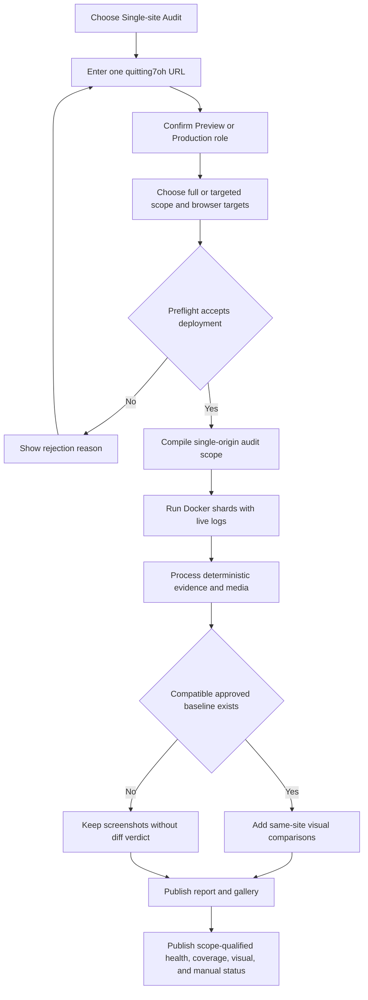
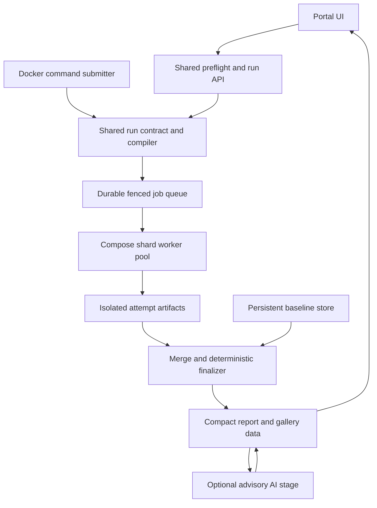
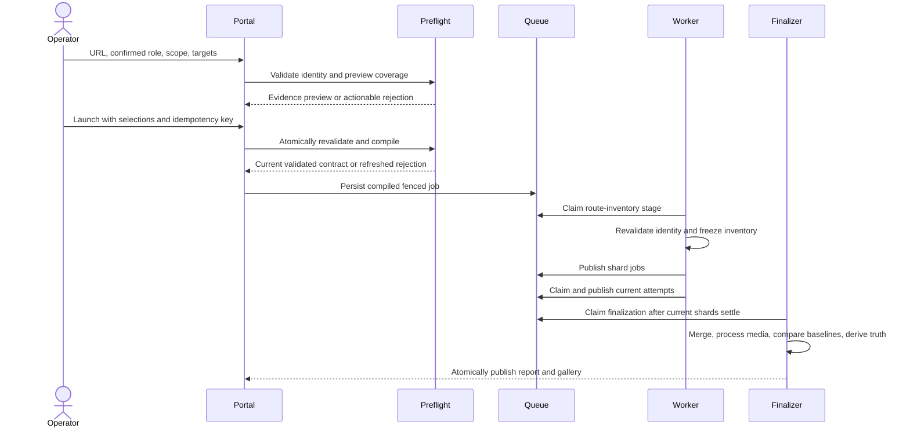
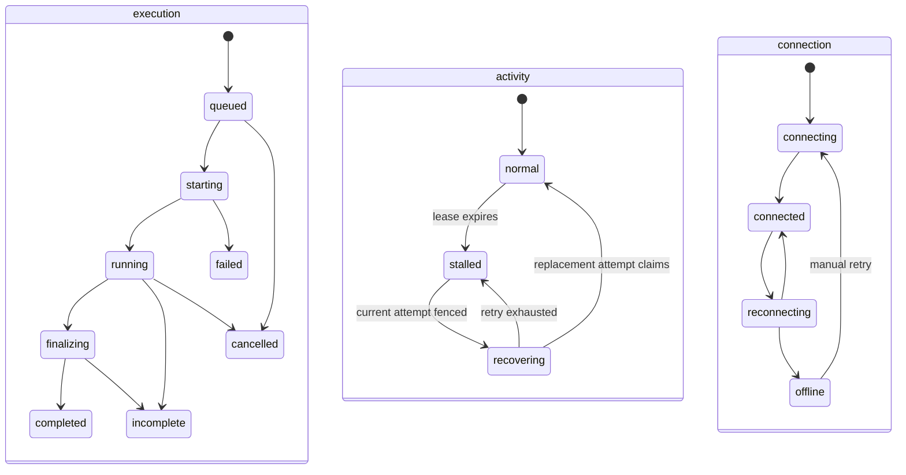
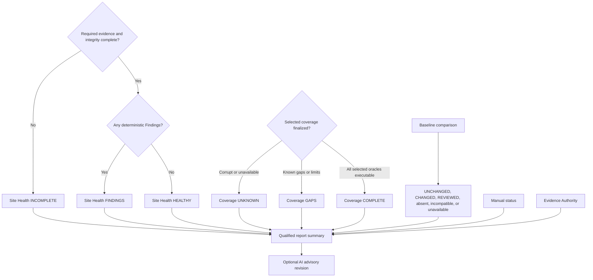

# Single-Site Audit Mode - Plan

## Goal Capsule

- **Objective:** An operator can run a complete, evidence-rich health audit against one quitting7oh deployment and receive a clear advisory verdict without supplying or comparing a second origin.
- **Means:** Add a mode-discriminated audit contract, deterministic scope compiler, and Docker worker pipeline that extend the existing evidence, portal, report, and gallery platform (KTD1, KTD2, KTD6).
- **Product authority:** This Product Contract defines the single-site operator experience and health semantics; it does not authorize or block promotion.
- **Authority hierarchy:** Product Requirements govern behavior; Key Technical Decisions govern implementation within those requirements; Implementation Units cannot override either.
- **Execution profile:** Deep software plan with Docker-first integration proof against the beta deployment.
- **Stop conditions:** Stop implementation if a change would weaken a Product Oracle, make Single-site truth release-authoritative, or require changing a session-settled Product Decision.
- **Tail ownership:** U8 owns integrated regression proof, documentation, and removal of abandoned implementation paths after U1-U7 are complete.

---

## Product Contract

### Summary

Single-site Audit mode validates one quitting7oh deployment with standalone Product Oracles, selected browser targets, complete evidence, live portal tracking, an advisory Site Health Verdict, and separate Coverage, Visual Review, and manual status. It excludes two-origin contracts before execution and can optionally compare visual evidence with an explicitly approved prior run of the same site role.

### Problem Frame

The current product is comparison-first: launch inputs, target roles, visual evidence, and release truth are organized around production and candidate origins. An operator who only wants to assess beta, production, or another quitting7oh deployment must still work around a second environment and then interpret which results matter.

That workaround can misstate coverage. Comparison-dependent contracts may be selected even though they cannot answer a single-site question, while candidate and production labels can imply release authority that the operator did not request. A trustworthy standalone run needs its own scope and verdict rather than a filtered comparative report.

### Key Decisions

- **Quitting7oh deployments only.** (session-settled: user-directed — chosen over arbitrary-site coverage: full feature validation depends on reviewed quitting7oh expectations.) Governs R2, R5, R7, R36.
- **First-class Single-site Audit mode.** (session-settled: user-directed — chosen over a filtered comparative wrapper and a separate runner: the mode needs truthful semantics without duplicating the evidence platform.) Governs R1, R6, R9, R14, R35.
- **Advisory health vocabulary.** (session-settled: user-directed — chosen over PASS/FAIL and READY/NOT_READY: site quality must remain distinct from promotion authority.) Governs R18, R19, R29, R30.
- **Operator-confirmed Deployment Role.** (session-settled: user-directed — chosen over hostname-only inference and role-neutral auditing: indexing and canonical expectations depend on intended use.) Governs R3, R4.
- **Deterministic checks plus optional same-site baselines.** (session-settled: user-directed — chosen over deterministic-only and baseline-only visual validation: the first run must remain useful while later runs can detect approved visual drift.) Governs R22-R25, R32.
- **Manual status remains separate.** (session-settled: user-directed — chosen over forcing INCOMPLETE or per-run strictness: the automated verdict should describe the automated scope.) Governs R20, R29.
- **Reviewed routes plus live discovery.** (session-settled: user-directed — chosen over either inventory alone: missing expected pages and unreviewed additions must both remain visible.) Governs R10-R13, R30, R31.
- **Explicit baseline approval.** (session-settled: user-directed — chosen over automatic or repository-only promotion: a defect must never silently become visual truth.) Governs R24-R27, R32, R33.

### Actors

- A1. **Audit operator:** Supplies the deployment, confirms its role, selects scope and browser targets, launches the run, and may approve a visual baseline.
- A2. **Evidence reviewer:** Monitors progress and evaluates the report, findings, screenshots, videos, visual diffs, logs, and outstanding manual work.
- A3. **Test author:** Maintains reviewed Product Oracles and declares which Audit Executions are valid in Single-site Audit mode.

### Requirements

**Mode and scope**

- R1. The portal and command-driven runner shall expose Single-site Audit as a first-class mode alongside comparative audit workflows.
- R2. A Single-site Audit shall accept exactly one quitting7oh deployment URL and shall not require or request a second origin.
- R3. The launch surface shall suggest Preview or Production from the URL and require the operator to confirm that Deployment Role.
- R4. Role-dependent policies shall use the confirmed Deployment Role rather than hostname inference alone.
- R5. A URL that cannot satisfy the quitting7oh deployment preflight shall be rejected before execution with a clear reason, focus the URL or Deployment Role control that can resolve it, preserve the operator's scope and browser selections, and allow preflight to be retried without creating a run.
- R6. Before execution, the platform shall compile the run from single-origin-compatible audit cases and publish a coverage manifest mapping every reviewed quitting7oh feature and Audit Definition to its selected standalone Product Oracle and planned Audit Executions. Comparison-dependent cases shall never be instantiated or skipped, and a required standalone variant that is absent shall produce a Coverage Gap rather than a product Finding.
- R7. A full Single-site Audit shall include every automated quitting7oh feature, cross-cutting, and page Audit Definition with a standalone Product Oracle.
- R8. The operator may narrow a Single-site Audit by audit area, plugin, Audit Definition, or browser target without changing its health vocabulary, but every stored and displayed result shall identify whether the eligible automated scope was FULL or TARGETED and record both selected and omitted coverage.
- R9. Browser targets shall describe browser and device coverage independently of candidate or production origin labels.

**Route coverage**

- R10. The audited page inventory shall be the union of the reviewed quitting7oh route catalog, the deployment-declared route manifest or sitemap, and routes found through bounded same-origin discovery from declared entry points.
- R11. A reviewed route that is absent or unreachable, or that should appear in the deployment's declared navigation or route manifest but does not, shall produce a Finding. An intentional bounded-discovery policy exclusion shall be retained as inventory evidence rather than treated as a site defect.
- R12. An inventoried route without a reviewed route contract shall receive generic page inspection. Observed product mismatches shall produce Findings, while the missing Product Oracle shall produce a separate Coverage Gap.
- R13. Every inventoried route shall receive applicable response, identity, structure, metadata, asset, runtime, overflow, link, accessibility, and evidence checks.

**Execution, evidence, and review**

- R14. Single-site Audit shall run asynchronously in Docker and expose useful live stage, command, request, and media-processing logs from launch through finalization under the shared lifecycle defined by R34.
- R15. Evidence policy shall continue to retain videos for interactions, screenshots for static visual states, and structured evidence for non-visual assertions.
- R16. Finalized runs shall provide the existing report, gallery, artifact access, AI advisory review, retention, and guarded purge capabilities with single-site context and the scope, coverage, manual, visual-review, and lifecycle truth defined by R29-R34.
- R17. AI review may explain or prioritize evidence but shall not change deterministic Findings or the Site Health Verdict.

**Verdict and manual work**

- R18. Site Health Verdict precedence shall be ordered: INCOMPLETE when required evidence collection or pipeline integrity cannot finish, including operator cancellation; otherwise FINDINGS when one or more Findings exist; otherwise HEALTHY. Evidence Authority qualifies that verdict independently: certificate bypass does not change the precedence result, but a non-authoritative verdict shall never be presented as an unqualified HEALTHY result.
- R19. The Site Health Verdict shall never authorize, block, or modify promotion and shall remain distinct from comparative release truth.
- R20. Outstanding manual audits shall be shown prominently in a separate manual status, co-visible with every primary Site Health summary, without changing HEALTHY or FINDINGS for the completed automated scope.
- R21. The report shall state that comparison contracts are outside the selected mode without rendering them as audit rows, skips, failures, or missing coverage.

**Visual baselines**

- R22. Deterministic visual, semantic, interaction, and accessibility assertions shall run whether or not a Same-site Visual Baseline exists.
- R23. A run without a compatible approved baseline shall remain complete and shall present its screenshots without a visual-diff verdict.
- R24. An operator may approve one visual evidence item from a completed run as a baseline with recorded approver and approval time. Compatibility shall require the same Deployment Role, route, browser target, viewport, theme, Audit Definition, and stable named visual state or capture point.
- R25. A later compatible run shall present its current image, approved baseline, visual difference, and Visual Review Status together without replacing deterministic Findings.
- R26. A baseline shall remain active until an operator explicitly replaces, revokes, or deletes it and shall never advance automatically. The portal shall distinguish active, replaced, revoked, deleted, incompatible, and absent baseline states; deletion may remove retained media but shall preserve tombstoned provenance metadata and digests.
- R27. Portal-approved Same-site Visual Baselines shall remain separate from and shall never overwrite or redefine repository-managed screenshot expectations.
- R28. New Single-site Audit launch, log, report, gallery, and baseline controls shall remain usable by keyboard, screen reader, touch, and narrow or wide screens through semantic labels, visible focus, deliberate focus placement, non-disruptive live-state announcements, accessible media descriptions, touch-sized controls, and responsive layouts.

**Scope, coverage, and lifecycle truth**

- R29. Every Site Health Verdict presentation and export shall show the audited URL, confirmed Deployment Role, FULL or TARGETED automated-scope qualifier, selected and omitted eligible coverage, Coverage Status, evidence-completion state, Evidence Authority, Finding count, and a co-visible manual-status indicator. An unqualified HEALTHY label shall never represent a targeted or non-authoritative run.
- R30. Coverage Status shall resolve independently of Site Health over the selected eligible scope: COMPLETE when every selected reviewed feature and inventoried route maps to an executable standalone Product Oracle, GAPS when one or more Coverage Gaps or explicit route-enumeration limitations exist, and UNKNOWN when the coverage manifest cannot be finalized. Operator-omitted eligible scope shall remain recorded and displayed under R8 but shall not count as a Coverage Gap. Coverage Gaps and limitations shall remain prominent but shall not be counted as product Findings or change Site Health.
- R31. The route inventory shall retain the contribution and disposition of each catalog, deployment-manifest, sitemap, navigation, and bounded-discovery source. Any route type that these sources cannot enumerate shall be recorded as an explicit coverage limitation rather than silently treated as covered.
- R32. Each compatible baseline comparison shall receive Visual Review Status UNCHANGED when no material difference is detected, CHANGED when review is required, or REVIEWED when a reviewer records a disposition. CHANGED items shall enter the evidence-review queue, while Visual Review Status remains separate from deterministic Findings, Site Health, and promotion authority.
- R33. Baseline approve, replace, revoke, and delete actions shall preview the exact evidence identity and resulting state, require confirmation, and record actor, time, source run, action, rationale, and supersession history. INCOMPLETE or non-authoritative media shall be ineligible; unresolved Findings associated with eligible evidence shall require an explicit recorded waiver before approval.
- R34. Asynchronous state shall use three independent dimensions: durable execution distinguishes queued, starting, running, finalizing, completed, failed, incomplete, and cancelled; worker activity distinguishes normal, stalled, and recovering; each live portal client connection distinguishes connecting, connected, reconnecting, and offline. Live surfaces shall preserve the latest received output, show last-event time, retry interrupted streams automatically with a visible manual retry fallback, and give report, gallery, and artifact panels explicit loading, processing, unavailable, and retry states. Lease expiry, not client-stream silence, starts worker recovery.
- R35. Every Audit Definition shall declare its Single-site Audit classification as standalone-compatible, comparison-only, or standalone-required. Comparison-only definitions shall be reported as outside the selected mode under R21, while a standalone-required definition without an executable standalone variant shall produce a Coverage Gap under R6.
- R36. Deployment preflight shall establish quitting7oh identity from fetched application-level markers rather than hostname alone; hostname may suggest defaults but shall not be sufficient proof of identity.

### Operator Flow

### Key Flows

- F1. Launch a full standalone audit
  - **Trigger:** A1 selects Single-site Audit.
  - **Actors:** A1
  - **Steps:** The operator supplies one URL, confirms its Deployment Role, accepts or changes browser targets, and launches the full eligible scope.
  - **Outcome:** The portal creates one traceable asynchronous run without requesting a comparison origin.
  - **Covers:** R1-R4, R6, R7, R9, R14
- F2. Build and execute the page inventory
  - **Trigger:** Deployment preflight succeeds.
  - **Actors:** A1, A3
  - **Steps:** The platform combines reviewed and discovered routes, identifies missing contracts or pages, and executes applicable standalone audits.
  - **Outcome:** Expected omissions and unexpected additions both produce explainable evidence.
  - **Covers:** R10-R15, R30, R31
- F3. Review site health
  - **Trigger:** Automated execution and evidence processing settle.
  - **Actors:** A1, A2
  - **Steps:** The reviewer follows live completion into the report and gallery, inspects Findings and media, and sees scope, coverage, evidence completion, and manual status together.
  - **Outcome:** The run receives one advisory, scope-qualified Site Health Verdict with separate Coverage and manual truth.
  - **Covers:** R16-R21, R29, R30, R34
- F4. Approve a visual baseline
  - **Trigger:** A2 accepts visual evidence from a completed run.
  - **Actors:** A1, A2
  - **Steps:** The operator previews one eligible evidence identity, confirms approval or waiver, and the system records its scope, provenance, and lifecycle state.
  - **Outcome:** Later matching runs may use that evidence for same-site visual comparison.
  - **Covers:** R24, R26, R27, R33
- F5. Review a run against an approved baseline
  - **Trigger:** A compatible baseline exists for captured visual evidence.
  - **Actors:** A2
  - **Steps:** The report and gallery present baseline, current image, and difference while preserving deterministic outcomes.
  - **Outcome:** Visual drift enters a review queue without turning baseline pixels into the sole Product Oracle or altering Site Health.
  - **Covers:** R22, R24, R25, R32

### Acceptance Examples

- AE1. **Beta full audit**
  - **Covers:** R1-R4, R6, R7, R9, R14-R21, R29, R30, R34
  - **Given:** The operator enters `https://beta.quitting7oh-org.pages.dev/` and confirms Preview.
  - **When:** The operator launches a full Single-site Audit across every required target in the versioned Single-site full profile.
  - **Then:** The run requests no production origin, executes only standalone-compatible audits, streams progress, and publishes a FULL advisory verdict with Coverage and manual status.
- AE2. **Production standalone audit**
  - **Covers:** R2-R4, R18-R21
  - **Given:** The operator enters the production quitting7oh URL and confirms Production.
  - **When:** The full run completes with product Findings.
  - **Then:** The report shows FINDINGS without creating candidate comparison rows or blocking promotion.
- AE3. **Missing reviewed page**
  - **Covers:** R10-R13
  - **Given:** The reviewed route catalog contains a page that the deployment no longer serves.
  - **When:** Inventory reconciliation completes.
  - **Then:** The missing page produces a Finding with its response and discovery evidence.
- AE4. **New unreviewed page**
  - **Covers:** R10, R12, R13, R30, R31
  - **Given:** The deployment exposes a same-origin route absent from the reviewed catalog.
  - **When:** Discovery finds and inspects that route.
  - **Then:** Generic page checks run, observed mismatches become Findings, the missing Product Oracle becomes a Coverage Gap, and the route's inventory sources remain visible.
- AE5. **No visual baseline**
  - **Covers:** R22, R23
  - **Given:** No compatible baseline has been approved.
  - **When:** The run captures static screenshots.
  - **Then:** The run can still resolve to HEALTHY or FINDINGS and the gallery labels the screenshots as having no approved comparison.
- AE6. **Compatible visual baseline**
  - **Covers:** R24-R27, R32, R33
  - **Given:** An operator approved eligible evidence for the same role, route, browser target, viewport, theme, Audit Definition, and named capture point.
  - **When:** A later run captures compatible evidence.
  - **Then:** The reviewer sees the approved baseline, current image, visual difference, Visual Review Status, and approval provenance; a CHANGED comparison enters the evidence-review queue.
- AE7. **Manual work outstanding**
  - **Covers:** R18, R20, R29
  - **Given:** Automated checks are healthy and physical-device acceptance remains outstanding.
  - **When:** The report finalizes.
  - **Then:** The summary shows HEALTHY for FULL automated scope and keeps the outstanding manual indicator co-visible with the verdict.
- AE8. **Evidence pipeline failure**
  - **Covers:** R18, R29, R34
  - **Given:** A required shard or media stage terminates without trustworthy final evidence.
  - **When:** The run settles.
  - **Then:** The lifecycle settles as incomplete, the Site Health Verdict is INCOMPLETE rather than HEALTHY or FINDINGS, and the latest logs and retryable surfaces remain available.
- AE9. **Rejected deployment preflight**
  - **Covers:** R5, R36
  - **Given:** The operator has entered a URL or confirmed a Deployment Role that cannot satisfy quitting7oh preflight and has already selected scope and browser targets.
  - **When:** Preflight rejects the deployment.
  - **Then:** The portal reports which fetched application-level identity evidence was absent or invalid, focuses the control that can resolve it, preserves the other selections, and permits another preflight without creating a run.
- AE10. **Targeted standalone audit**
  - **Covers:** R8, R29, R30
  - **Given:** The operator selects a subset by audit area, plugin, Audit Definition, or browser target.
  - **When:** The targeted run is compiled and launched.
  - **Then:** Only the selected standalone-compatible scope executes, Coverage Status is computed over that selected eligible scope without treating deliberate omissions as gaps, and every result surface shows exact selected and omitted scope with a TARGETED qualifier; HEALTHY is never presented as unqualified whole-site health.
- AE11. **Accessible portal operation**
  - **Covers:** R28
  - **Given:** An operator uses keyboard navigation, assistive technology, touch input, or a narrow viewport.
  - **When:** The operator configures a run, follows live progress, reviews evidence, or manages a baseline.
  - **Then:** Controls remain labeled and operable, focus and state changes are understandable, media comparisons have accessible descriptions, and the layout remains usable.
- AE12. **Orphaned deployment route**
  - **Covers:** R10-R13, R30, R31
  - **Given:** A deployed page appears in the deployment route manifest but not in the reviewed catalog or bounded navigation crawl.
  - **When:** Inventory reconciliation completes.
  - **Then:** The page still receives generic inspection, its missing Product Oracle creates a Coverage Gap, and the manifest remains recorded as its inventory source.
- AE13. **Intentional discovery exclusion**
  - **Covers:** R11, R31
  - **Given:** Bounded discovery excludes a non-page URL pattern by policy while the reviewed route remains directly auditable.
  - **When:** Inventory reconciliation completes.
  - **Then:** The exclusion is retained as inventory evidence and does not become a product Finding merely because the crawler did not follow it.
- AE14. **Baseline approval guard**
  - **Covers:** R24, R26, R33
  - **Given:** Visual evidence is non-authoritative, belongs to an INCOMPLETE run, or has an unresolved associated Finding.
  - **When:** An operator attempts to approve it.
  - **Then:** Non-authoritative or incomplete evidence is rejected, while otherwise eligible evidence with an unresolved Finding requires a confirmed rationale and recorded waiver.
- AE15. **Interrupted live stream**
  - **Covers:** R14, R16, R34
  - **Given:** A running shard continues while the portal's live log connection is interrupted.
  - **When:** The live client detects that no new event has arrived within the configured connection window.
  - **Then:** The client connection shows reconnecting or offline with last-event time, preserves existing logs, retries automatically, offers manual retry, and leaves durable execution and worker activity unchanged unless their own persisted evidence changes.

### Scope Boundaries

**Outside this feature**

- Arbitrary non-quitting7oh websites and AI-invented Product Oracles
- Beta-versus-production comparison, migration mapping, and content parity
- Promotion authorization or deployment gating from the Site Health Verdict
- Automatic visual-baseline promotion
- Replacing repository-managed screenshot baselines
- Adding new browser providers, real-device integrations, or manual-test automation

### Dependencies

- Existing Docker, evidence, reporting, gallery, logging, AI review, and purge mechanisms can be extended for another audit mode, but mode-neutral reuse may require adaptation.
- Each automated audit case can be classified as standalone-compatible, comparison-only, or in need of a standalone variant without weakening its Product Oracle.
- Existing sitemap parsing and per-page link inspection can inform deployment-declared inventory and route discovery, while multi-source union inventory, source attribution, explicit coverage limitations, and bounded same-origin crawl behavior are new product work.
- The proving beta deployment remains reachable from the pinned Docker testing environment under the configured TLS policy.

### Sources and Research

- `README.md` — current product surface, Docker execution, portal, report, gallery, AI review, and purge behavior
- `audit/types.ts` and `audit/targets.ts` — current environment, applicability, evidence, manual, and target vocabulary
- `audit/catalog.ts` — standalone and comparison-dependent Audit Definitions
- `plugins/platform-routes-content/plugin.json` — shared plugin registration for migration and parity contracts
- `tests/page-audit.spec.ts` and `tests/contracts.spec.ts` — reviewed page checks, link inspection, and sitemap inventory behavior
- `tests/visual-regression.spec.ts` — current production-reference artifacts and repository-managed screenshot expectations
- `reporters/report-model.ts` and `scripts/lib/release-truth.mjs` — current comparative release truth and manual-status handling
- `portal/server.mjs` and `portal/release-eligibility.mjs` — current launch inputs, reports, logs, artifacts, and release authority boundaries
- `docs/solutions/best-practices/trustworthy-comparative-visual-release-audits.md` — observation/oracle separation, applicability-before-execution, truth separation, and mutation-canary requirements

---

## Planning Contract

The Product Contract above is preserved from the reviewed brainstorm. Planning resolved its five technical questions without changing the requirements: targets remain additive, baselines live outside run storage, route discovery is bounded and source-attributed, worker leases reuse the existing heartbeat policy, and preflight uses independently reviewed application markers.

### Key Technical Decisions

- KTD1. **Use one discriminated run contract.** Add `comparative` and `single-site` branches with explicit URL, Deployment Role, scope qualifier, and target selection; missing `mode` on stored legacy manifests means `comparative-legacy`. This instantiates R1, R4, R8, R9, R19, and R29 without renaming comparative fields or target IDs. (session-settled: user-directed — chosen over a filtered comparative wrapper and a separate product: shared infrastructure must keep mode-specific truth explicit.)
- KTD2. **Compile applicability at definition and executable-case levels.** Definition metadata owns R35 classification, while each executable case declares supported modes and an independent Product Oracle variant. The compiler emits an immutable Definition Coverage Manifest before work is queued, and the route stage later freezes a Route Inventory Manifest before browser shards start. This prevents an audit such as `CONTENT-002` from losing a valid standalone case merely because the same Audit Definition also owns a paired case.
- KTD3. **Revalidate preflight atomically at launch and bind evidence to one deployment revision.** The preview endpoint is side-effect free and returns evidence plus a timestamp, not an execution capability. Launch repeats the shared identity checks and compiles the selected scope under one idempotency key before creating the durable job; if the deployment, role evidence, registry revision, target set, or runner revision changed, launch creates no run and returns a refreshed actionable preview. The Docker command adapter performs the same preflight-and-compile transaction in one process without calling or scraping the portal. The job separates stable reviewed identity markers from a deployment-revision fingerprint derived from an explicit build identifier or reviewed asset-manifest and validator evidence. Each shard and the finalizer recheck both; identity or revision change fences remaining work and settles INCOMPLETE, while an origin that exposes no usable revision evidence starts with a visible non-authoritative Evidence Authority limitation.
- KTD4. **Inventory routes with bounded adapters and explicit limitations.** The inventory stage combines the reviewed catalog, discovered sitemap or manifest adapters, rendered navigation, and a same-origin crawler. Initial ceilings are 500 normalized HTML routes, depth four, eight concurrent fetches, 50 MiB total HTML, and 60 seconds; U2's live beta probe may lower the route ceiling or raise the byte/time budget before these values are frozen, but no configured secondary bound may routinely preempt the declared route ceiling. It strips fragments, bounds query variants, refuses credentialed, private, link-local, non-HTTP, download, logout, form-submit, and API paths, and records every exclusion, response, redirect, failed source, and exhausted bound.
- KTD5. **Add neutral Single-site target IDs.** Target templates keep browser, device, viewport, fidelity, and provider facts while the run context binds the one origin. Existing production/candidate target IDs and screenshot names remain unchanged. Intent-level helpers replace candidate-only skips where the same case is valid in both modes. (session-settled: user-directed — chosen over origin-prefixed standalone targets: browser and device coverage must not imply a comparison role.)
- KTD6. **Use a predeclared Compose worker pool, never a portal Docker socket.** The portal and command submitter publish validated jobs to a dedicated Docker local volume. Claims use atomic directory creation for per-job locks plus fsynced temporary-file rename for state publication; unsupported network-volume semantics fail startup. Long-lived shard workers and one finalizer claim jobs with a lease, attempt ID, and monotonically increasing fencing token. A stale attempt cannot publish into the current run. Infrastructure loss gets one isolated retry; assertion failures are completed evidence and are never retried by the queue. Start with one worker and benchmark the beta full run; enable additional replicas only when they improve wall-clock time without degrading evidence integrity. This fenced pool is the intended eventual execution path for both modes, while comparative migration is explicit follow-on work outside this plan and its existing runner remains supported meanwhile.
- KTD7. **Keep health truth separate from release truth.** A strict Single-site truth module owns Site Health, Coverage, Visual Review, manual, Evidence Authority, and Pipeline Integrity. Mode-discriminated readers reject Single-site documents as comparative release evidence, and the existing release parser and eligibility logic remain unchanged for comparative runs.
- KTD8. **Extend compact immutable report and gallery publication.** Summary documents stay small, audit and evidence details remain paginated and abortable, and cursors carry content, order, flag, and baseline revisions. Every read surface serializes the same mode and truth fields through a shared public contract; no UI reconstructs verdicts from presentation strings.
- KTD9. **Materialize approved baseline bytes outside run artifacts.** Approval copies and verifies one image into a dedicated persistent baseline volume before compare-and-swap activation. The identity uses R24 fields plus a rendering-contract fingerprint for browser build, device-pixel ratio, capture-contract revision, runner image, and font pack. A mismatch is incompatible, not CHANGED. An environment-change workflow groups fingerprint-only incompatibilities, publishes calibration evidence, and guides item-by-item reapproval without erasing provenance. Replacement, revocation, and deletion append history, prior reports retain the exact revision used, and purging the source run cannot delete copied active baseline bytes.
- KTD10. **Publish deterministic truth before optional AI.** Final report and gallery truth complete without Anthropic. AI receives a bounded mode-aware evidence packet afterward and publishes a separately versioned advisory artifact. Model failure, timeout, or missing credentials cannot delay or change Site Health, Coverage, Visual Review, manual, baseline, or release state. Baseline actions, waivers, visual dispositions, manual attestations, credential changes, and purge remain human-only operator mutations.
- KTD11. **Separate execution, activity, and live-client connection state.** Durable execution uses queued, starting, running, finalizing, completed, failed, incomplete, and cancelled. Worker activity uses normal, stalled, and recovering. Each live portal client session independently uses connecting, connected, reconnecting, and offline. Heartbeats run independently of browser, merge, and media work. Five-second heartbeat and 30-second lease values are initial configurable defaults; a maximum-load Docker fixture must show zero false fencing and the final lease must be at least four times the observed p99 heartbeat delay. Lease expiry, not SSE silence, starts recovery.
- KTD12. **Keep corporate trust and development bypass role-aware.** Netskope CA installation and pinned Chromium trust remain the default. A certificate-error bypass may be selected only when the operator confirms Preview and the exact normalized origin appears in an operator-controlled Preview bypass allowlist. The exception is recorded in every Evidence Authority summary and makes the otherwise normally derived Site Health Verdict non-authoritative; Production and comparative production remain strict.

### High-Level Technical Design

**Component topology**

**Launch and execution sequence**

**Independent state dimensions**

**Truth derivation**

### Implementation Constraints and Defaults

- A selected scope that compiles to zero executable cases is rejected before run creation with comparison-only, unsupported-target, and missing-variant reasons.
- FULL resolves only when every definition, executable case, and required target in the versioned Single-site full profile is selected; any omission makes the run TARGETED. Optional provider targets outside that profile do not change the qualifier. Generic inspection for an unreviewed route runs on one declared canonical target per run, while reviewed route contracts use their declared target matrix; routes dropped by the 500-route ceiling remain explicit R31 limitations rather than silent omissions.
- Full runs execute route inventory before shards. A targeted run that omits route coverage does not crawl and records the omission without creating a Coverage Gap.
- Known inventory limitations resolve Coverage to GAPS. Compiler or publication corruption resolves Coverage to UNKNOWN. Failure of required full-run inventory evidence resolves Site Health to INCOMPLETE.
- Every outbound Single-site fetch, including identity probes, manifests, sitemaps, discovery, redirects, and retries, uses one origin-bound URL-safety policy: HTTP(S) only, no userinfo, permitted ports only, DNS resolution checked at every hop against loopback, private, link-local, and metadata ranges, and no cross-origin redirects. Preview certificate bypass is permitted only for the exact confirmed origin under KTD12 and never relaxes address or redirect checks.
- Every route, title, metadata value, Finding, and log string sourced from the audited deployment is serialized and rendered as inert text; it is never interpreted as HTML or interpolated into an unsafe URL scheme.
- The baseline comparator starts from the repository's existing 0.0025 maximum differing-pixel ratio through direct `pixelmatch` and `pngjs` dependencies, then freezes a versioned policy only after a calibration corpus shows zero known-defect misses across typography, spacing, clipping, contrast, missing-element, theme, and expected rendering-noise examples. Every comparison records that policy revision. Baseline storage unavailability leaves deterministic health intact and reports visual comparison as unavailable.
- Baseline approval, replacement, revocation, deletion, and run purge share a mutation lock, revision precondition, and idempotency key. A copied active baseline survives source-run purge, while the purge confirmation discloses that copied media remains and its provenance link becomes unavailable. Revoked and replaced bytes are retained for 30 days by default, then deleted by guarded garbage collection while append-only metadata and digests remain; an operator may invoke earlier guarded baseline-media deletion.
- The deterministic finalizer completes the run before optional AI begins. AI has its own pending, completed, failed, or unavailable state and can publish a later report revision.
- Portal, API, and command adapters call the same validators and compiler. The command adapter never scrapes or drives the portal.
- Preflight and run launch require an authenticated operator. Every mutation derives actor identity from the server-side session, enforces same-origin and CSRF checks plus operation-specific authorization, rejects client-supplied actor labels, and uses a dedicated service identity for authorized command-path mutations. Shared-access viewers cannot invoke preflight, launch, stop, credentials, baselines, visual dispositions, manual evidence, or purge.
- AI review is per-run opt-in. Before Anthropic egress, an allowlist strips credentials, authorization headers, secret-bearing query values, personal data, and unapproved media; the portal records the sanitized payload inventory, and a failed sensitivity check excludes the item rather than weakening redaction.
- During execution, lifecycle is the primary status; after finalization, scope-qualified Site Health is primary. Coverage, manual status, Visual Review, Evidence Authority, and Pipeline Integrity remain co-visible secondary dimensions, while a client reconnect banner never overwrites durable execution or worker activity.
- Legacy manifests are read without mutation. Missing `mode` is interpreted only as comparative legacy data.

### Sequencing

1. Establish shared contracts, catalog metadata, and neutral targets in U1.
2. Build identity preflight, route inventory, and deterministic scope compilation in U2.
3. In parallel, build U3's representative execution adapter plus audit-family migrations and U4's synthetic fenced queue. Connect Playwright after the adapter contract and queue recovery fixtures are both green.
4. Demonstrate an interim beta job that compiles scope, executes one representative shard, and publishes raw evidence plus lifecycle records before report and baseline work proceeds.
5. Derive and publish Single-site truth through the compact report model in U5 while U3 finishes the remaining audit-family migration.
6. Build U6 baseline storage/comparison in parallel with U7's launch, lifecycle, report, and gallery shell; connect U7 baseline mutations only after U6's transaction tests pass.
7. Add mode-aware AI, documentation, live beta proof, and comparative regression proof in U8.

### System-Wide Impact

- **Operators and reviewers:** Gain a one-origin launch path and clearer truth, but must confirm Deployment Role and retain control of destructive or trust-changing actions.
- **Test authors:** Must declare mode and Product Oracle metadata for every executable case; registry validation prevents silent omissions.
- **Operations:** Single-site run capacity moves from a portal child process to a durable Compose worker pool with visible queue and lease state. Comparative execution stays on its existing path in this plan and is an explicit follow-on migration to the same pool. No service receives the host Docker socket.
- **Stored evidence:** New manifests are mode-discriminated and baseline media has an independent lifecycle. Legacy comparative runs remain readable.
- **Security and privacy:** Workers cannot read the Anthropic vault. Public shared-access views remain read-only, logs remain redacted and byte-bounded, and AI has no mutation capability.

### Risks and Mitigations

- **Stale workers overwrite recovered work:** Fencing tokens and isolated attempt directories make stale publication invalid.
- **A copied wrong site passes preflight:** Multiple independently reviewed application markers and worker-start revalidation reduce false identity; hostname alone never passes.
- **Runtime discovery creates unbounded work:** Hard route, depth, byte, concurrency, and time limits fail visibly into coverage limitations.
- **Single-site semantics leak into release gating:** Discriminated readers, parser rejection, and comparative regression fixtures keep release truth isolated.
- **Baseline approval launders a defect:** Eligibility checks, explicit waiver rationale, copied-byte integrity, human confirmation, and append-only history prevent silent promotion.
- **Large evidence overwhelms the browser:** Immutable summaries, paginated details, bounded logs, cursor revisions, abortable requests, and loading/error states preserve responsiveness.
- **Optional AI becomes operationally blocking:** Deterministic publication precedes AI and the advisory state settles independently.

### Alternative Approaches Considered

- **Filter the existing comparative report after execution:** Rejected because skipped paired cases would masquerade as coverage and release vocabulary would remain authoritative-looking.
- **Mount the host Docker socket into the portal:** Rejected because it grants the web-facing container host-level orchestration authority and is not portable across Docker runtimes.
- **Keep only source-run paths as baselines:** Rejected because guarded purge would destroy active comparison truth.
- **Load one complete evidence document in the report:** Rejected because existing bounded publication already solves browser overload and should remain the platform contract.

---

## Implementation Units

### U1. Establish run, catalog, target, and TLS contracts

- **Goal:** Make mode, role, scope, target, executable-case applicability, and evidence authority explicit before any runtime behavior branches.
- **Requirements:** R1, R4, R6, R8, R9, R19, R21, R29, R35; KTD1, KTD2, KTD5, KTD12.
- **Dependencies:** None.
- **Files:** `audit/types.ts`, `audit/definitions.ts`, `audit/catalog.ts`, `audit/plugins.ts`, `audit/targets.ts`, `audit/environments.ts`, `audit/evidence-policy.ts`, `audit/tls.ts`, `fixtures/test.ts`, `playwright.config.ts`, `shared/target-applicability.mjs`, `shared/target-applicability.d.mts`, shared/run-contract.mjs (create), shared/run-contract.d.mts (create), `plugins/*/plugin.json`, `audit/plugins.generated.json`, `audit/targets.generated.json`, `scripts/validate-plugins.ts`, `scripts/validate-plugin-metadata.ts`, `scripts/validate-targets.ts`, `scripts/target-registry-self-test.ts`, `scripts/evidence-policy-self-test.ts`, scripts/run-context-self-test.mjs (create).
- **Approach:**
  1. Add the discriminated persisted and runtime contracts from KTD1 without changing legacy comparative IDs or fields.
  2. Extend plugin generation so each definition and executable case carries KTD2 metadata and a named Product Oracle variant.
  3. Generate neutral Single-site targets from existing target templates and bind their origin through the run contract.
  4. Centralize KTD12 evidence-authority policy so reports and tests cannot disagree about certificate bypass.
- **Patterns to follow:** Generated registry validation in `audit/plugins.ts`; target validation in `audit/targets.ts`; evidence annotation in `fixtures/test.ts`; strict environment parsing in `audit/tls.ts`.
- **Test scenarios:**
  - Parse valid comparative, legacy comparative, full Single-site, and targeted Single-site contexts into distinct branches.
  - Reject mixed one-origin and production/candidate fields, unknown modes, duplicate target IDs, and role-incompatible TLS bypass.
  - Fail registry validation when a definition lacks R35 classification or an executable case lacks supported-mode or Product Oracle metadata.
  - Retain a standalone `CONTENT-002` case while excluding its paired visual case for Single-site compilation metadata.
  - Resolve every existing comparative target and screenshot name unchanged, while neutral targets expose the same browser/device facts without an origin prefix.
- **Verification:** Generated plugin and target registries are deterministic; type checking passes; existing comparative metadata fixtures remain byte-compatible where no new field is required.

### U2. Build identity preflight, route inventory, and coverage compilation

- **Goal:** Turn one URL and confirmed role into a trustworthy, source-attributed, executable Single-site plan before browser assertions run.
- **Requirements:** R2-R7, R10-R13, R30, R31, R36; KTD2-KTD4.
- **Dependencies:** U1.
- **Files:** `audit/routes.ts`, `audit/page-audit-family.ts`, shared/outbound-url-policy.mjs (create), shared/outbound-url-policy.d.mts (create), shared/site-preflight.mjs (create), shared/site-preflight.d.mts (create), shared/route-inventory.mjs (create), shared/route-inventory.d.mts (create), shared/run-compiler.mjs (create), shared/run-compiler.d.mts (create), scripts/site-preflight-self-test.mjs (create), scripts/route-inventory-self-test.mjs (create), scripts/run-compiler-self-test.mjs (create), `portal/server.mjs`, `portal/tests/portal.spec.ts`.
- **Approach:**
  1. Apply the shared outbound URL and DNS policy to every hop, then probe the root page, its same-origin web manifest, and a reviewed sentinel route against independent constants; record response codes, rejected redirects, resolved destinations, and failed markers.
  2. Return a side-effect-free preview, then repeat preflight and compilation atomically at launch under the idempotency key; re-run the identity contract again at worker start.
  3. Compile the frozen Definition Coverage Manifest from selected definitions, cases, targets, omissions, exclusions, and gaps.
  4. Run KTD4 adapters as the first execution stage, freeze the Route Inventory Manifest, and generate generic inspection inputs only for unreviewed routes.
- **Execution note:** Start with failing compiler and inventory fixtures for comparison-only exclusion, missing standalone variants, and bounded crawl exhaustion. Before freezing identity constants or crawl defaults, run a read-only Docker probe against beta and record actual markers, build-revision evidence, sitemap/manifest availability, route count, response sizes, and crawl time.
- **Patterns to follow:** Exact route contracts in `audit/routes.ts`; sitemap parsing in `tests/helpers.ts`; applicability generation in `audit/page-audit-family.ts`; portal validation errors in `portal/server.mjs`.
- **Test scenarios:**
  - Covers AE9. Reject a syntactically valid non-quitting7oh origin, return marker-level evidence and focus target, preserve selections, and create no run.
  - Accept the beta origin as Preview only after explicit role confirmation; when identity evidence or registry inputs change between preview and launch, create no run and return a refreshed preview while preserving selections.
  - Reject credentialed URLs, disallowed ports, cross-origin redirects, public-to-private redirects, DNS rebinding to a private or metadata address, and a Preview bypass request whose confirmed role or exact-origin allowlist entry is ineligible.
  - Return the original run contract for a duplicate idempotent launch and reject a duplicate key bound to different inputs.
  - Covers AE10. Compile a targeted selection with deliberate omissions, no comparison-only rows, and Coverage computed only over selected eligible scope.
  - Reject a selection with zero executable cases and list comparison-only, unsupported-target, and missing-variant causes.
  - Covers AE3 and AE12. Reconcile a missing reviewed page and an orphan manifest page with distinct Finding and Coverage Gap outcomes.
  - Covers AE4. Inspect a newly discovered route generically and retain every source that contributed it.
  - Covers AE13. Record excluded assets, queries, APIs, redirects, and an exhausted bound as inventory evidence without manufacturing a Finding.
  - Record distinct stable identity and deployment-revision fingerprints; report a missing revision signal as non-authoritative and reject a changed revision at a later execution checkpoint as INCOMPLETE.
  - Resolve failed required inventory in a full run to Coverage UNKNOWN and Site Health INCOMPLETE; resolve known enumeration limitations to Coverage GAPS.
- **Verification:** Preflight is side-effect free; compiler output is deterministic for the same registry revision; every route has source and disposition; no observed DOM value becomes its own expected oracle.

### U3. Adapt the audit suite and plugins to compiled Single-site execution

- **Goal:** Execute all worthwhile standalone quitting7oh assertions without paired-origin skips, tautological expectations, or irrelevant videos.
- **Requirements:** R6, R7, R9, R13, R15, R22, R27, R35; KTD2, KTD5, KTD12.
- **Dependencies:** U1, U2.
- **Files:** `fixtures/test.ts`, `tests/helpers.ts`, `tests/accessibility.spec.ts`, `tests/calculators.spec.ts`, `tests/content-system.spec.ts`, `tests/contracts.spec.ts`, `tests/meetings.spec.ts`, `tests/navigation.spec.ts`, `tests/page-audit.spec.ts`, `tests/performance.spec.ts`, `tests/search.spec.ts`, `tests/shell-content.spec.ts`, `tests/smoke.spec.ts`, `tests/sows.spec.ts`, `tests/theme-responsive.spec.ts`, `tests/visual-regression.spec.ts`, `plugins/platform-routes-content/tests/runtime.spec.ts`, `plugins/_template/tests/starter.spec.ts`, `scripts/assertion-quality-self-test.ts`, `scripts/evidence-policy-self-test.ts`, `scripts/runtime-expectation-self-test.ts`, `scripts/generate-assertion-ledger.ts`, `docs/ASSERTION_LEDGER.md`.
- **Approach:**
  1. Track A first adapts the fixture, case filter, one reviewed route case, and one interaction case as the stable execution interface that unblocks U4.
  2. Track B migrates the remaining audit families in parallel with U4, replacing environment-name conditionals with intent-level helpers while leaving explicit comparative mappings in the comparative branch.
  3. Select tests from the compiler's exact case filter and inventory artifacts rather than broad audit-ID grep plus runtime skip.
  4. Keep screenshot, video, and structured attachment policy tied to semantic action and response under R15.
  5. Extend mutation canaries so plausible wrong pages, partial inventories, wrong destinations, missing oracles, and self-derived expectations remain red.
- **Execution note:** Add characterization coverage around every comparison-dependent case before changing its applicability.
- **Patterns to follow:** Observation-then-oracle issue collection in `tests/page-audit.spec.ts`; exact not-found and search contracts in `tests/contracts.spec.ts` and `tests/search.spec.ts`; evidence-before-assertion ordering in `fixtures/test.ts`.
- **Test scenarios:**
  - Run every standalone-compatible case for one neutral Chromium target without requesting a second origin or emitting comparison skips.
  - Prove paired migration, parity, and production/candidate visual cases are absent from Single-site enumeration but unchanged in comparative enumeration.
  - Generate generic route cases from the frozen inventory while reviewed routes retain exact route-specific Product Oracles.
  - Reject a self-canonical generic shell, exact-title empty article, incomplete category, wrong link destination, and incomplete sitemap.
  - Record video only for an action-response sequence and screenshots for static visual assertions; reject white, too-short, unrelated, or non-authoritative video evidence under the existing media policy.
  - Preserve Netskope trust by default and mark Preview certificate bypass evidence non-authoritative.
- **Verification:** Assertion ledger generation succeeds; every automated Single-site execution has an independent Product Oracle; comparison-only cases produce no skip rows; media policy self-tests prove evidence relevance.

### U4. Add the fenced Docker queue, shard workers, and deterministic finalizer

- **Goal:** Let portal and command launches run asynchronously across portable Docker containers with recoverable, observable execution.
- **Requirements:** R1, R2, R6-R9, R14, R18, R29-R31, R34; KTD3, KTD6, KTD11.
- **Dependencies:** U1, U2, and U3 Track A; U3 Track B proceeds in parallel behind the same execution interface.
- **Files:** `docker-compose.yml`, `Dockerfile`, `docker/entrypoint.sh`, `package.json`, scripts/run-single-site.mjs (create), scripts/run-single-site-worker.mjs (create), scripts/finalize-single-site.mjs (create), scripts/lib/job-queue.mjs (create), `scripts/lib/sharded-defaults.mjs`, `scripts/lib/sharded-evidence.mjs`, `scripts/lib/pipeline-diagnostics.mjs`, `scripts/lib/merge-stage-integrity.mjs`, `scripts/run-playwright-shard.mjs`, `scripts/process-videos.ts`, `portal/server.mjs`, `portal/runner-isolation.mjs`, scripts/single-site-queue-self-test.mjs (create), `scripts/sharded-isolation-self-test.mjs`, `scripts/merge-stage-integrity-self-test.mjs`, `scripts/docker-entrypoint-identity-self-test.sh`.
- **Approach:**
  1. Add dedicated job and baseline volumes, a fixed scalable shard-worker service, and one finalizer service; neither receives the portal credential volume or host Docker socket.
  2. Publish schema-validated atomic job envelopes containing the compiled manifest digest, current identity/preflight digest, current attempt, fence token, and per-stage deadlines; no bearer credential or secret enters an envelope or log.
  3. Fence all checkpoints and artifact publication, isolate retry attempts, and merge only the current terminal attempt for every required shard.
  4. Preserve structured commands, request outcomes, FFmpeg/media commands, stage timing, response codes, heartbeats, last activity, signals, and exit diagnostics in bounded logs and lifecycle data.
- **Execution note:** Prove lease expiry and stale-worker rejection with deterministic synthetic workers before connecting Playwright.
- **Patterns to follow:** Heartbeat and lease documents in `scripts/run-sharded-release.mjs`; stale-blob rejection in `scripts/merge-sharded-release.mjs`; artifact containment and identity separation in `portal/runner-isolation.mjs`.
- **Test scenarios:**
  - Covers AE1. Submit a full beta job from the portal and command adapter and produce identical compiled scope and queued lifecycle.
  - Begin with one worker, record wall-clock duration, CPU/memory, artifact size, and integrity failures, then repeat with additional replicas; keep the higher default only when it materially improves duration without evidence loss.
  - Claim different shards from separate workers, publish current attempts, and finalize only after all required current attempts settle.
  - Race concurrent workers against the same job on the supported Docker local volume and prove exactly one claim and one monotonically advancing fencing token; reject unsupported volume semantics at startup.
  - Recheck deployment identity and revision before every shard and final publication; fence a simulated mid-run redeploy and settle INCOMPLETE without mixing evidence.
  - Expire a worker lease, fence its late output, recover once in a new attempt directory, and settle INCOMPLETE after retry exhaustion.
  - At maximum declared worker, shard, and media concurrency, measure heartbeat p99, prove the independent heartbeat continues through long browser/media work, and observe zero false fencing at the derived lease.
  - Treat Playwright exit 1 with fresh evidence as completed Findings; treat a signal, explicit command error, stale evidence, or exit outside 0/1 as pipeline failure.
  - Stop or cancel queued and active work without accepting later stale publication.
  - An operator-cancelled run settles Site Health INCOMPLETE with cancellation reason, retains bounded settled evidence, and is ineligible as a baseline source.
  - Covers AE8. Fail a required media, comparison, merge, or report stage and retain logs while publishing INCOMPLETE.
  - Covers AE15. Disconnect the portal stream while workers continue, retain execution truth, and replay from the latest bounded event cursor.
- **Verification:** A portal container launches multi-container work without Docker socket access; job recovery is idempotent across process restart; the beta smoke job produces sealed deterministic artifacts and complete lifecycle records.

### U5. Derive Single-site truth and publish compact reports

- **Goal:** Produce one scope-qualified advisory health result with independent coverage, evidence, visual, and manual truth while preserving comparative release authority.
- **Requirements:** R16, R18-R21, R29-R32, R34; KTD7, KTD8, KTD10, KTD11.
- **Dependencies:** U3, U4.
- **Files:** scripts/lib/site-health.mjs (create), scripts/lib/site-health.d.mts (create), `scripts/lib/release-truth.mjs`, `reporters/report-model.ts`, `reporters/checklist-reporter.ts`, `scripts/rebuild-report.ts`, `scripts/lib/portal-e2e-output.mjs`, `portal/report-publication.mjs`, `portal/release-eligibility.mjs`, `portal/server.mjs`, `portal/public/report.html`, `portal/public/report.js`, `reporters/assets/report.js`, scripts/site-health-self-test.mjs (create), `scripts/release-truth-self-test.mjs`, `scripts/report-audit-id-self-test.ts`, `portal/tests/portal.spec.ts`.
- **Approach:**
  1. Parse and derive KTD7 truth from frozen coverage, route inventory, current shard evidence, and required-stage integrity.
  2. Branch report construction by run mode; never route Single-site data through candidate gating or production baseline logic.
  3. Extend compact summary, paginated audit, and bounded detail documents under KTD8 and publish them atomically before optional AI.
  4. Keep manual status and comparison exclusions visible through shared serialized fields rather than generated placeholder audit rows.
- **Patterns to follow:** Strict checklist parsing in `scripts/lib/release-truth.mjs`; bounded report publication in `portal/report-publication.mjs`; paged detail loading in `portal/public/report.js`.
- **Test scenarios:**
  - Covers AE2. Produce FINDINGS for a Production-role Single-site run without candidate rows, release decision, or promotion effect.
  - Produce INCOMPLETE before FINDINGS when required trustworthy evidence is absent, and HEALTHY only when required evidence is complete with no Findings.
  - Derive the same HEALTHY or FINDINGS precedence under Preview certificate bypass while publishing Evidence Authority as non-authoritative and never rendering an unqualified HEALTHY label.
  - Set Coverage UNKNOWN and Site Health INCOMPLETE when compiler or publication corruption prevents trustworthy scope accounting; set an operator-cancelled run to INCOMPLETE with its cancellation reason.
  - Covers AE7. Keep HEALTHY with an outstanding manual indicator co-visible on every primary summary.
  - Covers AE10. Show TARGETED, selected and omitted scope, Coverage Status, evidence state, Evidence Authority, Finding count, and manual status on every verdict presentation and export.
  - Reject a Single-site checklist passed to the comparative release parser; read old mode-less comparative manifests as comparative legacy without rewriting them.
  - Page a reference-scale report without loading a monolithic evidence payload; abort stale detail requests and expose loading, retry, and unavailable states.
- **Verification:** Site Health and comparative release self-tests both pass; every serialized verdict surface uses the shared truth contract; comparative READY/NOT_READY fixtures remain unchanged.

### U6. Add persistent baselines, post-test visual comparison, and gallery revisions

- **Goal:** Support explicit same-site visual drift review without making baselines product truth or tying them to purgeable runs.
- **Requirements:** R22-R27, R32, R33; KTD8-KTD10.
- **Dependencies:** U1, U4, U5.
- **Files:** `package.json`, `package-lock.json`, `shared/gallery-contract.mjs`, `shared/gallery-contract.d.mts`, shared/visual-baseline-contract.mjs (create), shared/visual-baseline-contract.d.mts (create), audit/visual-policy.ts (create), `fixtures/test.ts`, portal/visual-baselines.mjs (create), `portal/gallery-data.mjs`, `portal/server.mjs`, `reporters/gallery-model.ts`, `reporters/live-gallery-reporter.ts`, scripts/compare-visual-baselines.ts (create), `scripts/gallery-publish.mjs`, `scripts/lib/video-manifest-history.ts`, `portal/public/gallery-core.js`, `portal/public/gallery.js`, `portal/public/gallery.html`, scripts/visual-baseline-self-test.mjs (create), `scripts/gallery-catalog-self-test.ts`, `scripts/gallery-state-self-test.mjs`, `scripts/gallery-retention-self-test.mjs`, `portal/tests/gallery.spec.ts`.
- **Approach:**
  1. Add exact theme, capture point, identity, rendering fingerprint, and baseline revision fields to visual evidence.
  2. Add direct `pixelmatch` and `pngjs` dependencies, a versioned visual calibration corpus, and a zero-known-defect-miss policy gate; then implement preview, eligibility, copied-byte verification, compare-and-swap activation, replacement, revocation, guarded media deletion, retention, and append-only history in the independent baseline store.
  3. Run baseline matching and immutable diff generation after media processing and before deterministic report publication.
  4. Add baseline revision to gallery head, cursors, deltas, and historical comparison records so later mutations do not rewrite old evidence.
- **Execution note:** Implement identity, eligibility, and transactional mutation tests before adding the portal controls.
- **Patterns to follow:** Gallery flag mutation locks and idempotency in `scripts/gallery-flags.mjs`; containment in `portal/safe-artifact-open.mjs`; immutable gallery revisions in `portal/gallery-data.mjs`.
- **Test scenarios:**
  - Covers AE5. Complete a deterministic run with no baseline and show current screenshots with an absent comparison state.
  - Covers AE6. Match an exact compatible revision, generate baseline/current/diff artifacts, classify material change, and queue CHANGED for review.
  - Detect injected typography, spacing, clipping, contrast, missing-element, and theme defects while classifying the reviewed unchanged/noise corpus correctly; record the comparator policy revision.
  - Mark a changed item REVIEWED with a human disposition without altering Site Health or deterministic Findings.
  - Treat role, route, target, viewport, theme, audit, capture point, or rendering fingerprint mismatch as incompatible.
  - Group fingerprint-only incompatibilities as environment changes, show calibration evidence, and guide item-by-item reapproval from the newest eligible run without hiding prior provenance.
  - Covers AE14. Reject incomplete or non-authoritative evidence and require an explicit waiver for an eligible item with an unresolved Finding.
  - Race two approvals with the same expected revision; activate one and reject the stale mutation without losing copied bytes or history.
  - Purge a source run while retaining copied active baseline bytes and prior comparison provenance; prevent purge during an in-flight baseline mutation; expire revoked/replaced bytes after the configured retention window while retaining tombstoned metadata and digests.
  - Fail baseline storage or image decoding visibly without changing completed deterministic Site Health.
- **Verification:** Baseline history is append-only and containment-safe; purge cannot remove an active copied baseline; gallery pagination remains stable across baseline revision changes.

### U7. Complete the accessible portal launch, lifecycle, report, and baseline workflows

- **Goal:** Make every Single-site operation understandable and responsive from run setup through review and guarded cleanup.
- **Requirements:** R1, R3, R5, R8, R14, R16, R20, R28, R29, R32-R34; KTD3, KTD8-KTD11.
- **Dependencies:** Launch and lifecycle shell: U2 and U4; report review: U5; baseline and visual mutation controls: U6. These tracks may proceed in parallel behind the shared public contracts.
- **Files:** `portal/public/index.html`, `portal/public/app.js`, `portal/public/styles.css`, `portal/public/report.html`, `portal/public/report.js`, `portal/public/report.css`, `portal/public/gallery.html`, `portal/public/gallery.js`, `portal/public/gallery.css`, `portal/server.mjs`, `portal/gallery-data.mjs`, `portal/tests/portal.spec.ts`, `portal/tests/gallery.spec.ts`, `scripts/portal-security-self-test.mjs`, `scripts/portal-gallery-integrity-self-test.ts`, `scripts/gallery-scale-self-test.ts`.
- **Approach:**
  1. Add mode selection, one-URL preflight, explicit role confirmation, full/targeted scope, neutral targets, and coverage preview without disturbing comparative launch.
  2. Render KTD11 state dimensions independently with last-event time, retained logs, automatic reconnect, manual retry, and distinct loading, processing, unavailable, and error states; use lifecycle as the running primary status and Site Health as the finalized primary result.
  3. Present KTD8 report and gallery truth with filters for suite, evidence kind, Finding, Coverage Gap, and Visual Review Status while retaining keyboard next/previous review. Default the evidence queue to attention items ordered by Finding severity, CHANGED status, Coverage Gap, suite, and stable test order, with a clear empty state and Browse all evidence action.
  4. On wide screens show synchronized baseline, current, and diff panes; on narrow screens use an accessible tablist for those views. Preserve test/verdict context, zoom, previous/next, and keyboard/touch operation in both layouts.
  5. Add human-confirmed baseline and purge dialogs with exact identity previews, revision conflict recovery, focus placement, and live announcements. Purge confirmation states when copied baseline media will survive and when its source provenance link will become unavailable.
- **Patterns to follow:** Existing abortable report details in `portal/public/report.js`; gallery keyboard and cursor recovery in `portal/public/gallery.js`; typed purge confirmation and quarantine in `portal/server.mjs`.
- **Test scenarios:**
  - Preflight rejection focuses the URL or role control, preserves every other selection, and retries without a run record.
  - If a preview becomes stale before launch, show revalidation progress, return the refreshed rejection or coverage preview without creating a run, preserve selections, and return focus to the changed decision.
  - Full and targeted forms send the same canonical request shape as the command adapter and display the compiled coverage preview before launch.
  - Covers AE15. A stream interruption preserves logs and execution state, announces reconnecting, resumes from the last event, and offers manual retry when offline.
  - Covers AE11. Complete launch, log following, report filtering, gallery keyboard review, baseline preview/confirmation, and purge using keyboard and accessible names at narrow and wide viewports.
  - Load a reference-scale run with paged report and gallery requests while spinners, `aria-busy`, cancellation, empty, unavailable, and retry states remain accurate.
  - Deny shared-access preflight, run launch, baseline, visual disposition, manual evidence, credentials, stop, and purge while allowing bounded read APIs; reject forged actor labels, missing CSRF proof, and unauthorized command identities.
  - Render crafted route names, titles, Findings, log text, and unsafe schemes as inert text in report and gallery views.
  - Purge a completed run with explicit confirmation, recover a simulated interrupted purge, and retain independent active baseline data.
- **Verification:** Portal end-to-end and scale fixtures pass in Docker; no page requires loading full evidence logs; focus, announcements, touch targets, and responsive layouts satisfy R28.

### U8. Make AI mode-aware and prove the integrated feature

- **Goal:** Add useful advisory interpretation, complete operator documentation, and prove Single-site value without weakening any existing comparative audit.
- **Requirements:** R16, R17, R19, R29, R30; KTD7, KTD10, KTD12.
- **Dependencies:** U1-U7.
- **Files:** `ai/types.ts`, `ai/evidence-review.ts`, `scripts/analyze-run.ts`, `reporters/report-model.ts`, `portal/public/report.js`, `scripts/assertion-quality-self-test.ts`, `scripts/portal-security-self-test.mjs`, `scripts/external-evidence-self-test.mjs`, `README.md`, `docs/TEST_PLAN.md`, `docs/DOCKER.md`, `docs/PLUGINS.md`, `docs/AI_REVIEW.md`, `docs/REQUIREMENTS_TRACEABILITY.md`, `docs/RELEASE_PROCESS.md`, `.env.example`, `package.json`, `docker-compose.yml`, `portal/tests/portal.spec.ts`.
- **Approach:**
  1. Build a per-run opt-in Single-site AI packet from finalized, field-allowlisted, redacted artifacts and request health interpretation rather than a release recommendation; record the sanitized payload inventory before egress.
  2. Keep deterministic and human-only mutation APIs outside AI worker capabilities and prove that boundary with negative tests.
  3. Document portal and command launch, worker scaling, Netskope trust, Preview-only bypass consequences, mode-specific truth, route limits, baseline lifecycle, retention, purge, and troubleshooting.
  4. Run beta smoke, targeted, full sharded, and baseline-follow-up proofs, then run comparative regression and assertion mutation suites.
- **Execution note:** Treat the live beta runs as proving evidence after deterministic fixtures pass; do not edit Product Oracles merely to make the live run green.
- **Patterns to follow:** Bounded AI evidence selection in `ai/evidence-review.ts`; capability isolation in `portal/runner-isolation.mjs`; durable operational guidance in `docs/DOCKER.md`.
- **Test scenarios:**
  - Generate a Single-site advisory packet containing mode, URL, role, Site Health, Coverage, Visual Review, Evidence Authority, and manual state with no release recommendation or production/candidate divergence prompt.
  - Redact credentials, authorization headers, secret-bearing query values, and personal data; exclude media that fails sensitivity checks; prove no packet is sent without explicit per-run opt-in.
  - Fail or time out Anthropic after deterministic publication and retain a completed run with an explicit advisory failure state.
  - Prove AI workers cannot approve/revoke baselines, waive Findings, mark REVIEWED, submit manual evidence, mutate credentials, stop work, or purge runs.
  - Run the beta full matrix and confirm every enabled standalone definition is executed or appears as an explicit Coverage Gap, never an unexplained skip.
  - Approve one eligible beta screenshot, run the same compatible capture again, and inspect baseline/current/diff plus Visual Review Status.
  - Re-run comparative smoke and release-truth fixtures and confirm target IDs, migration/parity cases, production baseline context, and READY/NOT_READY semantics are unchanged.
  - Run assertion mutation canaries and confirm plausible wrong implementations remain red.
- **Verification:** AI remains advisory and non-gating; documentation matches shipped commands and schemas; beta evidence is reviewable from launch through final report; comparative validation remains green.

---

## Verification Contract

| Gate | Commands or evidence | Required outcome |
|---|---|---|
| Static contracts | `npm run plugins:check`, `npm run plugins:metadata-self-test`, `npm run targets:check`, `npm run targets:self-test`, `npm run typecheck` | Registries, discriminated contracts, and neutral targets are deterministic and type-safe. |
| Oracle and evidence quality | `npm run evidence-policy:self-test`, `npm run assertions:self-test`, `npm run assertions:ledger:check`, `npm run runtime-expectations:self-test`, `npm run video-retention:self-test` | Every automated Single-site execution has an independent oracle; comparison-only cases are absent; evidence policy rejects irrelevant media. |
| Truth and integrity | `npm run release-truth:self-test`, new Single-site health/compiler/queue/baseline self-tests, `npm run sharded-isolation:self-test`, `npm run merge-stage-integrity:self-test`, `npm run external-evidence:self-test` | Health, coverage, fencing, retry, baseline, and legacy release boundaries fail closed. |
| Compact review surfaces | `npm run report-audit-id:self-test`, gallery self-test suite, `npm run portal-security:self-test`, `npm run portal-gallery-integrity:self-test` | Reports, gallery cursors, logs, artifacts, purge, and mutation capabilities remain bounded and integrity-checked. |
| Portal behavior | `npm run portal:e2e`, `npm run portal:e2e:scale` | Launch, lifecycle, reconnect, report, gallery, baseline, accessibility, loading, failure, and large-run flows work in Docker. |
| Repository validation | `npm run validate` | The complete non-browser policy and integrity suite passes after all units land. |
| Live Single-site proof | New Docker scripts for beta smoke, targeted, full sharded, and a compatible follow-up baseline run | Real beta evidence reaches deterministic finalization with truthful Findings, Coverage, media, logs, and review links. |
| Comparative regression | `npm run audit:smoke` plus comparative release-truth and target fixtures | Existing production-versus-candidate behavior, IDs, gates, and evidence remain unchanged. |

Live evidence is not required to be HEALTHY. It is required to be complete, correctly classified, reproducible, and useful. A discovered defect is a successful test outcome when the pipeline and evidence remain trustworthy.

---

## Definition of Done

### Global

- The portal and command paths can launch the same full or targeted Single-site contract against the beta deployment without a second origin.
- Every selected automated execution has an independent Product Oracle, and every unsupported or missing standalone variant is visible before or within final Coverage truth.
- Docker workers run without a host Docker socket, stale attempts cannot publish, and every lifecycle transition and command is visible through bounded logs.
- Every report/export shows the R29 fields and never presents a targeted HEALTHY result as whole-site health.
- Baseline bytes, provenance, revisions, waivers, and purge behavior satisfy R24-R27 and R33 without modifying repository screenshots.
- Optional AI and human-only mutations respect KTD10 capability boundaries.
- Existing comparative runs, manifests, targets, release truth, and migration/parity checks pass regression verification unchanged.
- Documentation explains launch, scaling, TLS/Netskope behavior, evidence semantics, baseline lifecycle, retention, purge, and recovery.
- All temporary experiments, dead paths, unused adapters, stale generated files, and superseded code from implementation are removed before handoff.

### Per Unit

- **U1:** Mode, role, scope, case applicability, targets, and TLS authority are explicit and registry-validated.
- **U2:** Preview preflight is side-effect free; launch revalidates and compiles atomically; compiler and route inventory emit deterministic, source-attributed manifests bound to one deployment revision.
- **U3:** Standalone cases execute without paired skips and assertion mutation canaries reject plausible wrong implementations.
- **U4:** Portal and command jobs execute across fenced Docker workers with truthful recovery and finalization.
- **U5:** Site Health, Coverage, Visual Review, manual, Evidence Authority, and Pipeline Integrity publish independently of release truth.
- **U6:** Baseline approval and comparison are transactional, revisioned, purge-independent, and historically stable.
- **U7:** All portal workflows are asynchronous, accessible, responsive, retryable, and safe at reference-scale evidence volume.
- **U8:** AI is mode-aware and advisory; beta proof is reviewable; comparative and full repository validation remain green.
