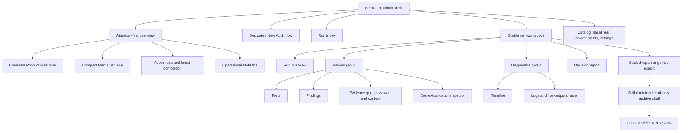
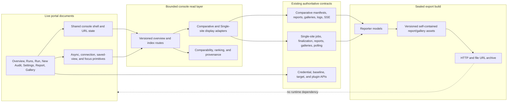
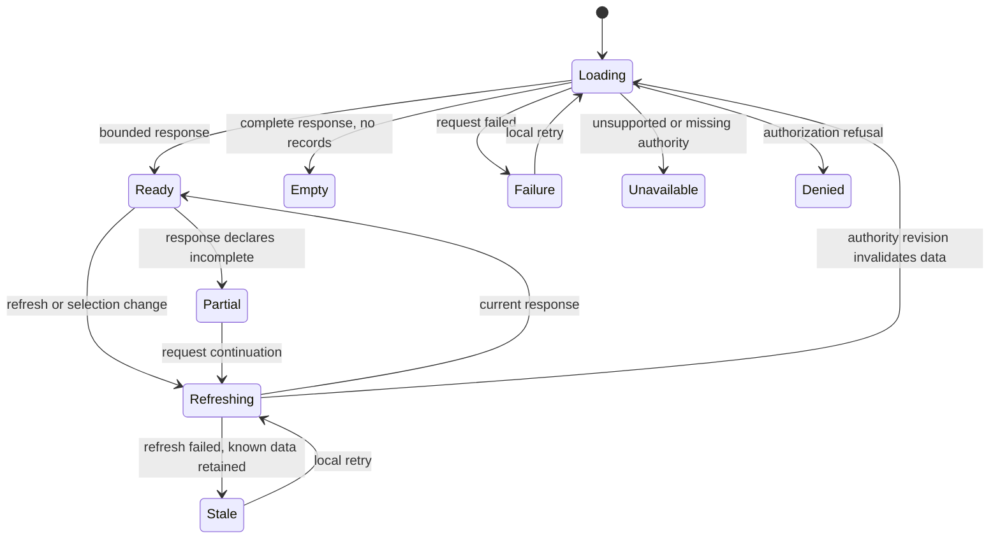

# Portal Admin Console Redesign - Plan

## Goal Capsule

- **Objective:** An operator can identify the most important product risks, understand limits on run trust, monitor active audits, and reach the supporting evidence quickly from one coherent desktop workspace.
- **Means:** Introduce a progressively enhanced multi-page console, bounded server-owned read models, mode-capability adapters, canonical safe URL state, and shared async/review primitives while preserving sealed archive isolation (KTD1-KTD8).
- **Product authority:** This plan owns the portal's information architecture, interaction hierarchy, and visual presentation across existing operator surfaces. Existing audit definitions, execution semantics, evidence policies, and verdict authority remain governed by their current contracts.
- **Open blockers:** None. Implementation must stop rather than improvise if an authoritative state, action contract, archive guarantee, or bounded-data limit cannot be preserved.

---

## Product Contract

### Summary

Implement the approved desktop console through a shared progressively enhanced shell, bounded server-side read models, and mode-aware presentation adapters.
The implementation covers the full live portal and sealed report/gallery exports while preserving existing audit authority, action eligibility, transport behavior, and direct-entry compatibility.

### Problem Frame

The portal's capabilities have outgrown its current page structure.
The landing page combines a long launch form with the run list, while run monitoring opens in a large modal and reports and galleries live as separate destinations.
This makes high-value information compete with configuration, forces context switches during review, and turns large evidence sets into a navigation problem.

The redesign must improve orientation without discarding the portal's strongest behavior.
Live logs, bounded asynchronous loading, evidence context, keyboard review, guarded purge controls, and independent release-truth states are operational requirements rather than incidental details.

### Key Decisions

- **Use a hybrid admin shell with focused workspaces.** (session-settled: user-directed — chosen over dashboard-only and single-cockpit layouts: the portal needs both fast orientation and deep review.) Governs R1, R2, R3, R15, R16, R17, R18, R19.
- **Use a flat, neutral operations-console visual language.** (session-settled: user-directed — chosen over blue accents, capsule badges, gradients, card grids, and excessive rounding: those patterns obscured hierarchy and felt generated.) Governs R4, R5.
- **Make the overview attention-first.** (session-settled: user-approved — chosen over launch-first and infrastructure-first homepages: the first view should explain the most important changes since the latest completed run.) Governs R6, R7, R8, R9, R10, R11.
- **Give Product Risk more visual authority than Run Trust.** (session-settled: user-directed — chosen over equal-width lanes: confirmed user impact should remain primary while trust limits stay visible.) Governs R7, R8.
- **Move audit configuration into a dedicated flow.** (session-settled: user-approved — chosen over the current inline form and a transient drawer: launch complexity needs progressive disclosure without competing with monitoring.) Governs R12, R13.
- **Optimize for desktop use.** (session-settled: user-directed — chosen over mobile feature parity: the portal will almost always be used on a desktop.) Governs R4.
- **Start with an opinionated dashboard and saved views.** (session-settled: user-approved — chosen over a customizable widget system: useful defaults and shareable filters provide value with less carrying cost.) Governs R6, R14.
- **Prefer explicit factors over a synthetic health score.** (pressure-tested: adopted — an opaque score could overstate unlike findings, review work, and pipeline conditions.) Governs R7, R8, R17, R26.

### Actors

- A1. **Test operator:** Launches audits, monitors work, inspects results, manages settings, and controls run retention.
- A2. **Evidence reviewer:** Triages findings, compares visual evidence, reviews manual checks, and records dispositions; this role may be performed by A1.
- A3. **Audit pipeline:** Publishes execution, activity, evidence, and finalization updates without deriving its state from whether an operator has the portal open.

### Presentation Semantics

| Interface construct | Authoritative input | Required interpretation |
| --- | --- | --- |
| Product Risk | Findings plus explicitly labelled visual-review and manual-attention records | A bounded attention queue. Every item retains its source type, severity, blocking intent, scope, and authority. It is never a Release Decision or Site Health Verdict. |
| Run Trust | Mode-authoritative coverage conclusions, Evidence Authority, Pipeline Integrity, Manual Acceptance Status, finalization state, and source freshness | A set of independently labelled limitations and valid conclusions. It must not collapse to one green/red score or erase a confirmed Finding. |
| Operational attention | Execution State, Activity State, client Connection State, leases, stages, shards, and transport freshness | A separate live-operations concern. It may demand immediate operator action without being presented as a product defect. |
| Comparable predecessor | The latest eligible completed run with the same audit mode, audited deployment or environment pair, compatible profile/scope, and compatible target set | The only run from which novelty or change may be inferred. If none exists, the interface must say that no valid comparison is available. |

### Requirements

**Shared shell and hierarchy**

- R1. Live portal routes must use one persistent admin shell that exposes the current scope, active destination, and run context. Navigation must group operational destinations (Overview, Runs, Findings, Evidence Review), creation (New Audit), and configuration (Test Catalog, Baselines, Environments, Settings) rather than giving every destination equal weight; no primary destination may open as an unlabelled modal or orphaned page.
- R2. Each run must use one stable, URL-addressable workspace from queued state through completion. Its default Overview must lead to grouped Review views (Tests, Findings, Evidence), Diagnostics views (Timeline, Logs), and the Report without presenting seven equal-weight tabs; Timeline must expose stage, shard, attempt, retry, and duration relationships.
- R3. Live reports and galleries must retain the admin shell while allowing navigation and secondary panes to collapse for review. Sealed report and gallery exports must instead use a self-contained read-only workspace shell that preserves bounded review over HTTP and `file://` without portal APIs, authentication, credentials, mutations, saved views, or live-event dependencies.
- R4. The primary layout must be designed for 1280-1920 pixel desktop workspaces, with a functional stacked fallback for narrower screens that preserves run identity, critical state, permitted actions, keyboard focus, and destructive confirmations.
- R5. The visual system must use flat surfaces, thin rules, restrained semantic color, compact but accessible typography, and text-supported state indicators. Tables, split panes, tabs, filters, and inspectors must carry hierarchy; equal-sized metric cards, capsule-heavy status treatment, gradients, decorative charts, repeated rounded containers, and card-based navigation must not become the default composition.

**Overview and prioritization**

- R6. Within the selected scope, the Overview must default to a bounded queue of the highest-priority current items and changes from a Comparable Predecessor, while keeping active work and the most recent terminal run visible in the initial 1440-by-900 viewport. First-run, mixed-mode, stale-history, and no-attention states must be explicit and must not imply a regression.
- R7. Product Risk must occupy the dominant overview region and use deterministic lexicographic ordering: declared severity, blocking intent, source authority (Finding, then unresolved visual review, then manual obligation), novelty when a Comparable Predecessor exists, affected scope, unresolved age, and stable identity. Every item must expose the factors that placed it, link to its source record, and retain whether it is a Finding, review-only change, or manual obligation; no opaque aggregate score may determine order.
- R8. Run Trust must appear beside Product Risk as individually sourced mode-appropriate coverage, Evidence Authority, Pipeline Integrity, finalization, manual-acceptance, and freshness facts. It must state which conclusions remain supported, limited, or unavailable without recoloring, downgrading, or erasing confirmed Product Risk.
- R9. Active runs must show Execution State, Activity State, client transport state where applicable, progress, elapsed time, current stage or shard, last server update, scope, and provisional findings observed so far as distinct information. Mode-appropriate stop or cancel, open-workspace, retry, and deep-link actions must show eligibility and disabled reasons.
- R10. The most recent terminal run within the selected scope must show its mode-appropriate outcome, finalization state, coverage conclusion, Evidence Authority, Pipeline Integrity, completion time, and direct path into its workspace. It must be identified independently from the Comparable Predecessor used for change claims.
- R11. The Overview may show at most six secondary operational statistics drawn from definition coverage, duration, flaky executions, worker health, queue depth, and evidence storage. Every displayed metric must name its population, time window, freshness, and source or drill-down; an unsupported or stale metric must be omitted or labelled unavailable rather than rendered as zero or success.

**Launch, configuration, and run control**

- R12. New Audit must be a dedicated flow with strong defaults and progressive disclosure for advanced configuration; preflight validation, stale-preview revalidation, and recoverable errors must preserve valid selections and return focus to the field or decision that needs action.
- R13. The launch flow must preserve comparative and Single-site Audit modes, depth, origins or Deployment Role, certificate policy, Audit Targets, scope, plugins, audit areas, individual checks, preflight, and optional AI review.
- R14. Live-portal filters, sort, selected scope, destination, run, tab, record, and inspector context must use canonical URL state where safe. Named saved views must be browser-local shortcuts over that safe state, support reset and invalid-state recovery, and must never persist raw logs, reviewer prose, credentials, secret-bearing URLs, cursors, or sealed-archive state.
- R15. Stop or cancel, purge, manual-evidence, report, gallery, checklist, and source-report actions must remain available in run context with their existing mode- and state-specific eligibility, authorization, confirmation or reason, conflict, completion, and consequence rules. The interface must not show optimistic success before the server accepts a mutation.
- R16. Credential and environment configuration must move to Settings while exposing only availability, mode, dry-run, and non-secret fingerprint metadata. Credential submission and deletion must keep the existing isolated mutation, authorization, CSRF, immediate field clearing, and exact-confirmation contracts; plaintext credentials must never enter URLs, saved views, logs, diagnostics, or API responses.

**Finding and evidence review**

- R17. Attention views must distinguish canonical Findings from visual-review changes, flaky executions, infrastructure problems, and manual checks. These types act as explanatory facets rather than replacement verdicts: one record may carry multiple labels, one deterministic primary category must govern its queue placement, and totals must state whether they count unique records or category memberships.
- R18. Selecting a finding, execution, attempt, or evidence item must open a persistent keyboard-accessible inspector while retaining the surrounding list, filters, sort, and run identity. Selection must be deep-linkable; refresh and browser back/forward must restore safe context, and a filter that excludes the selected record must say so rather than silently switching records.
- R19. Evidence must retain authoritative ownership at run, stage, fixture, test, attempt, step, or visual-capture level, including retry and timestamp/source identity. Interaction videos must remain distinct from static screenshots and raw files; duplicate, missing, unavailable, or orphan evidence must be labelled from provenance rather than guessed into a nearby execution.
- R20. Both audit modes must support attention-first and browse-all sequential review with media and suite filters, persistent queue-viewer-context coordination, keyboard navigation, and no link-by-link traversal. Comparative and sealed-archive views must preserve the exact keyboard contract in `docs/TEST_PLAN.md`; Single-site review must also preserve baseline/current/diff, changed-region, zoom/fit, and guarded disposition behavior without implying that review changes deterministic truth.
- R21. The report must present the mode-appropriate Release Decision or Site Health Verdict, Coverage Status, Evidence Authority, Pipeline Integrity, manual acceptance, Findings, visual review, and supporting sources as distinct, source-labelled sections. Missing or unavailable evidence must never render as pass, zero, or empty success, and every conclusion must link to supporting records or an explicit provenance explanation.

**Live operations, scale, and recovery**

- R22. Live output must remain bounded, redacted, verbose, and contextual, with commands, HTTP responses, FFmpeg activity, shard or stage identity, ordering, and timestamps available through a collapsible drawer or Logs view. Logs must provide source/stage filtering, text search over the bounded window, pause/resume tailing, jump-to-latest, stale/live state, and cursor or tail recovery without loading the full file into the browser.
- R23. Each asynchronously loaded surface must implement the applicable states from a shared vocabulary: initial loading, refreshing, partial, empty-success, stale, retryable failure, unavailable, permission-denied, reconnecting, and offline. It must expose freshness and completeness, keep known data during local failures, retry the smallest failed surface where possible, and avoid blocking unrelated workspace regions.
- R24. A client disconnect must change client transport state only; it must not change durable Execution State or Activity State. Server-derived values must freeze with a last-update timestamp and stale indication until the surface-specific SSE cursor, bounded replay, revision refresh, or polling contract recovers.
- R25. The redesign must adopt the numeric scale, bounded-payload, DOM, responsiveness, accessibility, keyboard, and media-review requirements in `docs/TEST_PLAN.md` without relaxation for comparative, Single-site, and sealed-archive review. Each mode must become first-usable before requesting its full inventory, abort stale requests, and keep tables, logs, and galleries paged or windowed.
- R26. Counts and status totals must navigate to the exact filtered records that explain them. Aggregate operational metrics without a record set must instead open a provenance view containing their source, population, time window, formula, and freshness; neither kind may act as decorative statistics.
- R27. The Overview must consume a versioned, bounded read model that partitions comparative and Single-site populations, carries source timestamps and completeness, supports cancellation and pagination, and avoids client fan-out across full per-run reports. Ranking inputs and metric sources must be present or explicitly unknown.
- R28. The unified workspace must adapt the existing comparative and Single-site contracts without merging, reconstructing, or renaming authoritative states. Mode-inapplicable views and actions must be explicitly unavailable, and the existing raw report, checklist, Playwright report, AI review, gallery, and artifact paths must remain reachable as fallbacks.

### Workspace Composition



### Key Flows

- F1. **Daily orientation**
  - **Trigger:** A1 opens the portal.
  - **Actors:** A1, A3.
  - **Steps:** The Overview presents Product Risk, Run Trust, active runs, the latest completed run, and operational statistics; A1 drills into the highest-value item.
  - **Covered by:** R6, R7, R8, R9, R10, R11, R26, R27.
- F2. **Launch an audit**
  - **Trigger:** A1 chooses New Audit.
  - **Actors:** A1, A3.
  - **Steps:** The dedicated flow applies defaults, reveals advanced choices on demand, performs preflight where required, creates the run, and opens its stable workspace.
  - **Covered by:** R12, R13.
- F3. **Monitor active execution**
  - **Trigger:** A1 opens an active run.
  - **Actors:** A1, A3.
  - **Steps:** The workspace streams state, stages, progress, logs, and emerging evidence; reconnects preserve run truth and selected context.
  - **Covered by:** R2, R9, R22, R23, R24, R28.
- F4. **Triage a completed run**
  - **Trigger:** A2 opens a completed run or a dashboard attention item.
  - **Actors:** A2.
  - **Steps:** A2 filters findings, selects an item, reviews its inspector and attached evidence, and moves between report and gallery without losing run context.
  - **Covered by:** R2, R14, R17, R18, R19, R20, R21, R28.
- F5. **Understand a trust limitation**
  - **Trigger:** A run has incomplete or failed evidence processing.
  - **Actors:** A1, A2, A3.
  - **Steps:** Run Trust explains the affected evidence and conclusions while Product Risk retains valid confirmed findings.
  - **Covered by:** R7, R8, R21, R23.
- F6. **Control and retain a run**
  - **Trigger:** A1 needs to stop active work, attach manual evidence, or purge a terminal run.
  - **Actors:** A1, A3.
  - **Steps:** Contextual actions expose the current eligibility and consequence, require existing attestations or destructive confirmation, and return an explicit result state.
  - **Covered by:** R15, R23.
- F7. **Review a sealed archive**
  - **Trigger:** A2 opens a retained report or gallery export without the live portal.
  - **Actors:** A2.
  - **Steps:** The read-only archive opens from HTTP or `file://`, identifies its run and sealed revision, provides bounded report or gallery review, and omits live-only navigation and actions without broken controls.
  - **Covered by:** R3, R20, R21, R25, R28.
- F8. **Manage credentials and configuration**
  - **Trigger:** A1 opens Settings to inspect or change a server-backed configuration capability.
  - **Actors:** A1, A3.
  - **Steps:** Settings loads non-secret capability state, validates a credential or configuration mutation, clears secret input immediately, reports only accepted server state, and keeps unrelated portal regions operational if the settings request fails.
  - **Covered by:** R14, R16, R23.

### Acceptance Examples

- AE1. **Covers R7, R8, R21.** Given a run with a critical product regression and failed media finalization, when the Overview loads, then the regression leads Product Risk while Run Trust separately explains which media claims are unavailable.
- AE2. **Covers R6, R9, R10, R11.** Given no unresolved high-priority finding, when A1 opens the Overview, then active runs and the latest completed run remain visible without fabricated urgency.
- AE3. **Covers R9, R23, R24.** Given an audit is running when the portal event stream disconnects, when the browser reconnects, then the UI shows Connection State recovery without changing execution or worker activity truth.
- AE4. **Covers R12, R13.** Given A1 starts a common smoke audit, when the New Audit flow opens, then safe defaults are ready and advanced target or evidence controls do not dominate the initial step.
- AE5. **Covers R17, R18, R19, R20.** Given a finding has a screenshot, interaction video, trace, and logs, when A2 selects it, then each item remains tied to the finding and attempt while the surrounding review queue stays visible.
- AE6. **Covers R3, R20, R25.** Given A2 enters full-width visual review, when navigation chrome collapses, then keyboard navigation, filters, selected identity, and the queue-viewer-context relationship continue to work.
- AE7. **Covers R23, R25.** Given a reference-scale completed run, when the report or gallery opens, then useful content appears from bounded requests before the full evidence inventory is loaded.
- AE8. **Covers R4, R15.** Given A1 uses a narrow screen in an emergency, when a running audit needs attention, then its state and permitted control remain usable in a stacked fallback without desktop-density parity.
- AE9. **Covers R15.** Given a terminal run is purgeable, when A1 invokes purge, then the existing exact confirmation and consequence language remain required before deletion begins.
- AE10. **Covers R6, R7, R10, R27.** Given the run list contains mixed audit modes but no Comparable Predecessor for the selected scope, when the Overview loads, then it shows the latest terminal run, labels novelty unavailable, and does not compare unrelated modes or fabricate a regression.
- AE11. **Covers R3, R20, R21, R25, R28.** Given a sealed gallery or report export is opened from a direct `file://` URL, when A2 reviews it, then bounded content, run identity, filters, and keyboard behavior work without portal APIs while live-only mutations and settings are absent.
- AE12. **Covers R7, R8, R17, R21.** Given one P0 deterministic Finding also has a changed visual and failed media finalization, when it is presented, then the Finding leads Product Risk, the visual state remains review-only, Run Trust explains the media limitation, and the item is counted once in unique-record totals.
- AE13. **Covers R14, R18.** Given A2 opens an inspector from a sorted and filtered findings view, when they move to Evidence and use browser back or refresh a safe deep link, then the run, destination, filters, sort, selected record, and inspector context are restored or explicitly reported unavailable.
- AE14. **Covers R11, R26, R27.** Given evidence-storage history is missing or stale, when the Overview renders, then it omits or labels the metric unavailable and does not show a fabricated zero, success state, or clickable count without supporting provenance.
- AE15. **Covers R16.** Given A1 saves and later deletes an Anthropic credential in Settings, when requests, URLs, saved views, logs, and API responses are inspected, then plaintext never appears and the input is cleared immediately after submission.
- AE16. **Covers R9, R23, R24, R28.** Given a comparative SSE stream and a Single-site polling surface both lose connectivity, when each recovers, then both retain last-known server truth and use their surface-specific recovery contract without presenting client transport failure as a run-state transition.
- AE17. **Covers R20, R22, R25, R27.** Given comparative, Single-site, and sealed-archive fixtures at the reference evidence scale, when their workspaces open, then the primary summary and first useful records render before full inventory requests, stale requests can be aborted, and DOM and payload limits remain within `docs/TEST_PLAN.md`.
- AE18. **Covers R2, R17, R19, R28.** Given one retrying visual execution has attempt evidence, stage logs, and one unavailable artifact, when A2 reviews it, then mode, retry, source ownership, primary category, secondary facets, and missing-artifact status remain explicit without guessing associations.
- AE19. **Covers R1, R2, R5, R6, R14.** Given a 1440-by-900 viewport with active runs and dense historical data, when A1 moves among Overview, Runs, a run workspace, New Audit, and Settings, then scope and active destination stay visible, return paths preserve safe context, and the hierarchy uses tables, groups, and panes rather than modal pages or a grid of equal-weight cards.
- AE20. **Covers R22, R23, R24.** Given a long multi-shard run log exceeds the browser's bounded window, when A1 filters by shard, searches, pauses live tailing, resumes, and recovers after replay overflow, then ordering, source labels, redaction, last-update state, and access to the bounded recent tail remain correct without loading the entire file.
- AE21. **Covers R15, R23.** Given A1 opens a stop, cancel, purge, or manual-evidence confirmation for one immutable target, when selection, URL state, eligibility, or authority revision changes before submission, then the confirmation is invalidated; after submission, only server acceptance is success, and a lost response is reconciled from authoritative state without automatically repeating the mutation.

### Success Criteria

- At a 1440-by-900 desktop viewport, an operator can identify the highest Product Risk, any Run Trust limitation, active-run state, and the latest completed result from the initial overview without opening another page.
- An operator can reach the executions and evidence behind every summary count or status total through a direct filtered drill-down.
- A reviewer can move among findings, screenshots, interaction videos, traces, logs, report sections, and gallery items without losing the selected run or rebuilding filters.
- Live runs remain understandable from queue through finalization during normal streaming, reconnecting, partial, and failed states.
- Product Risk, Run Trust, and operational attention remain visibly distinct and can each be traced to authoritative source records or provenance without a synthetic overall score.
- Sealed reports and galleries remain fully reviewable over HTTP and `file://` without a running portal service.
- The acceptance suites enforcing R23 and R25 continue to pass.
- Visual review confirms R5 across every core admin surface.

### Scope Boundaries

- The redesign includes all current operator-facing portal pages and the navigation between them.
- Audit definitions, plugin behavior, browser execution, media retention policy, evidence authority, and verdict calculation remain unchanged.
- Product Risk ordering, Run Trust presentation, and overview metrics may summarize authoritative data but may not become durable audit states or promotion authority.
- Desktop-equivalent density on narrow screens is outside scope; R4 owns the required functional fallback.
- Custom widget construction, multi-user assignment, comments, organization roles, and collaboration workflows are outside scope.
- The public quitting7oh website and its visual identity are outside scope.
- New cloud-device or third-party testing integrations are outside scope.

### Dependencies and Assumptions

- The current portal remains a single-operator tool even though operator and reviewer roles may be performed at different times.
- Existing run, report, gallery, settings, baseline, and artifact data remain the product authority; planning may add derived summaries but may not invent new audit truth.
- Historical metrics are useful only when their source population, compatibility, time window, freshness, and formula are visible.
- Existing comparative, Single-site, live, and sealed-archive contracts remain authoritative. Shared presentation may adapt them but must preserve their mode-specific status, transport, evidence, mutation, and portability semantics.

### Product Contract Preservation

The Product Contract is restructured without a scope change. F8 and AE21 make existing R14-R16 and R23 behavior explicitly traceable; the Planning Contract resolves engineering choices without altering requirement meaning, audit authority, evidence policy, mutation eligibility, or verdict semantics.

### Pressure-Test Record

An adversarial review against the current portal, gallery, archive, and security contracts identified and resolved eight plan-level risks: live-shell assumptions that would break `file://` archives; synthetic Product Risk or Run Trust authority; cross-mode comparison ambiguity; missing bounded Overview data; unsafe saved-view and credential persistence; transport-state conflation; evidence ownership ambiguity; and scale requirements that did not explicitly cover both audit modes and sealed archives.

### Sources and Research

- `CONCEPTS.md` — canonical audit, release-truth, execution, and evidence vocabulary.
- `docs/TEST_PLAN.md` — portal review flow, accessibility, scale, payload, DOM, and performance acceptance authority.
- `docs/plans/2026-08-24-0636-feat-run-visual-evidence-gallery-plan.md` — existing queue-viewer-context and keyboard-review contract.
- `docs/plans/2026-08-25-0240-feat-single-site-audit-mode-plan.md` — existing Single-site Audit, asynchronous lifecycle, report, gallery, and state-separation contract.
- `portal/public/index.html`, `portal/public/report.html`, and `portal/public/gallery.html` — current portal surface and navigation structure.
- `portal/public/app.js`, `portal/public/gallery-core.js`, `portal/public/gallery.js`, and `portal/server.mjs` — current asynchronous, bounded-loading, event-stream, and artifact behavior.
- [BrowserStack new dashboard](https://www.browserstack.com/docs/app-automate/new-dashboard) — project, build, test hierarchy and contextual debugging.
- [Cypress Cloud recorded runs](https://docs.cypress.io/cloud/features/recorded-runs) — latest-run overview, stable run header, and tabbed run details.
- [ReportPortal launches](https://reportportal.io/docs/work-with-reports/ViewLaunches/) — drillable metrics and hierarchical result navigation.
- [Allure timeline](https://allurereport.org/docs/timeline/) — worker-lane and duration-oriented execution review.
- [Playwright Trace Viewer](https://playwright.dev/docs/trace-viewer-intro) — action-focused debugging with related evidence panes.
- [Argos visual testing](https://argos-ci.com/visual-testing) — sequential visual review and comparison workflow.

---

## Planning Contract

### Execution Profile

- **Mode:** Code implementation with characterization tests first, then server contracts, shared browser primitives, page migration, archive migration, and final Docker verification.
- **Change posture:** Route-by-route replacement behind compatible direct entries; no framework migration, database migration, audit-engine rewrite, or assertion rewrite.
- **Tail owner:** The implementer who changes the last shared shell, report, gallery, or archive surface owns the complete cross-surface regression run and cleanup of superseded portal code.
- **Stop conditions:** Stop and escalate when implementation would require inventing audit truth, merging mode-incompatible states, weakening credential or mutation protections, eagerly loading unbounded run data, breaking `file://` exports, or relaxing an existing test-plan limit.
- **Completion boundary:** Work is complete only when the live console, both audit modes, direct legacy entries, destructive actions, credentials, reports, galleries, and sealed archives pass the Verification Contract. A visually complete shell with compatibility, scale, or truth-state failures is not complete.

### Key Technical Decisions

- **KTD1. Keep the live portal a progressively enhanced multi-page application.** Add a shared shell and page controllers using the existing static HTML, CSS, ESM, and Node HTTP stack; do not introduce a client framework, bundler, or history-fallback SPA. Real document URLs preserve reload, direct-entry, strict-CSP, and operational debuggability while shared modules prevent page-by-page drift. Governs R1-R5, R14, R28.
- **KTD2. Put cross-run prioritization in bounded, versioned server read models.** `portal/server.mjs` remains the single owner of stores, queues, caches, recovery, timers, and shutdown; it injects bounded read ports into pure console projections. A rebuildable non-authoritative summary index bounds source work as well as response size, publishes incomplete watermarks while catching up, and never writes its projections back as audit truth. The browser must not fan out across complete reports to compute Overview, Runs, Findings, Evidence, or Timeline. Governs R6-R11, R17, R22, R26-R28.
- **KTD3. Use a deterministic comparability and ranking library with no composite score.** Comparable Predecessor selection and Product Risk ordering use explicit tuple factors, stable tie-breakers, and reason metadata. Missing factors remain unknown, mixed modes are partitioned, and tests prove that presentation order cannot change verdict authority. Governs R6-R8, R10, R17, R26, R27.
- **KTD4. Make capability metadata—not UI mode checks—the shared-workspace boundary.** Comparative SSE and stop behavior, Single-site polling and cancel behavior, report revisions, gallery mutations, AI review, manual evidence, baselines, and archive restrictions remain mode-specific. Adapters expose supported actions, transports, destinations, and disabled reasons without pretending unsupported parity. Governs R2, R9, R13, R15, R16, R20-R24, R28.
- **KTD5. Treat canonical URLs as safe navigation state and browser storage as optional convenience.** Run, destination, selected record, filters, sort, view, and inspector state serialize through validated `URLSearchParams`; initial state uses `replaceState`, subsequent in-page changes use bounded same-origin history entries, and `popstate` restores selection and focus. Saved views persist only non-sensitive normalized URL state and layout preferences, tolerate storage denial, and never carry credentials, evidence content, logs, reviewer prose, cursors, or authority-bearing claims. Governs R1, R2, R14, R18.
- **KTD6. Centralize per-region asynchronous and live-connection behavior.** Shared request helpers own cancellation, response validation, stale-response suppression, retry, freshness, and retained-data behavior. Comparative event IDs/cursors/replay remain authoritative; Single-site remains polling/revision based. Connection State is a browser concern and never mutates durable Execution State or Activity State. Client ownership plus per-run/server stream budgets and polling limits prevent navigation or reconnect storms from exhausting server resources; capacity pressure falls back to bounded snapshots. Governs R9, R22-R25, R27.
- **KTD7. Keep sealed archives as a separate build and security boundary.** “Sealed” means publication-atomic, revision-pinned, self-contained, and mutation-free; it does not claim encryption, confidentiality, or cryptographic authenticity. Live shell assets may inform archive design tokens and interaction patterns, but exports receive a coherent versioned asset/schema bundle that works under existing opaque-origin and `file://` constraints. Existing exports are immutable; exports do not call portal APIs, open SSE, read credentials, or expose mutations. Governs R3, R16, R20, R21, R25, R28.
- **KTD8. Preserve semantics, controller ownership, archive isolation, and scale before applying final visual styling.** Characterize routes, actions, security, focus, keyboard behavior, payloads, DOM bounds, and archive portability first. At every cutover one module owns a mutation, transport, or history surface. Converge Single-site review on the existing bounded queue/viewer/context controller before restyling; migrate pages incrementally; then lock deterministic desktop visual snapshots. Native landmarks, tables, buttons, dialogs, and manual-activation tabs are preferred over custom ARIA widgets. Governs R1-R5, R12, R15-R25.

### High-Level Technical Design

#### Component and authority flow



The arrows into the read layer are one-way projections. Product Risk, Run Trust, comparability, UI freshness, and saved-view state are not written back into manifests, reports, finalization records, or release-truth fields.

#### Mode, transport, and action capability matrix

| Surface | Comparative live | Single-site live | Sealed archive |
| --- | --- | --- | --- |
| Run freshness | SSE sequence/cursor, replay, bounded log recovery | Polling plus job/finalization/gallery revisions | Sealed revision only; no connection state |
| Stop control | Existing stop endpoint and eligibility | Existing cancel endpoint and eligibility | Unavailable and absent |
| Purge | Existing comparative confirmation contract | Existing Single-site confirmation contract | Unavailable and absent |
| Report | Comparative compact report and paged audits/artifacts | Site Health report and revision-pinned paged audits | Embedded/self-contained read-only report |
| Gallery | Bounded items/detail/media/delta plus gallery SSE | Bounded head/items/detail/media/raw-file pages plus revision refresh | Embedded catalog with bounded client window |
| Review mutations | Existing manual evidence and gallery capabilities only | Existing guarded visual dispositions/baselines/AI review only | None |
| Credentials/settings | Server-backed, authenticated mutations | Server-backed, authenticated mutations | None |
| Unsupported capability | Explicit unavailable reason | Explicit unavailable reason | Control omitted with read-only explanation |

#### Async-region state model



Each region owns its controller and abort signal. A run-detail failure must not blank the global shell; a media failure must not discard the evidence queue; a settings failure must not stop a live run stream.

#### Live transport and durable-state separation

```mermaid
sequenceDiagram
  participant UI as Run workspace
  participant Read as Bounded snapshot API
  participant Live as SSE or polling controller
  participant Store as Durable run source

  UI->>Read: Request current bounded snapshot
  Read->>Store: Read authoritative state
  Store-->>Read: State plus freshness/revision
  Read-->>UI: Display adapter plus capabilities
  UI->>Live: Start mode-specific updates from cursor/revision
  Live-->>UI: Connected/update
  Live--xUI: Disconnect
  Note over UI: Mark Connection State stale; retain durable state
  UI->>Read: Recover bounded snapshot/revision
  Read->>Store: Re-read authority
  Read-->>UI: Current state and recovery cursor
  UI->>Live: Resume without duplicate events
```

### URL and Direct-Entry Contract

| Entry | Canonical responsibility | Compatibility requirement |
| --- | --- | --- |
| `/` | Overview and selected global scope | Must no longer contain the full launch/settings forms. |
| `/runs.html` | Combined bounded run index | Mode/state/scope/filter/sort remain URL-addressable. |
| `/run.html?mode=…&run=…&view=…` | Stable queued-through-terminal run workspace | Invalid mode/run/view states render explicit recovery, not a silent redirect. |
| `/findings.html` | Bounded global attention/finding queue | Selected record and inspector survive reload/back/forward when still authorized. |
| `/evidence.html` | Bounded global evidence queue | Media loads only for the selected item; filters remain safe URL state. |
| `/new-audit.html` | Comparative and Single-site launch workflow | Preserves current preflight, TLS, target, plugin, AI-review, and validation behavior. |
| `/settings.html?section=…` | Credentials and existing configuration capabilities | Test Catalog, Baselines, Environments, and credential sections expose only real existing contracts; no placeholder success state. |
| `/report.html?mode=…&run=…` | Live report workspace | Existing URLs remain valid and gain the shared shell without changing report authority. |
| `/gallery.html?mode=…&run=…` | Live visual evidence workspace | Existing URLs, `from`, item, member, review, filter, and keyboard behavior remain compatible. |
| Exported report/gallery entry | Self-contained sealed workspace | Must continue to open directly over HTTP and `file://` with networking unavailable. |

### Security and Data-Handling Invariants

- Preserve the current self-only CSP, host checks, mutation authorization, CSRF/origin checks, artifact containment, symlink defenses, and secret-store permissions.
- Treat derived console APIs as a new information-disclosure boundary. They must use existing descriptor-pinned, containment-checked, revision-aware readers; allowlist fields; bound individual fields and aggregate records; apply server-side redaction; and exclude raw log bodies, credential-bearing URLs, command excerpts, and unchecked artifact content from global projections.
- Render server-derived labels, paths, commands, response excerpts, and log text with DOM text APIs. No new console component may interpolate untrusted values through `innerHTML`.
- Keep the Anthropic credential write-only from the browser's perspective: API responses expose configuration/fingerprint metadata only, the input clears immediately, and no saved view or diagnostic export includes the plaintext.
- Validate URL and saved-view state as versioned structured data, not as a stored arbitrary URL. Reject duplicate/unknown keys, overlong or double-encoded values, nested/prototype-shaped records, stale schemas, excess entries, secret-like content, authority/mutation state, and cursors not bound to mode, scope, normalized filters, and source revision. Canonicalize rejected secret-like URL state away before making dependent requests.
- Bind every destructive or attestation dialog to an immutable mode, endpoint, entity identity, expected revision, eligibility snapshot, and exact confirmation. Invalidate the dialog on navigation, selection, revision, or capability change; never pre-arm an action from URL or storage; reconcile an unknown mutation result from authority instead of automatically retrying.
- Abort or ignore stale requests when page, run, revision, filter, or selection changes. An `AbortError` is normal cancellation and must not surface as a product failure.
- Keep logs and evidence bounded on both server and client. Search applies to the documented bounded window unless a future server search contract is added; the UI must say which window is searched.
- Use one active comparative run stream per workspace and close it on navigation. Enforce per-document, per-run, and server-wide stream budgets plus bounded retry/jitter and polling concurrency/frequency limits. Capacity pressure falls back to bounded snapshots and changes Connection State only.
- Treat purge, authority denial, missing/purged authority, and revision invalidation as destructive cache barriers, never as stale-data states. Evict every derived index/cache entry, DOM record, media/object URL, action target, and stream for the purged run before acknowledging success; quarantined or partial purge remains explicitly unavailable/retryable.
- Treat exported report, evidence, and reviewer content as sensitive files protected by external storage/access controls. Internal hashes detect package inconsistency but are not an external authenticity anchor, and purging a live run cannot revoke copies of a sealed export.

### Migration Strategy

1. Characterize current URLs, mutations, focus, security, transport recovery, source-work scale, and archive portability. Pin the existing archive asset-sharing/staging contract with passing HTTP and `file://` fixtures before changing live gallery assets.
2. Add injected read ports, the rebuildable console index, and pure server projections while existing pages remain unchanged.
3. Add inert shared shell/browser primitives and prove them on a test-only fixture; do not expose feature-route placeholders.
4. Extract New Audit and Settings from the current landing controller while preserving a tested legacy landing path.
5. Extract the stable run workspace, change post-launch navigation, and replace the run-detail modal only after action/transport parity passes.
6. Build Runs, Findings, and Evidence indexes, then cut `/` to Overview only after launch/settings/run callers no longer depend on the old landing controller.
7. Integrate live reports and galleries with layout-only shell ownership first, then make an atomic controller handoff; converge Single-site gallery loading on bounded incremental behavior before restyling.
8. Redesign archive assets through the existing build-time staging path, publish each export as one coherent versioned asset/schema bundle, and never rewrite existing exports.
9. Remove obsolete landing-page/modal code only after the rollback window and direct-entry, mode, scale, security, accessibility, visual, and N/N-1 compatibility suites pass.

### System-Wide Impact

| Area | Impact and owning rule |
| --- | --- |
| Runtime ownership | `portal/server.mjs` remains the only owner of queue/store handles, lifecycle maps, background synchronization, recovery, timers, HTTP startup, and shutdown. It constructs and injects bounded console read ports; console projection/API modules may not open stores, run recovery/backfill loops independently, or create unowned timers (KTD2). |
| Derived index lifecycle | The console summary index is rebuildable and non-authoritative. Lifecycle writes, bounded external sync, queue revisions, finalization, report/gallery publication, manual evidence, flags/dispositions, baselines, AI-review display state, and both purge paths update or invalidate it. Startup/backfill uses time, file, and source-byte budgets and publishes an incomplete watermark until caught up. |
| Snapshot consistency | Each response carries a source vector/watermark. Assembly rechecks the vector before return, retries once on change, then returns an explicit partial snapshot instead of mixing revisions. Byte-bounded caches key on normalized query plus complete source vector or stable seek key. |
| Failure propagation | Invalid query or authorization fails the request. One corrupt/unavailable source or record yields a bounded partial projection with source status, omitted count, freshness, and retry/provenance target; total index/source loss yields an unavailable response. Integrity failures cannot participate in ranking/comparability or fall back to stale-success claims. |
| Browser/controller lifecycle | One module owns each history writer, mutation handler, EventSource, poller, and gallery controller at any migration stage. Layout-only shell adoption does not attach duplicate controllers. Navigation, hidden documents, terminal state, purge, server refusal, and shutdown release streams, timers, requests, object URLs, and focus traps. |
| Archive lifecycle | The existing reporter staging path owns pure gallery logic copied into exports. New exports are atomic, versioned bundles; older exports remain immutable and readable. Archive mismatch fails closed, and archive storage/confidentiality remains an operator/deployment responsibility (KTD7). |
| Rollout and rollback | Server code and static assets deploy atomically. Pre-deploy and pre-rollback gates drain portal-managed comparative runs because restart is not operationally neutral. Changes remain additive through archive compatibility; existing APIs/direct entries remain until N/N-1 tests pass. Rollback may discard only derived indexes/caches and browser-local saved views—never runs, evidence, queues, finalizations, baselines, review history, or sealed exports. |
| Observability | Index lag/completeness, source failures, cache bytes/entries, purge eviction, open streams/pollers, reconnect pressure, response bytes, source files/bytes read, CPU/time, heap, and controller ownership are visible in bounded diagnostics and tests without leaking secret or raw evidence content. |

### Risks, Dependencies, and Operational Safeguards

| Priority | Risk or dependency | Mitigation and release gate |
| --- | --- | --- |
| P0 | Purged evidence remains visible through derived caches, open pages, media URLs, or streams. | Make purge a synchronous destructive barrier across both modes; warm every cache/open multiple pages in tests, purge, and prove the API, DOM, media URLs, actions, saved selection, and stream no longer retain the run before enabling global indexes. |
| P1 | A bounded response still performs unbounded filesystem/enumeration work. | Use the incremental summary index, bounded backfill watermarks, stable cursors, and source-work instrumentation. Canonical scale must bound files/bytes read, CPU/time, and heap as well as returned bytes/rows. |
| P1 | Derived projections expose secrets, hostile strings, outside-root content, or malformed publications. | Reuse verified readers, allowlist/bound/redact output, and test symlink/hardlink swaps, huge arrays/strings, active markup, control characters, malformed revisions, and synthetic secrets. A hostile record becomes bounded partial/unavailable output without echoing the value. |
| P1 | URL/history changes redirect a destructive action to a different target or repeat an accepted mutation. | Immutable dialog binding, revision/eligibility invalidation, exactly-one-request tests, and authoritative reconciliation after response loss are mandatory for U5/U6 completion and AE21. |
| P1 | Reconnect storms or multiple tabs exhaust EventSource timers/sockets or polling capacity. | Enforce client ownership plus per-run/server budgets, bounded retry/jitter, hidden/terminal/purge teardown, and snapshot fallback. Capacity tests must return connection/timer counts to baseline without changing run truth. |
| P1 | Live and archive gallery logic diverges or a new live asset breaks old exports. | Freeze the current asset-staging/drift contract in U1, keep `gallery-core.js` as the single pure controller source, test actual N/N-1 HTTP and `file://` exports, and never rewrite existing archives. |
| P1 | A partial migration attaches duplicate history, mutation, stream, polling, or gallery controllers. | Use the strangler sequence, one declared controller owner per surface, layout-only shell integration before atomic handoff, and tests proving one gesture/one request and at most one active controller. |
| P1 | Deploy or rollback terminates active work or mixes incompatible server/static assets. | Atomic deploys plus a comparative-run drain gate are required. Prohibit durable authority-schema rewrites; declare any unavoidable producer incompatibility roll-forward-only before implementation proceeds. |
| P2 | Visual baselines are updated to bless regressions or the dense layout becomes inaccessible. | Human inspection, semantic assertions, axe plus manual keyboard/focus review, and scale gates precede baseline approval; snapshots alone never satisfy R4/R5/R23/R25. |

Implementation depends only on the repository's pinned Node/npm, Playwright, Docker Compose, existing run/report/gallery/finalization/baseline stores, and deterministic fixtures. No new runtime dependency, external service, database, or credential is required for the redesign. Externally retained signed digests are required only if future scope demands cryptographic archive authenticity; that is not claimed here.

### Research Basis

- [WAI-ARIA Authoring Practices: landmarks](https://www.w3.org/WAI/ARIA/apg/patterns/landmarks/), [tabs](https://www.w3.org/WAI/ARIA/apg/patterns/tabs/), [modal dialog](https://www.w3.org/WAI/ARIA/apg/patterns/dialog-modal/), [table](https://www.w3.org/WAI/ARIA/apg/patterns/table/), [grid](https://www.w3.org/WAI/ARIA/apg/patterns/grid/), [window splitter](https://www.w3.org/WAI/ARIA/apg/patterns/windowsplitter/), and [keyboard interface](https://www.w3.org/WAI/ARIA/apg/practices/keyboard-interface/) — semantic and keyboard contracts for the shell, tabs, tables, dialogs, inspectors, and resizable panes.
- [MDN History API](https://developer.mozilla.org/en-US/docs/Web/API/History_API), [`pushState`](https://developer.mozilla.org/en-US/docs/Web/API/History/pushState), and [`URLSearchParams`](https://developer.mozilla.org/en-US/docs/Web/API/URLSearchParams) — same-origin, serializable, reloadable console state.
- [MDN AbortController](https://developer.mozilla.org/en-US/docs/Web/API/AbortController) — cancellation of stale navigation and filter requests.
- [MDN server-sent events](https://developer.mozilla.org/en-US/docs/Web/API/Server-sent_events/Using_server-sent_events) — reconnect, event identity, retry, connection limits, and explicit stream closure.
- [MDN localStorage](https://developer.mozilla.org/en-US/docs/Web/API/Window/localStorage) and [OWASP HTML5 Security](https://cheatsheetseries.owasp.org/cheatsheets/HTML5_Security_Cheat_Sheet.html) — optional non-sensitive saved views and storage-failure handling.
- [MDN CSS Grid](https://developer.mozilla.org/en-US/docs/CSS/Guides/Grid_layout) and [`prefers-reduced-motion`](https://developer.mozilla.org/en-US/docs/Web/CSS/Reference/At-rules/%40media/prefers-reduced-motion) — dense wide-screen structure, constrained panes, and reduced-motion fallback.
- [Playwright navigations](https://playwright.dev/docs/next/navigations), [Page API](https://playwright.dev/docs/api/class-page), [network inspection](https://playwright.dev/docs/network), and [assertions](https://playwright.dev/docs/test-assertions) — direct-entry, history, request-bound, focus, and deterministic UI verification.
- `docs/solutions/best-practices/trustworthy-comparative-visual-release-audits.md` — preserve product-oracle identity, distinguish skipped from covered, separate product findings from pipeline lifecycle, and present observations/evidence before terminal assertions.

---

## Implementation Units

### Execution Order

Execute `U1 → (U2 and U3 in parallel) → U5 → U6 → U4 → U7 → U8 → U9`. U4 retains its established ID but executes after U5/U6 so `/` is not cut over until launch, settings, and run-detail ownership have left the legacy landing controller. U1's archive characterization and asset-boundary checks are prerequisites for U7; U8 applies the redesigned archive presentation after live review behavior settles.

### U1. Freeze console contracts and characterize compatibility

- **Goal:** Make route identity, mode capabilities, state separation, and data bounds executable contracts before any page is replaced.
- **Requirements:** R1-R3, R14-R16, R22-R25, R28; supports every later unit.
- **Origin flows/examples:** F2-F4, F6-F8; AE3, AE9, AE11, AE13, AE15, AE16, AE19-AE21.
- **Dependencies:** None.
- **Files:**
  - Create `portal/console-contracts.d.mts` and `portal/console-contracts.mjs` for route IDs, surface IDs, mode capabilities, shared async-state names, and safe URL-state schemas.
  - Create `portal/console-read-ports.d.mts` for the bounded snapshots/revisions/capabilities that `portal/server.mjs` may inject without exposing store ownership to console modules.
  - Create `scripts/portal-console-contracts-self-test.mjs` with representative comparative, Single-site, stale, partial, unsupported, and sealed-archive fixtures.
  - Extend `portal/tests/portal.spec.ts` with characterization tests for `/`, comparative/Single-site mutations, credential handling, direct report/gallery entries, and current run-state/connection-state separation.
  - Extend `portal/tests/gallery.spec.ts` with characterization tests for queue/viewer/context focus, media-on-select, pagination, keyboard transitions, revision handling, and archive direct entry.
  - Extend the existing archive staging/equality checks in `reporters/gallery-model.ts`, `scripts/gallery-catalog-self-test.ts`, and `scripts/gallery-archive-self-test.mjs` to pin the current live-to-export asset boundary before U7 edits live gallery assets.
  - Modify `package.json` to expose `portal-console-contracts:self-test` and include it in `validate`.
- **Approach:**
  1. Define one declarative route table for the planned live documents and the legacy report/gallery entries; it describes identity and compatibility, not server fallback behavior.
  2. Define capabilities independently from display labels: transport, lifecycle mutation, purge, report, gallery, manual evidence, visual disposition, baseline, AI review, settings, and archive mutability.
  3. Define a shared async vocabulary and explicitly exclude durable run states from it.
  4. Define per-page URL keys, size limits, defaults, and sensitive/unsupported key rejection.
  5. Declare one controller owner for every current history, mutation, stream, poller, and gallery surface; later units must name the atomic handoff that changes ownership.
  6. Add characterization assertions around current secure mutations, bounded endpoints, direct links, archive asset staging, and real HTTP/`file://` exports so later refactors cannot silently weaken them.
- **Execution note:** This unit may add declarations and tests but must not alter audit execution, report models, route behavior, or current visuals.
- **Test scenarios:**
  - Comparative exposes SSE/stop/manual-evidence capabilities; Single-site exposes polling/cancel/revision/baseline capabilities; archive exposes no live or mutation capability.
  - Connection loss cannot map to an execution-state value.
  - A direct report/gallery link retains mode, run, origin context, and safe selection parameters.
  - URL schemas reject credential-like values, overlong inputs, invalid enums, and sealed-archive state in the live portal.
  - Current generated archive assets match the canonical pure gallery controller and work from pinned HTTP and `file://` fixtures before live gallery code changes.
  - Existing credential, stop/cancel, purge, manual evidence, report, gallery, and artifact tests remain green before page migration begins.
- **Verification:** `npm run portal-console-contracts:self-test`; targeted `PORTAL_E2E_GREP=characterization npm run portal:e2e`; `npm run typecheck`.

### U2. Add bounded console read models, comparability, and provenance

- **Goal:** Supply Overview and global index pages from deterministic server projections instead of browser fan-out across full reports.
- **Requirements:** R6-R11, R17, R22, R26-R28.
- **Origin flows/examples:** F1, F3-F5; AE1-AE3, AE10, AE12, AE14, AE16-AE18, AE20.
- **Dependencies:** U1.
- **Files:**
  - Create `portal/console-view-model.d.mts` and `portal/console-view-model.mjs` for comparative and Single-site display adapters.
  - Create `portal/console-risk.d.mts` and `portal/console-risk.mjs` for comparability keys, Product Risk tuples, stable ordering, and reason metadata.
  - Create `portal/console-overview.d.mts` and `portal/console-overview.mjs` for bounded Overview, Runs, attention, evidence, metric, and provenance projections.
  - Create `portal/console-run.d.mts` and `portal/console-run.mjs` for bounded run summaries and stage/shard/attempt/retry/duration timeline pages without browser report fan-out.
  - Create `portal/console-index.d.mts` and `portal/console-index.mjs` for the rebuildable summary index, source vector/watermark, invalidation, and bounded backfill state.
  - Create `portal/console-api.mjs` to parse bounded query options and serve versioned console endpoints from injected read ports.
  - Create `scripts/portal-console-view-model-self-test.mjs`, `scripts/portal-console-risk-self-test.mjs`, `scripts/portal-console-overview-self-test.mjs`, `scripts/portal-console-run-self-test.mjs`, and `scripts/portal-console-api-self-test.mjs`.
  - Modify `portal/server.mjs` to instantiate the summary index once, inject bounded readers, register routes, update/invalidate the index from existing lifecycle events, and own startup/backfill/shutdown. The console modules may not open stores or create independent timers.
  - Modify `package.json` to expose the new self-tests and include them in `validate`.
- **Approach:**
  1. Normalize only display concerns: stable identity, title, mode, scope, source timestamp, completeness, authoritative status fields, available destinations, and capability metadata. Preserve raw authoritative names and values alongside display labels where ambiguity is possible.
  2. Construct Comparable Predecessor keys from audit mode, audited deployment/environment pair, compatible profile/scope, and compatible target set. Exclude active, incomplete, incompatible, and stale-publication records from change claims.
  3. Order Product Risk lexicographically using the Product Contract factors. Return each factor and the stable tie-break identity; do not return a scalar score.
  4. Partition every cross-run collection by mode and scope. Use explicit `unknown`, `unavailable`, `partial`, and source freshness rather than defaulting missing values.
  5. Build the summary index incrementally from comparative lifecycle updates, bounded external synchronization, Single-site queue revisions, finalization, report/gallery publication, and review/baseline display changes. Bound startup/backfill by time, files, and source bytes and publish incomplete watermarks until caught up.
  6. Serve bounded Overview, Runs, attention, evidence, metric/provenance, run-summary, and timeline pages. Clamp limits and bind cursors to normalized query plus index/source revision or a stable seek key.
  7. Reuse existing descriptor-pinned/revision-aware report, manifest, job/finalization, gallery, log, and artifact readers. Allowlist and bound projected fields; do not crawl raw artifacts, echo hostile values, or load every report to answer a console request.
  8. Recheck the response source vector before return, retry assembly once if it changes, then return an explicit partial snapshot. Key byte-bounded caches on the full vector and apply the System-Wide Impact invalidation matrix, including destructive purge barriers.
  9. Keep credential state and mutation eligibility out of durable/index caches; resolve action eligibility from the authoritative current response.
- **Execution note:** If an Overview item cannot name a source record, source timestamp, completeness, and drill-down/provenance target, omit or label it unavailable; never fabricate a green or zero value.
- **Test scenarios:**
  - A critical Finding remains ahead of a review-only visual change while a media failure appears in Run Trust.
  - Mixed comparative and Single-site runs never become Comparable Predecessors for one another.
  - Latest terminal run and Comparable Predecessor may be different and remain separately identified.
  - Missing history, partial finalization, stale gallery publication, and unknown ranking factors produce explicit limitations.
  - Stable ordering survives input reordering and ties; no response includes a synthetic health or risk score.
  - Valid comparative data plus a corrupt Single-site record, and the inverse, return partial sourced data without ranking the corrupt record or blanking the valid mode.
  - Timeline pages preserve stage/shard/attempt/retry/duration identity for both modes without client inference or unbounded report reads.
  - API contract tests cover schema versions, limit clamping, cursor/anchor binding, cancellation, stale source vectors, partial/error shapes, hostile fields, response bytes, and purge invalidation.
  - Reference-scale fixtures keep source files/bytes read, initial response bytes, record counts, CPU/time, server memory, and response time within `docs/TEST_PLAN.md` limits.
- **Verification:** Run all five new self-tests; targeted browser navigation/rendering tests in `portal/tests/portal.spec.ts`; `npm run portal:e2e:scale`; `npm run typecheck`.

### U3. Build the shared desktop shell and browser primitives

- **Goal:** Establish the reusable layout, navigation, URL, async, focus, saved-view, and density foundations before composing feature pages.
- **Requirements:** R1-R5, R14, R18, R23-R25.
- **Origin flows/examples:** F1-F4, F7, F8; AE6, AE8, AE11, AE13, AE19.
- **Dependencies:** U1; may proceed in parallel with U2 after the U1 contracts land.
- **Files:**
  - Create `portal/public/console-shell.css` for tokens, landmarks, desktop grid, navigation, and truly shared tables, tabs, drawers, inspectors, splitters, async states, and narrow-fallback primitives; feature-page grids stay with their owning page.
  - Create `portal/public/console-shell.js`, `portal/public/console-url-state.js`, `portal/public/console-async.js`, `portal/public/console-live-state.js`, and `portal/public/saved-views.js`.
  - Create small shared fragments as DOM construction functions in `portal/public/console-components.js`; do not add a template runtime or inject server data through HTML strings.
  - Create a test-only `portal/public/console-shell-fixture.html` and `portal/public/console-shell-fixture.js`; do not expose feature-route skeletons or attach the shell to legacy-controlled pages in this unit.
  - Modify `portal/server.mjs` static-asset handling only to serve the explicit fixture in the E2E environment; do not add catch-all SPA fallback.
  - Add shell/history/focus/storage/fuzz tests to `portal/tests/portal.spec.ts` against the fixture.
- **Approach:**
  1. Use a small persistent left navigation, a context header, a primary `<main>`, and at most one contextual `<aside>`. Keep landmark labels unique and the landmark count restrained.
  2. Encode the approved flat visual direction as tokens: neutral surfaces, 1-pixel rules, compact accessible type, square or minimally rounded controls, restrained semantic colors, and no decorative gradients/card grids.
  3. Use native links for document navigation. Within a document, use the URL parser/serializer with `replaceState`, bounded `pushState`, and `popstate`; restore focus to a logical heading, selected row, or invoking control.
  4. Give each async region its own AbortController, request identity, status element, freshness metadata, and retry action. Preserve known content during refresh failure.
  5. Keep shareable safe state in the URL. Store only versioned route IDs, validated parameters, and non-sensitive pane/navigation preferences locally; enforce entry/aggregate limits, discard an invalid record atomically, catch storage errors, and fall back to memory/defaults.
  6. Implement resizable panes with CSS Grid custom properties and an accessible separator supporting pointer and keyboard adjustment, min/max values, and persisted non-sensitive width.
  7. Use manual activation for asynchronously loaded tabs; reserve modal dialogs for destructive/attestation workflows, not routine inspection.
  8. At narrow widths collapse navigation and secondary panes in a documented order while retaining run identity, state, allowed actions, focus, and dialog safety.
- **Execution note:** The shell is not complete when it only renders a static mock. Its history, focus, storage-denial, reduced-motion, async-race, direct-entry, and narrow-fallback behavior must pass before feature pages depend on it.
- **Test scenarios:**
  - Direct-load the fixture and use its links, reload, back, and forward without losing canonical safe state.
  - Rapidly switch run/filter/selection and prove only the latest response renders.
  - Deny browser storage and fuzz duplicate, oversized, double-encoded, stale-version, prototype-shaped, cursor-mismatched, and secret-like state; no external navigation, mutation, unbounded request, crash, or cross-run selection occurs.
  - Navigate entirely by keyboard, resize the inspector, activate async tabs manually, close dialogs with Escape, and verify focus return.
  - At 1280, 1440, and 1920 pixels the workspace is dense but readable; the narrow fallback has no page-level horizontal overflow.
  - Reduced-motion preference removes nonessential transitions and loading animation without hiding progress state.
- **Verification:** Targeted `PORTAL_E2E_GREP=console-shell npm run portal:e2e`; axe checks on the fixture and its states; `npm run typecheck`.

### U4. Implement Overview, Runs, Findings, and Evidence indexes

- **Goal:** Make the most important current product risk visible first, keep Run Trust and live operations beside it, and provide bounded global drill-down surfaces.
- **Requirements:** R6-R11, R14, R17-R19, R23, R25-R27.
- **Origin flows/examples:** F1, F4, F5; AE1, AE2, AE10, AE12-AE14, AE19.
- **Dependencies:** U2, U3, U5, and U6. Runs/Findings/Evidence may be built behind direct URLs after U2/U3, but `/` cannot cut over until U5/U6 remove launch and run-detail callers from the legacy landing controller.
- **Files:**
  - Create `portal/public/overview.js`, `portal/public/runs.js`, `portal/public/findings.js`, and `portal/public/evidence.js`.
  - Create `portal/public/runs.html`, `portal/public/findings.html`, and `portal/public/evidence.html`; replace `portal/public/index.html` with the Overview only at the final U4 cutover.
  - Create `portal/public/overview.css`, `portal/public/runs.css`, `portal/public/findings.css`, and `portal/public/evidence.css` for owner-specific grids, density, and narrow fallback using shared tokens.
  - Modify `portal/public/app.js` only to retire now-unreferenced Overview/run-list code after U5/U6 extraction; final deletion remains U9-owned.
  - Extend `portal/tests/portal.spec.ts` with deterministic fixtures for first run, no attention, active runs, mixed modes, stale/partial history, product defect plus pipeline failure, and unsupported metrics.
- **Approach:**
  1. Render Product Risk as the dominant bounded queue. Every row shows source type, severity/blocking intent, scope, novelty availability, unresolved age, stable identity, and a concise explanation of its ordering factors.
  2. Render Run Trust as adjacent sourced facts, not as an overall status banner. Each fact names supported, limited, or unavailable conclusions and links to source/provenance.
  3. Keep active runs and the latest terminal run in the initial desktop viewport using compact tables/rows rather than metric cards. Show execution, activity, connection, progress, elapsed time, current stage/shard, last update, and mode-appropriate actions separately.
  4. Limit secondary statistics to six. A record-backed count opens an exact filtered collection; a computed metric opens provenance with population, window, formula, freshness, source, and completeness.
  5. Use cursor-based continuation or bounded virtualization for Runs, Findings, and Evidence. Do not create hidden DOM for records not currently displayed.
  6. Open routine record detail in a URL-addressable non-modal inspector. If filters exclude the selected record, retain the selection identity and explain how to reveal it instead of silently selecting another row.
  7. Load media metadata with the evidence list but fetch image/video/raw content only when selected. Preserve evidence owner, attempt, step, source timestamp, duplicate/missing/orphan state, and media kind.
  8. Warm Overview/index caches in purge tests and prove destructive invalidation removes API rows, DOM selections, media/object URLs, actions, and open streams before the purge response is treated as complete.
- **Execution note:** “No attention” is a factual empty state, not a green release verdict. “No comparable predecessor” removes novelty claims but does not remove current findings.
- **Test scenarios:**
  - A P0 Finding leads while a failed evidence pipeline remains prominent in Run Trust without invalidating the Finding.
  - No-attention and first-run fixtures show active/latest information without fabricated success or regression language.
  - Every count drills into the exact records; every non-record metric drills into provenance.
  - Filtering and sorting preserve or explicitly exclude the selected record across reload/back/forward.
  - Initial Overview and index requests stay bounded; continuation happens only on demand; media requests occur only on selection.
  - Dense 1440-by-900 fixture keeps Product Risk, Run Trust, active work, and the latest terminal run visible without a grid of equal-weight cards.
- **Verification:** Targeted console-index E2E group; screenshot assertions at 1280, 1440, and 1920; request/DOM bound assertions; `npm run portal:e2e:scale`.

### U5. Extract New Audit and Settings without changing secure behavior

- **Goal:** Remove configuration from the Overview while preserving every launch mode, preflight rule, TLS choice, plugin/target option, AI-review option, and credential safeguard.
- **Requirements:** R12-R16, R23, R28.
- **Origin flows/examples:** F2, F8; AE4, AE15, AE21.
- **Dependencies:** U1 and U3; integrate with U2 capability metadata where it improves contextual links.
- **Files:**
  - Create `portal/public/new-audit.html`, `portal/public/new-audit.js`, and `portal/public/new-audit.css` by extracting and restructuring applicable launch logic from `portal/public/app.js`.
  - Create `portal/public/settings.html`, `portal/public/settings.js`, and `portal/public/settings.css` with section-addressable existing configuration capabilities.
  - Modify `portal/public/index.html` and `portal/public/app.js` only after the new routes reach parity; keep the legacy landing controller/path tested until U6 and U4 complete their cutovers.
  - Reuse existing target/plugin/visual-baseline/credential endpoints in `portal/server.mjs`; add no new credential transport.
  - Extend `portal/tests/portal.spec.ts` for comparative launch, Single-site preflight/launch, TLS bypass policy, stale preview revalidation, invalid configuration focus, AI dry-run, target/plugin selection, credential save/delete, and secret non-disclosure.
- **Approach:**
  1. Lead New Audit with mode and safe defaults, then show required scope/origin/deployment inputs; hide advanced browser, certificate, evidence, target, plugin, check, and AI options until requested or required.
  2. Preserve form values during preflight errors and stale-preview revalidation. Focus the first invalid field or the decision requiring operator action; do not clear valid selections.
  3. On accepted creation, navigate to the stable run workspace using mode and run identity from the server response. Do not show optimistic success before acceptance.
  4. Organize Settings by existing capability: credentials plus real Test Catalog, Baseline, and Environment/target data. If a capability is unavailable, show its source-backed reason rather than a decorative placeholder.
  5. Clear credential fields immediately after submission, never echo plaintext, and keep configuration status/fingerprint metadata separate from the secret.
  6. Preserve current same-origin, CSRF, mutation authorization, exact-confirmation, and dry-run behavior through characterization tests rather than rewriting server security.
  7. Use immutable target/revision binding for any settings attestation or destructive confirmation; navigation/capability changes invalidate the dialog and an unknown result is reconciled before another mutation is permitted.
- **Execution note:** This is an information-architecture extraction, not authorization to simplify the launch schema, loosen certificate policy, add new plugins/targets, or change AI model behavior.
- **Test scenarios:**
  - Common comparative and Single-site smoke launches can proceed from defaults; advanced settings remain available and correctly serialized.
  - Single-site stale preflight preserves valid input and requires revalidation before launch.
  - Invalid TLS bypass, target, plugin, check, origin, or mode combinations remain blocked with useful field focus.
  - Credential save/delete exposes only configured state and fingerprint metadata; plaintext is absent from DOM after submission, URL, history, local/session storage, logs, diagnostics, and responses.
  - Cross-origin, sandboxed, rebinding, and missing-origin mutation attempts remain rejected.
  - Back/forward, capability change, double activation, and response loss cannot redirect or duplicate a settings mutation.
- **Verification:** Targeted launch/settings E2E group; `npm run portal-security:self-test`; `npm run tls:check`; `npm run portal:e2e`.

### U6. Replace the run modal with a stable live run workspace

- **Goal:** Track a run from queued state through completion in one URL-addressable workspace with clear state, actions, timeline, logs, report, and review destinations.
- **Requirements:** R2, R9, R15, R18, R22-R24, R28.
- **Origin flows/examples:** F3, F6; AE3, AE8, AE9, AE16, AE18, AE20, AE21.
- **Dependencies:** U2, U3, and U5; U5 owns the extraction seam and post-launch navigation handoff from `app.js`.
- **Files:**
  - Create `portal/public/run.html`, `portal/public/run-workspace.js`, `portal/public/run-actions.js`, `portal/public/console-log-viewer.js`, and `portal/public/run-workspace.css`.
  - Extract run-detail, SSE, polling, artifact, stop/cancel, purge, and manual-evidence behavior from `portal/public/app.js`; keep the legacy modal/controller dormant but available through the rollback window, with final deletion in U9.
  - Consume U2's bounded run-summary/timeline routes plus existing bounded log, artifact, report, gallery, event, manual-evidence, stop/cancel, and purge endpoints.
  - Extend `portal/tests/portal.spec.ts` with active comparative, active Single-site, terminal, retrying, reconnecting, overflow, partial finalization, mutation conflict, and purge fixtures.
- **Approach:**
  1. Route every run row and successful launch to `/run.html` with explicit mode, run identity, and view. Keep the workspace URL stable as state changes.
  2. Adapt server values into separate Execution State, Activity State, Connection State, report/finalization state, coverage, Evidence Authority, Pipeline Integrity, and manual-acceptance fields. Do not use one status badge to represent them all.
  3. Present Review as grouped Tests, Findings, and Evidence destinations; present Diagnostics as Timeline and Logs. Do not render seven undifferentiated top-level tabs.
  4. Render Timeline only from U2's bounded authoritative projection of stage, shard, attempt, retry, and duration records. Unknown relationships remain unknown; the browser does not join full reports or infer a successful stage from absent errors.
  5. Use exactly one comparative EventSource for the selected workspace, resuming from event sequence/cursor and deduplicating replay. Respect per-run/server budgets and bounded retry/jitter; on overflow or capacity refusal, request the authoritative bounded snapshot/log tail before resuming. Close the stream on navigation, hidden/terminal policy, purge, or page exit.
  6. Keep Single-site on bounded polling and revision refresh with concurrency/frequency limits. Pause or back off polling when the document is hidden, resume with an immediate refresh, and never label polling as an SSE connection.
  7. Make logs a bounded region with timestamp, stage/shard/source, command/HTTP/FFmpeg context, redaction, search over the visible window, filters, pause/resume tailing, jump-to-latest, freshness, and explicit recovery. Do not download the complete evidence log to search it.
  8. Derive action controls from capability and authoritative eligibility. Bind destructive/attestation dialogs immutably to mode, target, revision, eligibility, and exact confirmation; invalidate on navigation/selection/revision/capability change. Routine detail stays non-modal. Refresh after server acceptance, reconcile unknown results from authority, and never retry or claim success optimistically.
- **Execution note:** Server acceptance is the only mutation success signal. Client disconnect, hidden document state, failed refresh, or closed inspector cannot change durable run state.
- **Test scenarios:**
  - Run comparative and Single-site audits simultaneously and verify each keeps its transport, lifecycle, actions, report, and gallery behavior.
  - Disconnect and replay comparative SSE, including overflow; prove no duplicate logs or execution-state mutation and confirm authoritative recovery.
  - Fail Single-site polling while finalization advances; retain last-known state, mark it stale, and refresh to the new revision without cross-revision evidence.
  - Stop/cancel, conflicting mutations, non-purgeable runs, exact purge confirmation, manual evidence, and action failures retain existing eligibility and consequence rules.
  - Back/forward during confirmation, cross-tab revision change, double activation, and response loss produce at most one request to the originally displayed target and reconcile its final state.
  - Multi-tab/reconnect/capacity tests return stream, heartbeat, polling, timer, and object-URL counts to baseline after navigation, purge, and shutdown.
  - A huge log remains bounded while filters, search, paused tail, resume, and jump-to-latest work with visible source/window disclosure.
  - Refresh/back/forward restores run, grouped view, selected record, log filters, and safe inspector context.
- **Verification:** Targeted live-workspace E2E group; SSE/polling recovery tests; mutation/security tests; `npm run portal:e2e`.

### U7. Integrate live reports and converge gallery review on bounded controllers

- **Goal:** Bring report and visual review into the shared shell while fixing Single-site's eager inventory load and preserving mode-specific review semantics.
- **Requirements:** R3, R17-R21, R23-R25, R28.
- **Origin flows/examples:** F4, F5; AE5-AE7, AE12, AE13, AE16-AE18.
- **Dependencies:** U1's pinned archive asset boundary, plus U2, U3, and U6.
- **Files:**
  - Modify `portal/public/report.html`, `portal/public/report.js`, and `portal/public/report.css` to use the shell, grouped source-labelled sections, local async regions, and stable run navigation.
  - Modify `portal/public/gallery.html`, `portal/public/gallery.js`, `portal/public/gallery-core.js`, and `portal/public/gallery.css` to use the shell and shared queue/viewer/context behavior.
  - Create `portal/public/gallery-data-source.js` as data-source adapters only; `portal/public/gallery-core.js` remains the sole gallery reducer/controller for selection, request slots, cancellation, stale suppression, focus, and queue/viewer/context rendering.
  - Replace `createSingleSiteGalleryController`'s all-pages-before-use behavior with head plus first-page loading, anchor/detail fetch for deep links, on-demand continuation, media-on-select, and stale-request cancellation.
  - Modify `portal/single-site-gallery.mjs`, `portal/single-site-gallery.d.mts`, and the registered gallery route to add a revision-bound anchor/queue-position contract; preserve existing revision pinning and mutation contracts.
  - Extend `portal/tests/portal.spec.ts`, `portal/tests/gallery.spec.ts`, `scripts/single-site-gallery-api-self-test.mjs`, `scripts/gallery-state-self-test.mjs`, and `scripts/gallery-scale-self-test.ts`.
- **Approach:**
  1. Keep report verdict, coverage, Evidence Authority, Pipeline Integrity, manual acceptance, Findings, visual review, and sources as distinct sections. Missing/unavailable data receives an explanation and retry/provenance path, never empty-success styling.
  2. Preserve revision-pinned paged audits/artifacts and per-region retry in reports. One failed audit page or artifact page must not blank the verdict or other report sections.
  3. Keep `gallery-core.js` as the one gallery reducer/controller for safe selection, queue position, focus region, filter/sort state, request ownership, and keyboard intent. `console-async.js` must not wrap or duplicate its controller; separate data-source adapters expose comparative, Single-site, and archive capabilities.
  4. Make the first usable gallery request only the head and bounded first page. Fetch an anchored selected item directly, then enough surrounding queue context to navigate. Continue pages only when the reviewer approaches the loaded boundary.
  5. Preserve comparative gallery SSE/delta/flag revisions and Single-site content/order/review revision checks without translating one protocol into the other.
  6. Preserve the exact comparative/archive keyboard contract from `docs/TEST_PLAN.md`; extend Single-site to the same queue/viewer/context navigation while retaining baseline/current/diff, changed regions, zoom/fit, and guarded disposition behavior.
  7. Retain evidence ownership down to run, stage, test, attempt, step, and capture. A missing or orphan artifact remains labelled from provenance; no nearest-neighbor association.
  8. Render videos only for interaction evidence and screenshots for static assertions as already defined by evidence policy; the portal redesign does not alter capture policy.
  9. Attach the shared shell to report/gallery as layout-only first. Transfer history, transport, mutation, and gallery ownership atomically, proving one gesture/one request and one active controller before removing legacy ownership.
- **Execution note:** Complete bounded loading, revision safety, keyboard behavior, and media relevance checks before applying the final gallery styling. A visually improved gallery that eagerly fetches thousands of items fails this unit.
- **Test scenarios:**
  - Reference-scale Single-site gallery becomes usable after head plus first page and does not request the remaining inventory until navigation requires it.
  - A deep-linked item outside the first page loads by identity/anchor without fetching preceding pages.
  - Rapid selection/filter changes abort or ignore stale detail/media responses; the final viewer matches the URL-selected item.
  - Comparative replay/delta and Single-site revision changes preserve selection when valid and show explicit stale/recovery state when not.
  - Keyboard review works across queue, viewer, and context; media/suite filters and attention/browse-all modes preserve position.
  - Missing artifacts, duplicate evidence, retry attempts, static screenshots, and interaction videos remain correctly typed and owned.
  - The Single-site anchor endpoint returns bounded surrounding context and queue position tied to filter/sort/revision; mismatched cursors or revisions fail safely without all-page loading.
- **Verification:** `npm run single-site-gallery-api:self-test`; `npm run gallery-state:self-test`; `npm run gallery-scale:self-test`; targeted report/gallery E2E groups; `npm run portal:e2e:scale`.

### U8. Redesign sealed exports without coupling them to the live portal

- **Goal:** Give retained reports and galleries the same dense review language while preserving their self-contained, read-only, offline-capable security model.
- **Requirements:** R3-R5, R20, R21, R25, R28.
- **Origin flows/examples:** F7; AE6, AE7, AE11, AE17.
- **Dependencies:** U1 pins the asset boundary; U7 settles the live review interaction contract. U8 must not depend on live shell runtime code.
- **Files:**
  - Modify `reporters/assets/report.css`, `reporters/assets/report.js`, `reporters/assets/gallery-archive.css`, `reporters/assets/gallery-archive.js`, `reporters/assets/gallery-core.js`, and `reporters/assets/gallery-loader.js`.
  - Modify `reporters/checklist-reporter.ts`, `reporters/report-model.ts`, `reporters/gallery-model.ts`, and `reporters/live-gallery-reporter.ts` only where versioned embedded data or semantic shell markup is required.
  - Extend the existing `reporters/gallery-model.ts` staging/copy path and `scripts/gallery-catalog-self-test.ts` byte-equality check for intentionally shared pure gallery logic; do not add a second synchronization mechanism.
  - Extend `scripts/gallery-archive-self-test.mjs`, `scripts/gallery-scale-self-test.ts`, `scripts/gallery-catalog-self-test.ts`, and `portal/tests/gallery.spec.ts` with bundle-version, atomic-publication, mismatch, and N/N-1 checks.
- **Approach:**
  1. Build a separate archive header, run identity, summary, report/gallery navigation, queue/viewer/context layout, filters, and provenance inspector using only packaged assets and sealed data.
  2. Share pure reducer behavior through the existing build-time read/inline/copy path from canonical `portal/public/gallery-core.js`; `reporters/assets/gallery-core.js` remains a development bridge, not a second implementation.
  3. Preserve current opaque-origin/sandbox/CSP constraints, safe artifact URLs, path containment, raw-file pagination, data revision identity, bounded client window, and fail-closed behavior for internal bundle/token/revision mismatch.
  4. Remove every live-only control and dependency: no Overview link that requires a server, EventSource, fetch to portal APIs, settings, credential state, saved views, purge, stop/cancel, disposition mutation, or optimistic action.
  5. Make unavailable live functionality explicit only when needed to explain the archive boundary; do not render disabled controls that suggest they might work.
  6. Publish each new export as one atomic versioned data/asset bundle and never rewrite existing exports. Test the generated artifact itself from direct `file://` with network disabled, not only through the portal server.
  7. Document that archives are sensitive copies, internal hashes are not a cryptographic trust anchor, live purge cannot revoke them, and external access controls own confidentiality.
- **Execution note:** Do not weaken browser sandboxing or enable network access to make shared assets easier. Duplication is acceptable at the export boundary when a generation/drift check proves intentional parity.
- **Test scenarios:**
  - Direct HTTP and `file://` report/gallery entries render run identity, bounded content, filters, keyboard navigation, and selected-item context.
  - Network denial does not break archive navigation or media links packaged with the export.
  - Archive DOM, storage, and network inspection reveal no credentials, live mutation endpoints, EventSource, or dependency on portal origin state.
  - Reference-scale archive keeps request/file-read, DOM, and interaction bounds from `docs/TEST_PLAN.md`.
  - Shared keyboard/reducer behavior cannot drift unnoticed between live and generated archive assets.
- **Verification:** `npm run gallery-archive:self-test`; `npm run gallery-scale:self-test`; targeted `file://` Playwright tests; `npm run portal-security:self-test`.

### U9. Lock visual quality, accessibility, scale, Docker portability, and cleanup

- **Goal:** Prove the redesign is operationally useful and portable, then remove superseded UI paths without weakening fallbacks.
- **Requirements:** All requirements, with explicit final ownership of R4, R5, R23, R25, and R28.
- **Origin flows/examples:** F1-F8 and AE1-AE21 as the final cross-surface gate.
- **Dependencies:** U4-U8.
- **Files:**
  - Modify `portal/playwright.portal.config.ts` and `scripts/run-portal-e2e.mjs` to support deterministic portal snapshot updates and retain existing failure evidence/logging.
  - Add committed portal UI baselines under the Playwright snapshot path for Overview, Runs, run workspace, New Audit, Settings, report, gallery, and archive fixtures at approved desktop widths plus the narrow fallback.
  - Extend `portal/tests/portal.spec.ts` and `portal/tests/gallery.spec.ts` with axe, keyboard, focus, direct-entry, history, async-race, storage-denial, reduced-motion, request-count, response-size, DOM-count, and snapshot suites.
  - Modify `package.json` with a Docker-backed `portal:e2e:update-snapshots` command and ensure all new self-tests are in `validate`.
  - Modify `docker-compose.yml` only as needed to pass snapshot/test-mode inputs while retaining the canonical 2 CPU/4 GiB portal benchmark profile.
  - Update `docs/TEST_PLAN.md`, `docs/DOCKER.md`, and portal-operating documentation with the new routes, truth-state model, saved-view safety, direct entries, and verification commands.
  - Remove obsolete launch/settings/run-modal code from `portal/public/app.js`, unused styles/markup from `portal/public/index.html` and `portal/public/styles.css`, and any dead compatibility shim not required by the URL contract.
- **Approach:**
  1. Use deterministic in-repository fixtures and frozen timestamps for visual baselines; mask only genuinely nondeterministic data, never product state or missing evidence.
  2. Snapshot the information hierarchy, not every transient animation. Separately test loading, refreshing, stale, partial, empty, failure, denied, reconnecting, and offline behavior through semantic assertions.
  3. Run axe and manual keyboard scenarios across shell navigation, tables, tabs, splitter, inspectors, dialogs, log drawer, report, gallery, and archive. A passing axe scan does not replace focus/order/manual review.
  4. Measure initial and continuation requests, decoded response bytes, DOM nodes, cold/warm readiness, and heap growth with the existing canonical Docker resource profile.
  5. Verify security invariants after extraction by inspecting URLs, history state, browser storage, logs, API responses, archive contents, CSP, host checks, and mutation refusal cases.
  6. Perform a desktop design review at 1280, 1440, and 1920 pixels against R5: Product Risk leads, Run Trust is visible but secondary, active/latest work is immediately discoverable, and hierarchy comes from tables/panes/rules rather than pills/cards/blue decoration.
  7. Prove N/N-1 compatibility: the new portal reads pre-redesign evidence, retained direct APIs/pages remain usable during rollback, and a rollback build can serve new self-contained exports. Any producer incompatibility must be declared roll-forward-only before cleanup.
  8. Require an atomic server/static-asset deployment and a pre-deploy/pre-rollback drain gate for portal-managed comparative runs; monitor index watermarks, source failures, purge evictions, stream counts, and resource limits after cutover.
  9. Delete superseded code only after the rollback window and replacement route have functional, security, accessibility, visual, direct-entry, scale, and compatibility coverage. Keep documented raw report/checklist/Playwright/gallery/artifact fallbacks reachable.
- **Execution note:** Snapshot approval requires inspecting the rendered images; updating baselines solely to make tests pass is forbidden. Any scale or security regression blocks cleanup and completion.
- **Test scenarios:**
  - Deterministic desktop screenshots match the approved dense console direction and show no unexpected horizontal page scroll or clipped action/focus state.
  - All direct live routes and sealed entries work from a clean browser context; back/forward/reload retain valid state.
  - Every async state remains local, understandable, and keyboard reachable; unrelated regions stay usable.
  - Canonical scale fixtures meet `docs/TEST_PLAN.md` request, payload, DOM, timing, and heap limits under 2 CPUs/4 GiB.
  - Credentials, mutation authorization, artifact containment, archive isolation, CSP, host checks, and TLS policy retain their current protections.
  - N/N-1 and drain-gate fixtures prove rollout/rollback cannot discard or rewrite runs, evidence, queue state, finalizations, baselines, review history, or sealed archives.
  - No dead launch form, modal run viewer, duplicate shell token set, unbounded gallery loader, or unused route remains.
- **Verification:** `npm run typecheck`; `npm run validate`; `npm run portal:e2e`; `npm run portal:e2e:scale`; inspect the generated HTML report, server log, invocation record, screenshots, traces, and videos for failures.

---

## Verification Contract

### Test Layers

| Layer | What it proves | Required gates |
| --- | --- | --- |
| Pure model self-tests | Capability partitioning, mode adapters, comparability, ordering factors, provenance, URL schemas, and unknown/unavailable handling | New console contract/view-model/risk/overview self-tests; `npm run typecheck` |
| Existing subsystem self-tests | Audit truth, report/gallery publication, security, TLS, evidence, retention, and archive invariants did not regress | `npm run validate` |
| Browser behavior | Direct entry, history, focus, keyboard, async cancellation, SSE/polling recovery, actions, settings, reports, galleries, and archive use | `npm run portal:e2e` |
| Canonical scale | Bounded requests, response bytes, DOM, readiness, heap growth, logs, evidence, and archive review under fixed resources | `npm run portal:e2e:scale` |
| Visual review | Approved flat desktop hierarchy across all stable surfaces and narrow fallback | Docker-generated deterministic snapshots plus human inspection |
| Security review | Secret non-disclosure, storage safety, mutation authorization, CSP/host checks, artifact containment, and offline archive isolation | Security E2E cases, `portal-security:self-test`, storage/network inspection |

### Requirement-to-Verification Map

| Requirement area | Primary automated evidence | Required human evidence |
| --- | --- | --- |
| Shell, hierarchy, desktop layout (R1-R5) | Direct-route/history/focus/axe/snapshot suites at 1280, 1440, 1920, and narrow fallback | Confirm hierarchy is dense, neutral, legible, and free of card/pill/blue visual slop. |
| Overview and prioritization (R6-R11) | Pure ranking/comparability tests plus Overview fixture E2E and exact drill-down assertions | Confirm Product Risk leads without hiding Run Trust, active work, or latest completion. |
| Launch, settings, and run control (R12-R16) | Existing/new launch, preflight, mutation, TLS, credential, origin, and purge suites | Confirm common launch is obvious and advanced options remain understandable. |
| Findings, evidence, report, gallery (R17-R21) | Mode fixtures, ownership/revision tests, bounded gallery tests, keyboard and direct-entry suites | Review representative screenshot, video, trace, missing artifact, retry, and report cases. |
| Live operations and recovery (R22-R24) | SSE cursor/replay/overflow and polling/revision recovery, log-window, and local-failure tests | Confirm logs expose useful commands/HTTP/FFmpeg/source context without overwhelming the default view. |
| Scale, provenance, compatibility (R25-R28) | Canonical Docker scale, request/DOM assertions, file archive, raw fallback, and capability tests | Confirm every count/metric explains itself and fallbacks are operationally reachable. |

### Origin Acceptance Trace

| Acceptance examples | Owning units | Required observable evidence |
| --- | --- | --- |
| AE1, AE2, AE10, AE12, AE14 | U2, U4, U9 | Deterministic Overview/API fixtures prove Product Risk vs. Run Trust, no fabricated urgency/comparison/metric, unique-record counts, and sourced unavailability. |
| AE3, AE16 | U1, U2, U6, U9 | Comparative disconnect/replay and Single-site polling loss preserve durable state while mode-specific Connection State recovers. |
| AE4 | U5, U9 | New Audit launches a common smoke run from safe defaults while preserving advanced comparative/Single-site inputs and preflight. |
| AE5, AE18 | U2, U7, U9 | Finding/evidence fixtures preserve attempt, retry, ownership, media kind, missing artifacts, and surrounding review context. |
| AE6 | U3, U7, U8, U9 | Live and archive keyboard/focus suites preserve queue-viewer-context behavior when shell chrome collapses. |
| AE7, AE17 | U2, U7-U9 | Comparative, Single-site, and archive reference-scale fixtures become useful from bounded initial work before inventory continuation. |
| AE8 | U3, U6, U9 | Narrow fallback keeps run identity, state, allowed action, focus, and destructive confirmation operational. |
| AE9, AE21 | U1, U5, U6, U9 | Purge and other destructive/attestation actions retain exact confirmation, immutable target binding, server-accepted success, conflict handling, and response-loss reconciliation. |
| AE11 | U1, U8, U9 | Generated report/gallery exports work from direct `file://` with network unavailable and no live mutation/settings dependency. |
| AE13 | U3, U4, U7, U9 | URL, refresh, back, and forward restore or explicitly invalidate run/filter/sort/record/inspector state without silent record switching. |
| AE15 | U1, U5, U9 | Credential save/delete inspection proves plaintext absence from DOM after submission, URLs, history, storage, logs, diagnostics, archives, and responses. |
| AE19 | U3, U4, U9 | 1440-by-900 navigation and snapshot tests prove persistent scope/destination, preserved context, and the approved table/pane hierarchy. |
| AE20 | U1, U2, U6, U9 | Reference log fixture proves bounded search/tail/replay with command, HTTP, FFmpeg, ordering, source, redaction, and freshness context. |

### Canonical Commands

Run from the repository root using the pinned Node/npm versions:

1. Fast contract loop: `npm run portal-console-contracts:self-test && npm run portal-console-view-model:self-test && npm run portal-console-risk:self-test && npm run portal-console-overview:self-test && npm run portal-console-run:self-test && npm run portal-console-api:self-test && npm run typecheck`.
2. Full non-browser regression: `npm run validate`.
3. Docker browser suite: `npm run portal:e2e`.
4. Fixed-resource Docker scale suite: `npm run portal:e2e:scale`.
5. Approved visual-baseline update only after inspection: `npm run portal:e2e:update-snapshots`, followed by a normal `npm run portal:e2e` from a clean baseline.

### Failure Policy

- A pure-model mismatch blocks dependent UI work; do not patch around it in rendering code.
- An existing security, audit-truth, report, gallery, archive, or TLS test regression blocks migration even when new console tests pass.
- A visual mismatch is investigated before baseline update. Baseline regeneration is not a fix.
- A canonical scale failure blocks completion; diagnostic fast-iteration results cannot waive the 2 CPU/4 GiB gate.
- A flaky test must be made deterministic or documented with a real external cause. Retries are not added to conceal instability.
- Test evidence must retain the command, response/log context, trace or screenshot as applicable, exit code, and signal. A green badge without the underlying evidence is insufficient.

---

## Definition of Done

### Global

- The live portal presents Overview, Runs, Findings, Evidence, New Audit, Settings, stable run workspaces, reports, and galleries through one coherent shared shell with compatible direct URLs.
- Product Risk, Run Trust, operational attention, verdicts, coverage, evidence authority, pipeline integrity, execution, activity, and client connection remain independently labelled and traceable to authority.
- Comparative and Single-site audits share presentation where safe while retaining their distinct transports, actions, revisions, evidence, and reports.
- Sealed reports and galleries remain self-contained, bounded, read-only, secure, and usable over direct HTTP and `file://` with networking unavailable.
- All asynchronous regions are local, cancellable, bounded, freshness-aware, recoverable, and safe against stale-response overwrite.
- The approved desktop visual direction is locked by reviewed deterministic baselines; narrow screens retain functional emergency operation.
- Credentials and destructive mutations retain their existing protections, and no sensitive state appears in URLs, browser storage, diagnostics, logs, archive assets, or responses.
- `npm run typecheck`, `npm run validate`, `npm run portal:e2e`, and `npm run portal:e2e:scale` pass in Docker-backed workflows with inspectable logs and artifacts.

### Per-Unit Exit Conditions

- **U1:** Contracts and characterization tests capture every direct entry, mode capability, state separation, sensitive URL rule, and existing mutation/security behavior used by later units.
- **U2:** Bounded server projections deterministically explain comparability, Product Risk, Run Trust, counts, metrics, provenance, freshness, and incompleteness without client fan-out or new verdict authority.
- **U3:** The shared shell passes direct-entry, history, focus, keyboard, async-race, storage-denial, reduced-motion, splitter, desktop, and narrow-fallback tests before feature composition depends on it.
- **U4:** Overview and global indexes make the most important product risk visible first, keep trust/live/latest context visible, and drill every count or metric into exact records or provenance.
- **U5:** Dedicated launch and settings routes reach behavior and security parity with the existing form before the old controls are removed.
- **U6:** Stable run workspaces preserve comparative SSE and Single-site polling, state separation, logs, actions, conflicts, recovery, and deep links from queue through terminal state.
- **U7:** Reports and galleries use bounded local async regions; Single-site no longer loads its full inventory before first use; all review modes retain required keyboard, revision, ownership, and media semantics.
- **U8:** Generated archives work offline over `file://`, contain no live dependencies or mutations, pass scale/security checks, and cannot drift silently from intentionally shared reducer behavior.
- **U9:** Accessibility, visual, scale, security, Docker, documentation, and cleanup gates pass; obsolete UI code is removed without removing documented raw fallbacks.

### Explicit Non-Goals at Completion

- No audit assertion, plugin, browser/device execution, capture policy, evidence retention rule, Site Health Verdict, Release Decision, promotion rule, or AI-review semantics are changed by this redesign.
- No framework, bundler, database, cloud-device provider, role system, collaboration feature, dashboard-widget builder, or public quitting7oh site change is introduced.
- No Product Risk or Run Trust scalar is persisted or treated as authoritative audit state.
