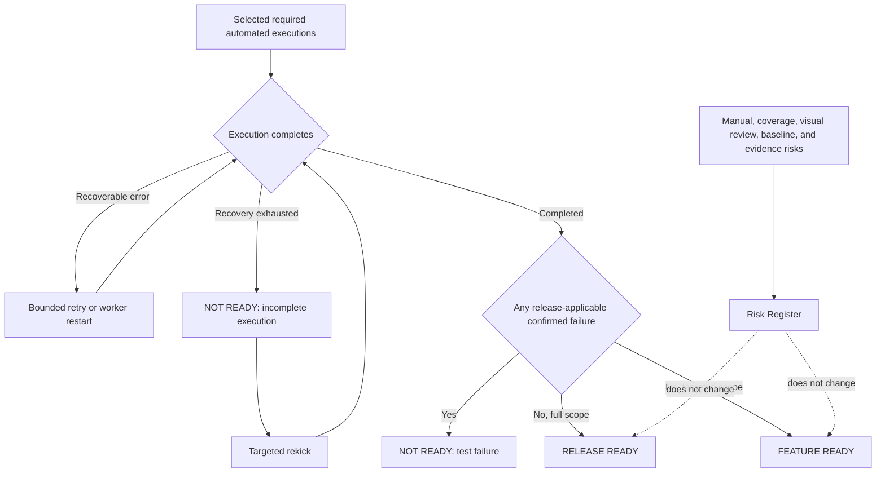
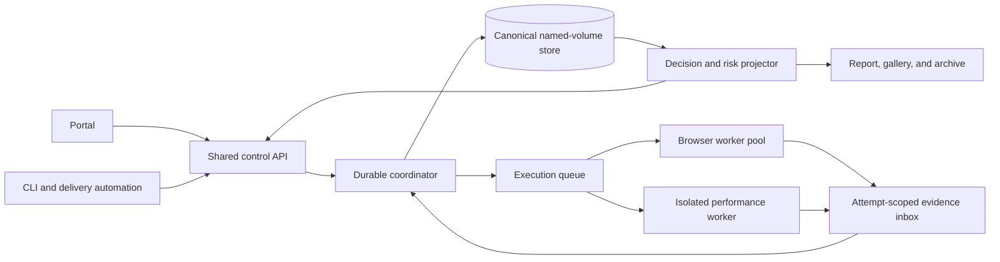
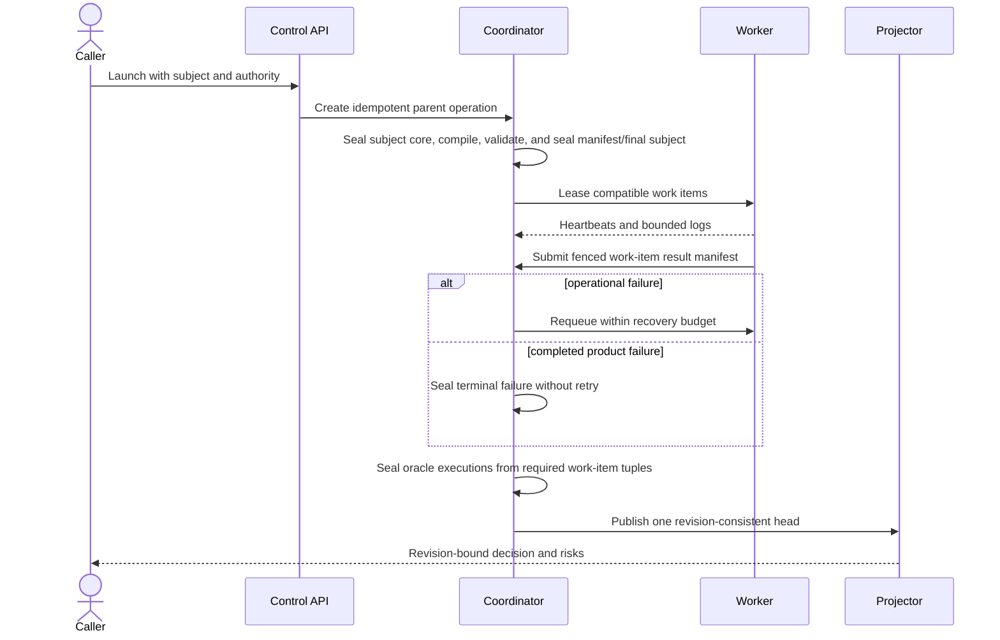
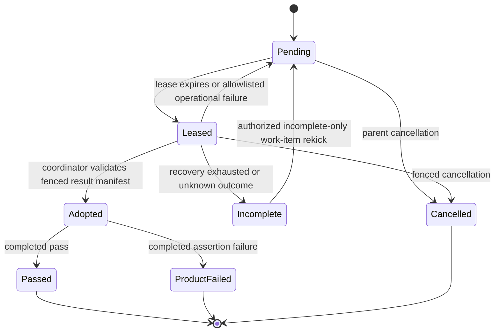
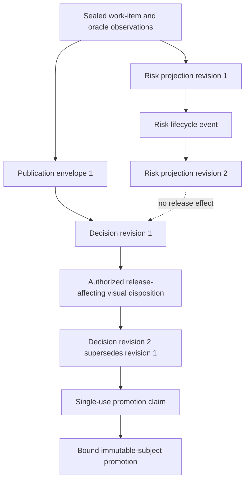
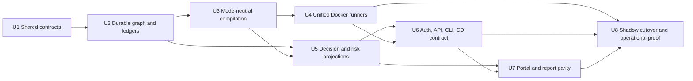

# Shared Release Decisions and Risk Register - Plan

## Goal Capsule

- **Objective:** Operators and delivery automation can rely on either audit mode for a scope-qualified release decision while retaining prominent, actionable visibility into every non-blocking risk.
- **Means:** Add one shared Release Decision layer, Risk Register, recovery contract, and CD-facing result across Single-site and Comparative audits.
- **Product authority:** This contract governs release decisions, risk presentation, and execution recovery in both audit modes. It supersedes the advisory-only promotion boundary in `docs/plans/2026-08-25-0240-feat-single-site-audit-mode-plan.md` without changing that plan's audit scope or Product Oracles.
- **Open blockers:** None.

---

## Product Contract

### Summary

Single-site and Comparative audits will use one durable execution system and publish the same authoritative, scope-qualified Release Decision alongside Site Health and a front-and-center Risk Register. Confirmed release-applicable test failures and unrecovered required executions prevent readiness; manual work and other review risks remain visible without blocking automation.

Product Contract unchanged during technical enrichment except for the confirmed clarification that both modes share the runner and orchestration model as well as the product experience.

### Problem Frame

Single-site Audit currently selects every standalone-eligible definition and executes every automated case in its full profile but deliberately stops at an advisory Site Health Verdict. That makes a clean beta audit insufficient for automated promotion even though the suite has enough deterministic evidence to judge the tested deployment.

The two audit modes also expose attention items through different concepts and surfaces. A future CD pipeline needs one stable answer, while human reviewers need the nuance that answer omits. Collapsing both into one green or red badge would either hide risk or let subjective review work stall automation.

### Key Decisions

- **Separate Release Decision from Site Health.** (session-settled: user-approved — chosen over redefining Site Health and a configurable policy engine: a dedicated decision preserves diagnostic truth and gives CD a stable contract.) Governs R1-R8.
- **Test outcomes are the release gate.** (session-settled: user-directed — chosen over manual, coverage, and unreviewed-visual gates: human attention must not silently stop delivery unless review confirms a visual defect.) Governs R3-R6, R9-R13.
- **Readiness is qualified by selected scope.** (session-settled: user-directed — chosen over denying targeted runs authority or implying whole-site readiness: targeted tests should certify only the named features they exercised.) Governs R2, R3, R19.
- **Recovery and targeted rekick are first-class.** (session-settled: user-directed — chosen over aborting a run or silently accepting missing work: the platform should recover automatically and isolate irrecoverable executions.) Governs R5, R14-R17.
- **Both modes share the product experience.** (session-settled: user-directed — chosen over adding release authority only to Single-site Audit: feature parity keeps reports, operations, and CD integration coherent.) Governs R18-R22.
- **Existing production defects remain context.** (session-settled: user-directed — chosen over blocking a comparison whenever production is already broken: the defect stays prominent while candidate-specific failures and regressions determine readiness.) Governs R7, R11, R21.
- **Release authority is bound and revisioned.** (review-confirmed — chosen over portable green status: a decision is valid only for the immutable release subject, declared scope, configuration, and revision it certifies.) Governs R3, R8, R17, R19-R20, R23-R25.

### Actors

- A1. **Audit operator:** Launches full or targeted audits, watches recovery, reviews risks, and rekicks incomplete work.
- A2. **Evidence reviewer:** Resolves human-review risks without rewriting immutable observations or automated results.
- A3. **Delivery automation:** Consumes the release decision, certified scope, reason codes, and stable exit behavior.
- A4. **Audit worker:** Executes required tests, retries recoverable failures, and publishes fenced attempt evidence.

### Requirements

**Release authority**

- R1. Every finalized Single-site and Comparative audit shall publish one Release Decision that remains distinct from Site Health, the Risk Register, and AI interpretation.
- R2. Release Decision shall use `RELEASE READY` for a full scope, `FEATURE READY` for a targeted scope, and `NOT READY` for a blocking outcome.
- R3. A run shall become ready for exactly its declared, non-empty scope when every selected required automated execution completes and no blocking outcome under R4 or R5 remains; compilation shall reject an empty required-execution set or a result whose executed scope does not match the authority requested by its caller.
- R4. Any confirmed failed required automated execution applicable to the certified release scope shall produce `NOT READY — TEST FAILURE`, including a deterministic visual failure or a visual change reviewed as a defect.
- R5. Any required automated execution that remains incomplete after bounded recovery shall produce `NOT READY — INCOMPLETE EXECUTION` until that execution completes successfully.
- R6. A non-blocking Risk Register entry shall never change the Release Decision or delivery exit result. `RISKS FLAGGED` is presentation metadata attached to a ready decision, not an additional Release Decision value.
- R7. A defect observed only in production, or reproduced unchanged in both Comparative environments, shall remain non-blocking baseline context unless an applicable paired-environment Product Oracle proves that the candidate introduced or worsened it.
- R8. Release Decision shall derive only from canonical execution results and authorized visual defect dispositions, shall be bound to the immutable release subject defined by R23, and shall not be changed by AI interpretation.

**Risk Register and human review**

- R9. Both audit modes shall publish a Risk Register containing coverage gaps, outstanding manual checks, unreviewed visual changes, production baseline defects, certificate bypasses, and evidence or pipeline limitations that do not make a required execution incomplete.
- R10. Each risk shall identify its category, severity, affected mode and scope, source execution or evidence, explanation, recommended human action, review state, release effect, actor attribution, and relevant timestamps. Non-visual risks shall support explicit `OPEN`, `ACKNOWLEDGED`, `RESOLVED`, and `SUPERSEDED` lifecycle states without rewriting their source observations.
- R11. Active risks shall appear beside the Release Decision on primary run, report, and review surfaces, ordered by product impact before operational attention.
- R12. An unreviewed visual `CHANGED` result shall remain non-blocking and require human review; a defect disposition shall create a failed visual result under R4.
- R13. Outstanding manual checks and coverage gaps shall remain non-blocking even when the Release Decision is ready.

**Recovery and rekick**

- R14. A required execution that encounters an operational failure shall receive bounded automatic retries or worker restarts with each attempt, recovery action, and terminal reason retained in visible logs; a completed product-assertion failure shall remain terminal and shall not be retried automatically.
- R15. Exhausting recovery for one execution shall not stop unaffected executions from completing.
- R16. An authorized operator and automation API shall be able to rekick only incomplete executions while preserving prior attempts and the original run's audit scope. Rekick requests shall be idempotent, execution-addressed, concurrency-limited, and subject to bounded attempt and resource limits.
- R17. A successful rekick shall recompute the original run's Release Decision from the complete authoritative execution set without duplicating passed work. It shall retain the original release subject, targets, configuration, and environment identity and shall reject any mismatch.

**Cross-mode parity and delivery integration**

- R18. Release Decision, Risk Register, live recovery state, rekick controls, report presentation, and exported result shapes shall have feature and accessibility parity across Single-site and Comparative modes, including keyboard operation, focus management, semantic status announcements, and non-color-only state cues.
- R19. Before execution, the caller shall declare whether it requests `FULL` or `TARGETED` authority. Every ready decision shall expose the granted authority; a targeted decision shall enumerate the features, definitions, targets, and known limits it certifies, while a full decision shall enumerate its coverage basis. A mismatch between requested and granted authority shall fail consumption rather than silently downgrade or broaden authority.
- R20. The machine-readable result shall expose distinct stable decision codes for full readiness, targeted readiness, and each not-ready reason; blocking reasons; risk summary; certified scope and coverage basis; release-subject identity; run and decision revisions; supersession state; and exit behavior in which an authority-matched ready result is success and not ready, empty evidence, stale authority, or scope mismatch is failure.
- R21. Comparative mode shall retain its candidate, production, and paired-contract semantics while presenting production-only problems through the shared Risk Register per R7.
- R22. Comparison-only definitions shall remain outside Single-site mode and shall be disclosed as not applicable rather than as failures, incomplete executions, or coverage gaps.
- R23. Every Release Decision shall identify an immutable release subject containing at minimum the audited deployment or build identity, target origins, audit mode, selected configuration, environment identity, and declared scope. Delivery automation shall reject a result that does not match the release subject it intends to promote.
- R24. Rekicks and release-changing visual dispositions shall require explicit authorization, CSRF protection for browser mutations, immutable actor attribution, and an append-only audit history. Authorization to view a run shall not by itself grant authority to mutate its release truth.
- R25. Any accepted visual disposition, confirmed visual defect, successful rekick, or other release-relevant mutation shall publish a new decision revision that supersedes the prior revision without altering sealed observations. Human and machine consumers shall identify superseded results and consume only the latest applicable revision.
- R26. Risk Register surfaces shall distinguish `LOADING`, `PROVISIONAL`, `AVAILABLE`, `PARTIAL`, `EMPTY`, and `UNAVAILABLE` states so missing or delayed risk data cannot appear to mean that no risks exist.
- R27. Certificate validation bypass shall remain a non-blocking risk when explicitly enabled for a development target, and shall be disclosed in the human report, Risk Register, certified scope, and machine-readable result.
- R28. A completed product-assertion failure shall remain authoritative and terminal for its immutable release subject. An explicit same-subject rerun may publish diagnostic evidence but shall not replace the failed canonical result or revise release authority; testing a changed deployment, build, configuration, target, or declared scope requires a new authoritative run.

### Decision and Risk Shape

### Key Flows

- F1. **Finalize a completed audit**
  - **Trigger:** All selected required executions reach a terminal state.
  - **Actors:** A3, A4
  - **Steps:** Aggregate deterministic outcomes, derive the scope-qualified decision, assemble risks independently, and publish both atomically.
  - **Outcome:** Delivery automation receives one authoritative result while operators retain the underlying nuance.
  - **Covers:** R1-R13, R18-R27.

- F2. **Recover and rekick incomplete work**
  - **Trigger:** A required execution loses its worker or fails for an operational reason.
  - **Actors:** A1, A3, A4
  - **Steps:** Retry within bounds, continue unaffected work, publish an incomplete decision when recovery is exhausted, and accept a scoped rekick.
  - **Outcome:** Missing work cannot masquerade as a pass, and completed work is not repeated unnecessarily.
  - **Covers:** R5, R14-R17, R20, R28.

- F3. **Review visual change**
  - **Trigger:** A compatible visual comparison reports `CHANGED` without a deterministic failure.
  - **Actors:** A1, A2
  - **Steps:** Add a non-blocking risk, present comparison evidence, authorize and audit the review disposition without altering original evidence, and publish a superseding decision revision when release truth changes.
  - **Outcome:** An accepted change resolves the risk; a confirmed defect produces the blocking result defined by R4, and stale decision revisions remain identifiable.
  - **Covers:** R4, R6, R8, R10-R12, R24-R26.

- F4. **Compare candidate with an already-broken production baseline**
  - **Trigger:** Comparative mode observes a production defect that is not a candidate regression.
  - **Actors:** A1, A2, A3
  - **Steps:** Preserve the production observation as baseline context, add it to the Risk Register, and evaluate candidate-specific Product Oracles normally.
  - **Outcome:** The issue remains visible without blocking a candidate that did not introduce or worsen it.
  - **Covers:** R6, R7, R10, R21.

### Acceptance Examples

- AE1. **Full Single-site run with manual work outstanding**
  - **Covers R1-R6, R9-R13, R19.**
  - **Given:** Every required automated execution passes and manual checks remain outstanding.
  - **When:** The run finalizes.
  - **Then:** The decision is `RELEASE READY`, and the manual work appears prominently as a non-blocking risk.

- AE2. **Targeted feature validation**
  - **Covers R2, R3, R19.**
  - **Given:** A targeted navigation and search audit completes without failures.
  - **When:** The run finalizes.
  - **Then:** The decision is `FEATURE READY` and names navigation, search, their definitions, and their targets without implying whole-site readiness.

- AE3. **Known coverage gap with passing executions**
  - **Covers R3, R6, R9, R13.**
  - **Given:** Every selected required execution passes and the coverage manifest records an untested route limitation.
  - **When:** The run finalizes.
  - **Then:** The scope-qualified decision is ready and the limitation remains a prominent non-blocking risk.

- AE4. **Visual change awaiting review**
  - **Covers R4, R6, R12.**
  - **Given:** A visual comparison reports `CHANGED` without failing a deterministic assertion.
  - **When:** The run finalizes and later receives human review.
  - **Then:** The run remains ready while review is pending, becomes not ready if the reviewer confirms a defect, and remains ready if the change is accepted.

- AE5. **Worker cannot recover**
  - **Covers R5, R14-R17.**
  - **Given:** One required execution exhausts automatic recovery while other executions finish.
  - **When:** The run finalizes and the operator rekicks the incomplete execution.
  - **Then:** The decision remains `NOT READY — INCOMPLETE EXECUTION` until the rekick passes, after which the decision is recomputed without rerunning completed work.

- AE6. **Existing production defect**
  - **Covers R6, R7, R21.**
  - **Given:** Comparative mode observes a production defect and no candidate-specific regression.
  - **When:** The run finalizes.
  - **Then:** The defect appears as non-blocking baseline risk and does not prevent a ready decision.

- AE7. **Candidate regression**
  - **Covers R4, R7, R21.**
  - **Given:** A paired Product Oracle proves the candidate introduced or worsened a defect.
  - **When:** The run finalizes.
  - **Then:** The decision is `NOT READY — TEST FAILURE` with the production context retained.

- AE8. **CD consumption**
  - **Covers R3, R6, R19-R20, R23, R25.**
  - **Given:** A run is ready but has active human-review risks.
  - **When:** Delivery automation consumes the published result.
  - **Then:** The command exits successfully with the certified scope and risk summary; active non-blocking risks do not change the exit result.

- AE9. **Requested authority does not match execution scope**
  - **Covers R3, R19-R20.**
  - **Given:** A caller requests full-site authority but compilation selects no required executions or only a targeted feature set.
  - **When:** The run is compiled or its result is consumed.
  - **Then:** The operation fails with an empty-evidence or scope-mismatch reason and cannot publish or consume a ready decision.

- AE10. **Late visual defect review**
  - **Covers R4, R12, R24-R25.**
  - **Given:** Delivery automation previously observed a ready revision while a visual change awaited review.
  - **When:** An authorized reviewer confirms the change as a defect.
  - **Then:** A new `NOT READY — TEST FAILURE` revision supersedes the earlier result, retains the sealed evidence and review actor, and causes later consumers to reject the stale ready revision.

- AE11. **Rekick targets a changed deployment**
  - **Covers R16-R17, R23.**
  - **Given:** An incomplete execution belongs to one deployment identity and the target now resolves to a different build or configuration.
  - **When:** An operator requests a targeted rekick.
  - **Then:** The rekick is rejected as a release-subject mismatch instead of combining evidence from different deployments.

- AE12. **Risk data is unavailable**
  - **Covers R11, R26.**
  - **Given:** The Release Decision is available but the Risk Register pipeline has not loaded or has partially failed.
  - **When:** An operator opens the run or report.
  - **Then:** The surface identifies the register as loading, partial, or unavailable and does not render an empty-state claim that no risks exist.

- AE13. **Authorized and bounded mutation**
  - **Covers R16, R24.**
  - **Given:** A user can view a run but lacks release-mutation authority, or repeatedly submits the same rekick request.
  - **When:** The user attempts a visual disposition or rekick.
  - **Then:** Unauthorized mutation is rejected; an authorized duplicate request is idempotent; and actor, request, and outcome remain auditable.

- AE14. **Development certificate bypass**
  - **Covers R9, R10, R27.**
  - **Given:** Invalid-certificate bypass is explicitly enabled for a development audit whose required executions pass.
  - **When:** The run finalizes.
  - **Then:** The scope-qualified decision remains ready, while the bypass is prominently disclosed in the Risk Register, report, and machine-readable result.

- AE15. **Comparison-only definition in Single-site mode**
  - **Covers R18, R22.**
  - **Given:** The catalog contains a definition that fundamentally requires two origins.
  - **When:** A Single-site run compiles and reports coverage.
  - **Then:** The definition is shown accessibly as not applicable, is not selected, and does not become a failure, incomplete execution, or coverage gap.

- AE16. **Assertion failure is rerun diagnostically**
  - **Covers R4, R14, R23, R28.**
  - **Given:** A required assertion fails for an immutable release subject.
  - **When:** An operator reruns the same assertion against the same subject and it later passes.
  - **Then:** The original failed canonical result and `NOT READY — TEST FAILURE` decision remain authoritative; the later attempt is identified as diagnostic evidence. A fixed or changed release subject must start a new authoritative run.

### Success Criteria

- A full clean run in either mode can authorize release without a second human decision.
- A targeted clean run authorizes only its enumerated feature scope.
- No confirmed release-applicable test failure or unrecovered required execution can produce a ready decision.
- Every active human-review concern remains visible and traceable without silently blocking delivery.
- Recovery and rekick preserve completed work, attempt history, and deterministic recomputation.
- Portal, report, export, and CD consumers present the same decision and risk truth in both modes.

### Scope Boundaries

**Deferred for later**

- Project-configurable blocking policies and organization-specific risk thresholds.
- Automated ownership assignment or external ticket creation from Risk Register entries.

**Outside this product's identity**

- Letting optional AI make or alter a Release Decision.
- Treating manual acceptance, unreviewed visual changes, or coverage gaps as hidden automated failures.
- Allowing targeted readiness to imply whole-site release readiness.
- Replacing Comparative audit semantics with Single-site semantics or vice versa.

---

## Planning Contract

### Implementation Strategy

Replace the mode-specific orchestration paths with one durable parent-run graph and a shared pool of capability-aware Docker workers. Single-site and Comparative compilers will emit the same canonical execution contract; batching, worker count, and container placement will affect scheduling only, never release identity or truth.

The migration will proceed contract-first, then run both old and new derivations in shadow mode against the same evidence before the shared projector becomes authoritative. There will be no permanent fallback capable of publishing `READY` from the legacy path after cutover.

### Key Technical Decisions

- **KTD1. Use one shared execution graph and runner model for both modes.** (session-settled: user-directed — chosen over retaining mode-specific orchestration: one shared execution graph and worker model improves speed, recovery precision, logs, and release reliability.) A parent run owns an immutable release subject, a sealed execution manifest, execution attempts, and the current decision head. Single-site and Comparative differ only in compilation, Product Oracle semantics, and declared worker capabilities. Implements R14-R18 and R21-R22.
- **KTD2. Bind authority through a two-stage canonical release identity.** A launch-time subject core seals build or deployment identity, origins and roles, mode, requested authority/scope, runner/plugin/target/configuration revisions, environment identity, and certificate policy. After inventory and compilation, the final release subject seals the subject-core digest, execution-manifest digest, granted authority, and coverage basis. Inventory binds to the core; browser results, decisions, rekicks, and promotion bind to the final subject. Worker count and batch layout are excluded. Implements R3, R17, R19-R20, R23, and R28.
- **KTD3. Compile through a graph barrier with separate work and authority nodes.** A fenced inventory work item discovers and validates routes, rechecks deployment identity, and seals a non-empty manifest before browser work begins. Workers lease independently fenced work items; compiler-issued oracle executions are the canonical authority units and declare the work-item result tuple needed to seal them. Single-site units are often one-to-one, while Comparative paired oracles may be many-to-one. Implements R3, R19, R21-R23.
- **KTD4. Treat shards and batches as disposable scheduling envelopes.** Workers may batch compatible work items to amortize browser startup, but each item submits an independently fenced result manifest as soon as it finishes. Batch manifests and structured Playwright rows carry exact compiler-issued work-item identities; missing, duplicate, undeclared, or cross-batch rows are rejected. A worker death retains adopted results, and a rekick repacks only incomplete work items without changing oracle identity. Implements R14-R17.
- **KTD5. Separate product failures from operational failures.** Authoritative Playwright executions use zero assertion retries. `completed_pass`, `completed_product_failure`, `operational_failure`, `cancelled`, and `incomplete_unknown` are distinct outcomes; only allowlisted infrastructure failures receive bounded automatic recovery. A completed product failure remains canonical even if a later same-subject diagnostic rerun passes. Implements R4-R5, R14-R17, and R28.
- **KTD6. Use append-only ledgers behind one transactional publication head.** Sealed observations never change. The active coordinator serializes mutations under a durable epoch/lease, writes immutable envelopes referencing exact ledger sequences and digests, then atomically swaps one current-head pointer. Release-affecting events advance the decision revision; risk-only lifecycle events advance the risk/run revision; long mutations publish durable operation resources. Readers consume a pinned envelope, never independently assembled “latest” files. Implements R8-R10, R12, R16-R17, and R24-R26.
- **KTD7. Keep human judgment explicit, scoped, and isolated from untrusted content.** Independently revocable operator, reviewer, delivery-service, and worker principals use separate scopes and immutable server-derived identities. Automation may present visual evidence but cannot submit human judgment. Browser mutations require fail-closed shared-mode HTTPS/origin/CSRF controls. Run-generated active content never shares control cookies or the control API origin, and workers cannot write canonical state directly. Implements R12, R16, R24-R25.
- **KTD8. Expose one control contract across portal, API, CLI, and CD.** Launch, watch, list work/oracle executions, stream bounded logs, cancel, rekick incomplete work, mutate risks, submit visual dispositions, purge, and assert release all operate on the same durable objects. Promotion uses a short-lived, single-use claim bound to the exact immutable subject, authority, current head, and delivery principal so a superseding mutation before consumption stops deployment. Implements R16-R20 and R23-R26.
- **KTD9. Publish revision-consistent, object-authorized projections.** Portal, report, gallery, archive, CLI, and machine views project from one publication envelope. Every run/log/artifact/status read rechecks principal scope; raw diagnostics and untrusted active artifacts stay outside generic control-origin serving. Risk availability is explicit, and foreground review reads outrank background hydration. Implements R1, R9-R13, R18, R20, and R26.
- **KTD10. Cut over through structurally non-authoritative shadow validation.** Shared runners run beside legacy paths until their execution sets and decisions match the pre-registered matrix. Shadow output lives in a diagnostic namespace with no release head or promotion-success exit. A singleton cutover advances the authority epoch once; after that, legacy and incompatible rollback readers fail closed and cannot independently authorize release. Implements R1, R8, R18, R20-R21.

### Planning Assumptions

- The first hardened deployment remains a single Docker Engine with named local volumes. It is restart- and crash-resilient but does not claim multi-host high availability.
- A configured, secret-backed opaque service identity with explicit scopes is sufficient for initial CD integration; introducing OAuth or an external identity provider is deferred.
- Full runs use bounded parallel batches. Small targeted runs may use one batch; larger targeted runs use the same bounded parallel scheduler. The exact batch-size default is tuned by load evidence rather than embedded in release identity.
- Cancelling a parent run fences outstanding work and finalizes it as incomplete. Cancellation is not resumable; a new authoritative run or an explicitly diagnostic child is required.
- Baselines and credentials remain separate narrow stores. Historical Comparative artifacts and old Single-site volumes are imported as read-only compatibility sources rather than merged into an in-flight shared ledger.

### Scope Boundaries

#### Included Technical Scope

- Replacement of both runner/orchestrator paths, including Single-site route inventory and Comparative isolated performance work.
- Shared durable storage, recovery, projections, mutation authorization, portal/API/CLI controls, reports, Risk Register, and promotion assertion.
- Migration and shadow-comparison tooling, Docker scale/crash validation, and live proof against the beta Single-site target plus the beta/production Comparative pair.

#### Deferred to Follow-Up Work

- Multi-host scheduling, remote database or object-store coordination, and cross-region availability.
- Organization-managed identity federation, delegated approval policy, and third-party ticketing integrations.
- Automatic worker autoscaling beyond configured Docker Compose replicas.

### High-Level Technical Design

These sketches define boundaries and invariants, not framework-specific implementation.

#### Shared component topology

#### Mode-neutral compilation and execution data flow

```mermaid
flowchart LR
  REQUEST[Declared mode, authority, targets, scope] --> CORE[Sealed subject core]
  CORE --> COMPILER{Mode compiler}
  COMPILER -->|Single-site| INVENTORY[Inventory barrier]
  COMPILER -->|Comparative| PAIRED[Paired Product Oracle units]
  INVENTORY --> MANIFEST[Sealed work-item and oracle manifest]
  PAIRED --> MANIFEST
  MANIFEST --> SUBJECT[Final release subject]
  SUBJECT --> BATCH[Disposable compatible batches]
  BATCH --> RESULTS[Per-work-item fenced results]
  RESULTS --> ORACLES[Sealed oracle executions]
  ORACLES --> DECISION[Release Decision]
  RESULTS --> RISKS[Risk observations]
```

#### Launch, recovery, and publication protocol

#### Leaseable work-item lifecycle

#### Publication and revision lifecycle

#### Shared versus mode-specific responsibilities

| Concern | Shared | Single-site specialization | Comparative specialization |
|---|---|---|---|
| Subject core/final subject, graph, queue, leases, retries, logs | Yes | None | None |
| Compilation | Contract and output shape | Inventory barrier and standalone-eligible definitions | Paired origin roles and comparison-only definitions |
| Product Oracle | Work-item result plus canonical oracle-execution contract | Usually one work item per oracle | Paired many-to-one evidence tuple and regression semantics |
| Worker scheduling | Capability-aware batching and fencing | Ordinary browser capability | Ordinary browser plus isolated performance capability |
| Decision, risks, report, portal, CLI, CD | Yes | Mode labels and not-applicable disclosures | Candidate/production context and baseline risks |

### Execution Dependencies

### System-Wide Impact

- **Persistence and ownership:** Canonical writes move behind one coordinator epoch and current-head publisher. Workers retain attempt-scoped evidence writes only; baselines, credentials, historical artifacts, and canonical state keep separate mount/permission boundaries.
- **Execution semantics:** A parent run contains leaseable work items and canonical oracle executions. Existing Playwright rows, batches, shards, and process exit codes become diagnostic/scheduling inputs rather than authority units.
- **Runner lifecycle:** Single-site inventory and Comparative paired/performance work enter one graph. Only worker replicas scale; coordinator, projector, and final publication ownership remain singleton and fenced across mixed-version restarts.
- **Release consumption:** Portal, reports, archives, API, CLI, and CI select one publication envelope. Delivery consumes a single-use claim for the live head rather than trusting copied or archived green output.
- **Security boundary:** Browser mutations, service calls, worker publication, direct artifact reads, raw logs, and purge each receive explicit object/action authorization. Untrusted active artifacts cannot share the authenticated control origin.
- **Historical compatibility:** Legacy volumes and host artifacts remain read-only sources. Compatibility adapters can render them but cannot synthesize missing shared fields or publish READY after the authority epoch advances.
- **Failure propagation:** Product failure remains terminal; operational loss affects only unfinished work items; projection/store corruption disables authority while preserving available read-only evidence and unrelated run progress.
- **Operational footprint:** Named-volume identity, bytes/inodes, filesystem atomicity, permissions, digest-chain health, lease age, operation backlog, and writer protocol become startup and monitoring signals.

---

## Implementation Units

### U1. Define shared release, execution, and risk contracts

**Goal:** Establish one validated vocabulary and pure derivation boundary before either runner changes.

**Traceability:** R1-R10, R19-R28; F1-F4; AE1-AE16; KTD2, KTD5-KTD6.

**Dependencies:** None.

**Files:**

- Add pure shared modules under `shared/` for subject-core/final-subject schemas, work-item and oracle-execution results, decision derivation, risk records, and publication envelopes.
- Adapt `scripts/lib/release-truth.mjs`, `portal/release-eligibility.mjs`, `reporters/report-model.ts`, and `scripts/lib/site-health.mjs` to consume the shared contracts.
- Add contract self-tests beside the existing `scripts/*-self-test.*` suite and update `CONCEPTS.md` only for missing domain definitions.

**Approach:**

- Define deterministic canonicalization and digest rules for subject cores, final release subjects, and sealed work-item/oracle manifests.
- Define stable decision codes, outcome taxonomy, authority/scope mismatch reasons, risk availability states, risk identity, and append-only event envelopes.
- Implement a pure reducer whose inputs are the release subject, sealed canonical execution results, and authorized release-affecting dispositions. AI output, manual obligations, and risk lifecycle state cannot enter that reducer.
- Retain non-authoritative compatibility readers for existing Comparative and Single-site artifacts, but require explicit mode and completeness instead of inferring READY from partial legacy data; only U8 may switch the authority epoch.

**Test scenarios:**

- A full Single-site manifest with all required passes derives `RELEASE READY`; the same execution set declared targeted derives only `FEATURE READY` with enumerated scope.
- Empty manifests, undeclared executed units, requested/granted authority mismatch, stale subject digest, and stale decision revision fail closed with distinct stable codes.
- A manual check, coverage gap, certificate bypass, or unreviewed visual change changes risk metadata but not a ready decision.
- A canonical product failure outranks an accompanying operational incident while preserving both blocking reasons; an incomplete execution without a product failure derives incomplete.
- Canonical serialization produces the same digest regardless of object key order and rejects unsupported schema versions or corrupted digest chains.
- The subject core remains stable through inventory; the final subject cannot seal until the execution manifest, granted authority, and deployment-identity recheck agree.
- A Comparative many-to-one oracle remains undecided until every declared work-item result is adopted; a Single-site one-to-one oracle seals from the same contract.

**Verification:** Run the focused contract self-tests in the pinned Node container and snapshot representative JSON results for both modes.

### U2. Add the durable parent-run graph, attempts, operations, and ledgers

**Goal:** Make a run and each execution recoverable across process and container restarts.

**Traceability:** R3-R5, R8-R10, R14-R17, R23-R26; F1-F3; AE5, AE9-AE13, AE16; KTD1-KTD6.

**Dependencies:** U1.

**Files:**

- Extract atomic filesystem primitives from `scripts/lib/job-queue.mjs`; add focused versioned parent-run store, work-item queue, ledger, coordinator, and legacy-read-adapter modules under `scripts/lib/`.
- Update `portal/report-publication.mjs` to project immutable publication revisions from the shared store.

**Approach:**

- Persist the parent run, subject core/final subject, compilation state, sealed work-item/oracle manifest, attempts, leases, fencing tokens, heartbeats, bounded logs, operation resources, immutable publication envelopes, and one transactional current-head pointer with atomic write/fsync/rename discipline.
- Give the coordinator its own durable epoch/lease and sole authority to expand graphs, adopt results, seal oracles, apply operations, and publish heads. Permit one fenced inventory owner and one active lease per work item; reject stale coordinators and results.
- Model launch, cancellation, rekick, and long mutations as idempotent durable operations with request identity, body digest, actor, state, and outcome.
- Maintain separate append-only decision, risk-lifecycle, mutation-audit, and operation histories. Serialize mutations under the coordinator epoch, fsync an immutable publication envelope referencing exact ledger sequences/digests, then atomically swap one head. Fail closed on corruption; do not claim cryptographic nonrepudiation.
- Validate a store manifest containing Docker Engine/Compose deployment identity, volume identity, schema, authority epoch, writer protocol, creation/cutover revision, and backup marker. Keep baselines, secrets, and historical compatibility roots separate.

**Test scenarios:**

- Killing the coordinator after an operation is accepted but before response delivery allows the same idempotency key to recover the original operation rather than duplicate it.
- Two workers attempting the same execution produce one accepted lease/result; a stale worker's heartbeat and result are fenced after lease expiry.
- A worker publishes a product failure and then crashes; the terminal failure survives and is not reclassified as infrastructure failure.
- Cancelling a run fences outstanding leases, preserves completed evidence, and publishes incomplete authority; attempting to resume the cancelled run is rejected.
- A corrupted ledger link, missing sealed manifest, or non-local-volume mount produces an explicit unavailable/incomplete state and cannot yield READY.
- Two coordinators racing yield one epoch owner; a stale owner cannot adopt results or swap the head after takeover. Crashes around envelope fsync and head swap expose either the old complete head or the new complete head.

**Verification:** Exercise queue/ledger self-tests against a temporary named Docker volume, including restart, simultaneous-claim, SIGKILL, persistence, and legacy-read fixtures.

### U3. Compile both modes into one canonical execution graph

**Goal:** Preserve each mode's Product Oracles while removing orchestration-specific execution shapes.

**Traceability:** R3-R4, R7, R18-R23, R27-R28; F1, F4; AE2-AE3, AE6-AE7, AE9, AE14-AE16; KTD1-KTD3.

**Dependencies:** U1 and U2.

**Files:**

- Refactor the catalog/run-context compiler used by `scripts/run-single-site.mjs` and `scripts/run-sharded-release.mjs` into pure compiler modules under `shared/`.
- Adapt `scripts/probe-single-site.mjs`, route-inventory helpers, plugin definitions, target registry, and Comparative shard planning to emit canonical execution units.
- Extend `scripts/run-compiler-self-test.mjs`, route-inventory tests, enumeration tests, and plugin/target validation tests.

**Approach:**

- Create one parent graph from declared authority, selected features/definitions/targets, mode, subject core, and environment policy.
- Single-site compilation begins with a fenced inventory work item, validates and digest-binds discovered routes, rechecks deployment identity, expands work-item/oracle nodes, and seals the manifest/final subject exactly once.
- Comparative compilation emits oracle executions whose completion requires their declared candidate/production work-item tuple. Production-only observations remain contextual unless the oracle proves a candidate regression.
- Mark comparison-only definitions not applicable in Single-site without adding failures, incomplete nodes, or coverage gaps. Reject empty or authority-incompatible graphs.

**Test scenarios:**

- A beta Single-site full audit inventories routes once, seals a non-empty manifest, and selects every standalone-eligible required execution.
- A targeted Single-site request seals only the declared feature units and cannot claim full authority.
- A Comparative paired assertion does not complete when only one required side publishes; it completes with baseline context when both sides satisfy the oracle.
- Losing one side of a paired oracle preserves the adopted opposite-side work item; rekick schedules only the missing side and seals the unchanged oracle identity.
- A comparison-only definition is disclosed as not applicable in Single-site and remains selected in Comparative mode.
- Inventory failure retries only while the graph is unsealed; an incomplete child rekick never reruns inventory or changes the execution-set digest.

**Verification:** Compare compiled manifests against existing beta Single-site and beta/production Comparative fixtures, then assert stable execution identities across repeated compilation and worker-count changes.

### U4. Introduce shared capability-aware Docker worker pools

**Goal:** Gain within-run parallelism and precise recovery without changing canonical test truth.

**Traceability:** R4-R5, R14-R18, R21, R28; F1-F2; AE5, AE7, AE16; KTD1, KTD4-KTD5.

**Dependencies:** U2 and U3.

**Files:**

- Introduce shared coordinator/worker entry points alongside `scripts/run-single-site-worker-pool.mjs`, `scripts/run-single-site-worker.mjs`, `scripts/run-sharded-release.mjs`, `scripts/run-playwright-shard.mjs`, and `scripts/run-playwright-performance.mjs`; U8 owns authority cutover and retirement.
- Update Playwright configuration to disable authoritative assertion retries and preserve diagnostic runs as separate lineage.
- Update `Dockerfile`, `docker-compose.yml`, queue identity checks, pool tests, sharded isolation tests, and Docker smoke workflows.

**Approach:**

- Scale identical worker containers that claim compatible work items and may batch by browser capability, target, and spec affinity.
- Give workers only lease-bound inputs and attempt-scoped evidence inboxes. The coordinator validates subject/fence/runner revision, structured row identities, size/count bounds, and artifact digests before adopting results; workers cannot mount canonical ledger/head roots writable.
- Submit every work-item result independently rather than waiting for a batch to finish. Repack only unfinished items after worker loss; use batch exit status as diagnostics rather than canonical truth.
- Keep isolated performance execution as a specialized capability class using the same lease, result, logging, and recovery protocol.
- Protect performance Product Oracles with a global exclusive resource lease: pause new ordinary leases, drain active browser work, then allow exactly one performance worker under the documented resource envelope.
- Classify only allowlisted external infrastructure evidence as operational failure. Navigation, assertion, and test timeouts remain product failures unless a trusted platform signal proves otherwise.
- Preserve narrow volume writers and run workers as the unprivileged Playwright user without Docker socket access or portal secrets.

**Test scenarios:**

- The same sealed graph run with one worker and multiple workers produces identical canonical results, subject digest, decision, and evidence membership while the multi-worker run reduces wall-clock time on the beta workload.
- Killing one worker midway retains its already-adopted work-item results, expires only its unfinished leases, and allows other workers to finish unaffected work.
- An isolated performance execution cannot be claimed by an ordinary browser worker and publishes through the same result contract when the capable worker runs.
- An authoritative assertion failure receives no Playwright retry; an allowlisted browser-process crash consumes a bounded recovery attempt with visible command and recovery logs.
- Scaling worker replicas up and down during a run does not duplicate evidence or change release authority.
- Partial batch exit, missing/duplicate/undeclared/cross-batch result rows, expired fences, artifact path escapes, and attempts to read or write another run are rejected without changing canonical truth.

**Verification:** Use Docker Compose to prove 1→N→1 scaling, container restart, SIGKILL, lease expiry, persisted progress, bounded recovery, and unchanged verdicts on identical inputs.

### U5. Project shared Release Decisions, Risk Registers, and revisions

**Goal:** Make both modes publish one authoritative decision and one lifecycle-aware, non-blocking Risk Register.

**Traceability:** R1-R13, R17-R22, R25-R27; F1, F3-F4; AE1-AE8, AE10, AE12, AE14-AE15; KTD5-KTD6, KTD9.

**Dependencies:** U1-U3.

**Files:**

- Rebuild `scripts/lib/release-truth.mjs`, `portal/release-eligibility.mjs`, `reporters/report-model.ts`, and `portal/console-risk.mjs` as projections over shared contracts.
- Extend `portal/visual-review-dispositions.mjs` from a Single-site fixed-actor store to scoped, append-only superseding dispositions.
- Update report publication, Site Health inputs, archive models, and their self-tests.

**Approach:**

- Derive decisions only after the required graph barrier is terminal or explicitly incomplete. Publish the decision and the risk availability/projection revision as one revision-consistent view.
- Create immutable risk source observations and overlay lifecycle events keyed by run, category, and immutable source identity. Source disappearance produces `SUPERSEDED`, never deletion.
- Keep risk-only acknowledgement/resolution changes from advancing decision revision. Every authorized visual disposition is release-relevant: acceptance publishes a superseding revision with the same ready value, while defect confirmation publishes a superseding not-ready value; successful incomplete-only rekick also advances the decision revision.
- Allow a reviewer to supersede a prior visual disposition with an expected review revision while retaining the full chain.

**Test scenarios:**

- Single-site and Comparative fixtures with equivalent pass/fail/incomplete states derive the same decision codes and Risk Register availability semantics.
- A production-only Comparative defect appears as a prioritized non-blocking baseline risk, while a proven candidate regression blocks release.
- A pending visual review remains non-blocking; acceptance resolves the risk without changing release truth; defect confirmation publishes a superseding not-ready decision.
- A ready revision followed by visual acceptance yields a newer ready decision revision; a consumer pinned to the earlier revision is stale even though the decision value did not change.
- A later correction supersedes the prior visual disposition only when the expected review revision matches and preserves every actor/action record.
- Loading, partial, unavailable, empty, and available Risk Register states remain distinguishable in projections and exports.

**Verification:** Run shared reducer golden fixtures through reporter, portal, archive, and CLI serializers and assert byte-equivalent decision/risk meaning across surfaces.

### U6. Add scoped mutation auth and a shared API/CLI/CD contract

**Goal:** Let humans and automation control and consume runs safely through the same durable interface.

**Traceability:** R16-R20, R23-R26; F1-F3; AE5, AE8-AE13; KTD7-KTD8.

**Dependencies:** U2, U4, and U5.

**Files:**

- Extend `portal/server.mjs`, `portal/console-api.mjs`, and the existing operator authorization flow with scoped browser, reviewer, delivery-service, and worker identities.
- Split control-origin application responses from untrusted/run-generated active artifacts and raw diagnostic serving.
- Add shared CLI commands/scripts for launch, watch, execution inspection, bounded logs, cancel, rekick, risk mutation, and release assertion; replace the narrow behavior in `scripts/assert-release-decision.mjs`.
- Expand `scripts/portal-security-self-test.mjs`, console API integration tests, and release-truth tests.

**Approach:**

- Make shared mutation mode fail closed unless startup has a trusted external HTTPS origin and secure host-only session policy with idle/absolute expiry, renewal, logout, and revocation. Retain local HTTP mutation only when both socket and published binding are loopback. Require unsafe methods, JSON, exact Origin, synchronizer CSRF header, and same-origin fetch metadata.
- Create distinct, independently revocable principal records and credentials for humans, services, and workers. Store credential verifiers safely, scope them per project/run/action, derive immutable actor identity server-side, and keep the legacy shared unlock link limited to loopback single-operator use.
- Serve active run artifacts from a cookie-less non-control origin or force inert/download rendering; keep privileged portal reports under strict escaping and script policy. Reauthorize every run/log/artifact/range/stream read at object level.
- Return durable operation resources for asynchronous mutations. Namespace idempotency by principal, operation type/target, and request ID; retain body digest/result through the retry window and enforce revision, quota, and resource bounds.
- Split scopes for visual disposition, risk acknowledgement/resolution, rekick, cancel, purge, and promotion. A live derived certificate, coverage, or pipeline condition may be acknowledged but not resolved away while its sealed source remains present.
- Model purge as a privileged durable operation that first fences work and publishes an irreversible authority tombstone, then removes evidence while retaining the minimal subject/decision/audit lineage outside the purge target.
- Keep CLI JSON on stdout and diagnostics on stderr. Release assertion issues a short-lived, single-use promotion claim matching subject, authority, execution-set digest, run/decision revisions, supersession state, and delivery principal; head change invalidates the claim.

**Test scenarios:**

- A view-only browser session cannot rekick, cancel, mutate risk, or submit a visual disposition; each authorized role can perform only its assigned actions.
- Missing/wrong Origin, CSRF token, content type, subject, or expected revision rejects a browser mutation without changing durable state.
- A duplicate mutation request returns the original operation; reusing its key with different content is rejected and audited.
- Delivery automation succeeds for an authority-matched current ready head with active non-blocking risks, and fails for not-ready, stale, empty, superseded, or scope-mismatched results.
- Worker credentials can claim/publish executions but cannot read unrelated run evidence or mutate release decisions.
- Malicious HTML/SVG/report/log content cannot read control bootstrap data, call mutations, navigate the control frame, or receive control cookies; no rejected attempt advances an operation, ledger, or head.
- Two reviewers remain distinguishable in immutable history; revocation, expiry, role change, credential confusion, proxy/header spoofing, sibling-origin requests, and client-supplied actor fields fail closed.
- Pausing delivery after assertion, superseding the decision, then resuming causes promotion-claim consumption to fail; replay, expiry, wrong subject, and wrong principal also fail.
- Crashes before, during, and after purge yield either an intact run or a tombstoned non-promotable run; copied pre-purge READY output cannot authorize delivery.

**Verification:** Run the security matrix and API/CLI integration suite in Docker, including portal restart between mutation acceptance and status retrieval.

### U7. Deliver cross-mode portal, report, gallery, and archive parity

**Goal:** Put release risk, live recovery, and actionable controls at the forefront without sacrificing information density or responsiveness.

**Traceability:** R1-R2, R9-R13, R16-R20, R25-R27; F1-F3; AE1-AE5, AE8, AE10, AE12-AE15; KTD8-KTD9.

**Dependencies:** U5 and U6.

**Files:**

- Update `portal/public/run-workspace.*`, `report.*`, `runs.*`, `gallery-*`, `findings.*`, shared console components, and asynchronous controllers.
- Update `portal/console-run.mjs`, report/index projections, gallery/archive data models, and related browser/self-tests.
- Update reporter and archive assets under `reporters/` to render the same revision-bound contract offline.

**Approach:**

- Present Product Risk first, with Pipeline Integrity adjacent but subordinate; neither hides the other. Show current decision, certified scope, revision, active tests, recovery, and the newest completed run.
- Place incomplete-execution rekick and authorized risk/review actions in contextual inspectors, backed by durable operation progress rather than blocking page requests.
- Use paged/virtualized bounded logs and evidence lists so large runs cannot overrun the browser. Preserve foreground review priority over background gallery hydration.
- Ingest structured allowlisted log fields, sanitize terminal/markup controls, redact before publication, separate raw sensitive evidence from offline/public archives, and treat regex scanning only as a detection backstop.
- Announce loading, provisional, partial, unavailable, completion, and failure states semantically; preserve keyboard navigation, focus return, and non-color status cues.

**Test scenarios:**

- Single-site and Comparative reports expose the same decision, risk columns, operation states, and controls while retaining their mode-specific context.
- A large evidence/log fixture opens quickly, fetches bounded pages asynchronously, preserves keyboard gallery navigation, and does not freeze other run controls.
- Starting a rekick shows immediate durable operation feedback, survives navigation/reload, streams useful command/HTTP/recovery logs, and updates only when a new revision publishes.
- A missing or delayed risk projection displays loading/partial/unavailable instead of “no risks”; an empty available register explicitly says it is complete.
- Keyboard-only and screen-reader flows can inspect risk evidence, initiate an authorized action, observe progress, and return focus to the originating row.
- Direct IDs, range reads, stream reconnects, archive exports, and encoded/multiline secret canaries preserve object authorization and do not expose cross-run or secret bytes.

**Verification:** Run portal unit/integration tests and Playwright browser coverage at desktop-first widths plus the existing narrow regression viewport; update visual baselines only after semantic assertions pass.

### U8. Shadow-validate, cut over, and prove the release path

**Goal:** Retire split release authority only after the shared system proves equivalent truth, better recovery, and useful throughput.

**Traceability:** All requirements and flows; AE1-AE16; KTD1-KTD10.

**Dependencies:** U4, U6, and U7.

**Files:**

- Add shadow comparison and migration diagnostics under `scripts/` and update `.github/workflows/release-audit.yml` plus `.github/workflows/docker-smoke.yml`.
- Update `docs/RELEASE_PROCESS.md`, `docs/DOCKER.md`, `docs/TEST_PLAN.md`, `docs/REQUIREMENTS_TRACEABILITY.md`, `README.md`, and plugin/operator documentation.
- Retire release-authorizing branches in legacy runner/finalizer paths after the cutover gate passes.

**Approach:**

- Run legacy and shared compilers/projectors against the pre-registered AE1-AE16 and corruption/recovery matrix, diff canonical membership/classification/authority, and store every intentional difference with its governing requirement and review. Shadow output has diagnostic authority only and no current-head or promotion-success path.
- Drain legacy launches and release-changing mutations, verify shared-store identity/backup/protocol, fence old coordinators/workers, start the shared build read-only, then advance one authority epoch/selector under the singleton coordinator lease before reopening admission.
- Prove full beta Single-site authority and beta-versus-production Comparative authority with pass, product failure, visual review, certificate bypass, baseline defect, worker loss, and rekick cases.
- Update CI so the pinned runtime derives identity from the immutable artifact/deployment being promoted, reads the live current head, obtains the bound promotion claim, and promotes that exact subject without mutable rebuild or manual gap.
- After the first shared authoritative write, permit rollback only to a prequalified shared-compatible build that honors the authority epoch/schema floor; otherwise disable promotion and repair forward. Snapshot restoration invalidates all later decisions and requires new authoritative runs.
- Remove or hard-disable legacy READY derivation after cutover. Preserve historical sources read-only without treating missing shared fields as ready.

**Test scenarios:**

- Shadow runs produce identical canonical execution coverage and decisions where legacy behavior was valid; every intentional difference maps to a reviewed requirement and stable reason.
- A clean full beta Single-site audit can produce `RELEASE READY`; a deterministic failure produces not ready; manual checks and allowed development certificate bypass remain flagged and non-blocking.
- A Comparative run preserves paired regression and production-baseline semantics while using the same Risk Register, worker recovery, and decision contract.
- CI refuses promotion when the target changed after the run, the decision was superseded, evidence is incomplete, or requested authority differs—even if an older ready artifact exists.
- Historical artifacts remain viewable but cannot be asserted as authoritative unless they satisfy the shared completeness and subject contract.
- Clean shadow output, old READY manifests, wrong authority epochs, incompatible writer versions, and restored-stale snapshots are structurally rejected before, during, and after cutover.
- A rehearsed pre-activation rollback can return to the drained legacy deployment; a post-activation rollback cannot re-enable legacy READY and keeps promotion disabled if no compatible shared build is healthy.

**Verification:** Complete the Verification Contract below, capture timing and crash-recovery evidence, and require an operator-reviewed cutover report before deleting legacy release authority.

---

## Verification Contract

All authoritative validation runs in the repository's pinned Docker/Node runtime because the host Node version may not satisfy `package.json`.

### Contract and unit gates

- Run the repository's formatter/type/lint gates and all focused `scripts/*-self-test.*` suites touched by U1-U6 inside the application container.
- Run compiler, queue, release-truth, Site Health, visual-review, report-publication, portal security, console API, gallery, archive, and assertion-quality self-tests.
- Require deterministic fixtures to produce the same subject, execution-set digest, decision, risk identity, and machine result across repeated runs.
- Reject missing, duplicate, undeclared, cross-batch, stale-fence, wrong-subject, and wrong-run structured result rows; batch exit status alone never decides a work item.

### Docker resilience gates

- Build the full Compose stack from a clean checkout and start it using named volumes only.
- Execute one deterministic sealed workload with one worker, scaled workers, and one worker again. Require exact equality for subject core/final subject, ordered canonical work/oracle membership, normalized result classes, oracle outputs, blocking reasons, risk-source identities, and decision. Require required-evidence identity/membership and provenance equality; require raw byte digests only for frozen fixtures, with semantic invariants for live media/performance evidence.
- Pre-register a deterministic workload digest, replica counts, browser concurrency, host CPU/memory limits, cache policy, and measurement boundaries; run at least three warmed trials per topology and record median wall time, utilization, variance, and throughput improvement without making an unvalidated numeric target a release gate.
- Kill workers and the portal/coordinator at inventory seal, work-item adoption, oracle seal, envelope fsync, head swap, and mutation acceptance; require bounded recovery, fencing of stale work/coordinators, persisted operations, and no duplicated evidence.
- Confirm that `docker compose down` preserves durable state and explicitly document that `docker compose down -v` is destructive, not a recovery action.
- Have a trusted deployment/init step record a random store marker and capture resolved Engine/Compose/volume metadata in the cutover report. Containers verify the shared marker, schema, authority epoch, writer protocol, filesystem behavior, permissions, space/inodes, digest chains, stale leases, unresolved operations, and backup/restore rehearsal without Docker API access.

### Product acceptance gates

- Run a full Single-site audit against `https://beta.quitting7oh-org.pages.dev/` covering passing, failing, manual-review, visual-review, certificate-policy, inventory, and recovery cases.
- Run a Comparative audit between `https://beta.quitting7oh-org.pages.dev/` and `https://quitting7oh.org/` covering candidate regression, unchanged shared defect, and production-only baseline cases.
- Exercise AE1-AE16 through automated fixtures or live evidence as appropriate and link each result from the traceability document.
- Confirm videos are limited to action/response tests, screenshots cover static visual assertions, and every published artifact resolves from portal, report, gallery, and archive views.

### Interface and accessibility gates

- Run the portal Playwright suite for run launch, live logs, recovery, risk review, visual disposition, report, gallery, archive, purge, and release assertion in both modes.
- Test keyboard navigation, focus return, semantic live status, non-color cues, loading/provisional/partial/unavailable states, and large paged evidence/log fixtures.
- Verify portal, CLI, API, report, offline archive, and CD assertion agree on the same selected publication revision.
- Verify active-artifact isolation, object-level authorization for direct/range/stream reads, inert log/rationale rendering, and purge tombstone visibility across online and offline surfaces.

### Security and delivery gates

- Exercise the complete role/scope/CSRF/idempotency/revision matrix and verify logs, ledgers, reports, and exports contain no credentials or secret-bearing headers.
- Assert a current matching ready revision succeeds and each not-ready, stale, superseded, empty, corrupt, subject-mismatched, and authority-mismatched case fails with a stable exit class.
- Exercise same-origin active-artifact, target-string injection, worker-to-ledger escape, browser/service credential confusion, cross-run IDOR, promotion supersession, purge crash, and encoded/multiline secret-canary cases. Rejected requests may append sanitized, rate-limited security-audit events but must not create operations or advance run mutation/decision/risk ledgers or publication heads, and must return no protected bytes.
- Stop cutover on any duplicate accepted result, stale-fence acceptance, split head, digest break, unsupported mount, store-marker or writer-version mismatch, publication failure, legacy/shadow READY consumption, or immutable-subject promotion mismatch.
- Run `.github/workflows/docker-smoke.yml` and `.github/workflows/release-audit.yml` equivalents locally where possible, then require both workflows on the cutover branch.

### Cutover and rollback gates

- Before cutover, require zero active legacy authoritative runs, zero in-flight release-changing mutations, terminal or fenced durable operations, rehearsed backups, singleton canonical writers, a complete shadow matrix with zero unexplained authority drift, and a prequalified shared-compatible rollback build.
- During cutover, close admission, record store/head markers, fence old leases, validate the shared build read-only, advance the authority epoch once, prove one shared current-head owner, then reopen with fail-closed Single-site and Comparative canaries.
- After cutover, require the deterministic 1→N→1 proof, crash-boundary proofs, live immutable-subject runs in both modes, and agreement among portal/API/CLI/report/archive/CD. Rehearse post-activation rollback without restoring legacy authority.

---

## Definition of Done

- Single-site and Comparative audits are compiled, scheduled, executed, recovered, and finalized by one shared durable runner architecture.
- One versus many workers changes scheduling only; it cannot change the normalized canonical subject, work/oracle set, result semantics, required-evidence membership/provenance, or decision. Throughput improvement is measured against the pre-registered resource/workload envelope.
- Every required execution has a canonical terminal result or explicitly blocks readiness as incomplete; product failures are never retried into passes.
- Both modes publish the same revisioned Release Decision, Risk Register, operation state, report/export shape, and accessible portal controls.
- Incomplete-only rekick preserves completed work and subject identity; same-subject product-failure reruns remain diagnostic.
- Browser, reviewer, service, and worker mutations are scoped, CSRF/idempotency/revision protected where applicable, actor-attributed, and append-only audited.
- The full beta Single-site and beta/production Comparative acceptance suites pass in Docker, including crash/restart and scaled-worker proofs.
- CI asserts the current expected subject, authority, and decision revision immediately before promotion and cannot fall back to legacy READY truth.
- Legacy mode-specific runner paths no longer possess release-authorizing behavior; historical artifacts remain safely readable.
- Shadow output is structurally incapable of becoming a release head, and post-cutover rollback cannot restore legacy READY authority.
- Every writer/consumer verifies the same single-engine store identity, schema, authority epoch, and compatible writer protocol; cutover and rollback are rehearsed.
- CI consumes a live-head-bound promotion claim for the exact audited immutable subject in the pinned runtime; archived artifacts alone cannot authorize promotion.
- Operator and contributor documentation explains the unified runner, scaling, recovery, risk lifecycle, release codes, destructive volume operations, and plugin-extension contract.

---

## Risks and Mitigations

- **Migration drift could silently alter test coverage.** Seal and diff canonical execution manifests before comparing decisions; block cutover on unexplained membership drift.
- **Filesystem durability can be overstated.** Scope the initial claim to one Docker Engine, validate named mounts, fsync critical transitions, and defer multi-host claims.
- **Overbroad retry classification could hide defects.** Default ambiguous failures to incomplete or product failure and require a trusted platform signal for operational recovery.
- **Batch optimization could recreate shard-level data loss.** Publish per execution under fencing and treat a batch as disposable scheduling metadata.
- **Late visual review can supersede a previously observed ready result.** Revision every release-affecting mutation and consume a live-head-bound promotion claim.
- **Risk loading failure could look like a clean run.** Publish explicit availability states and never infer completeness from an empty list.
- **Cross-surface projection drift could confuse operators or CD.** Share contracts and golden fixtures and identify the selected publication revision on every surface.
- **Verbose logs could leak secrets or overwhelm the portal.** Apply structured redaction, bounded segments, paging/virtualization, and retention limits before publication.
- **Same-origin active artifacts could inherit operator authority.** Isolate untrusted content from control cookies/origin and test target-controlled active payloads adversarially.
- **Compromised workers could forge truth through writable mounts.** Keep canonical roots unmounted/read-only, use lease-bound inboxes, and let only the fenced coordinator adopt validated manifests.
- **A normal rollback could re-enable legacy READY.** Advance an authority epoch at cutover and allow only prequalified shared-compatible rollback builds afterward.
- **A point-in-time check could race a superseding review.** Bind promotion to a short-lived, single-use live-head claim invalidated by revision change.
- **Purge could orphan an apparently green artifact.** Tombstone authority before evidence deletion and retain minimal non-promotable lineage outside the purge target.
- **Redaction cannot be the confidentiality boundary.** Enforce object-level read authorization and inert rendering; use canary scanning only as a backstop.

## Documentation and Operational Changes

- Rewrite the release-process documentation so Single-site and Comparative are equally authoritative for their declared scope.
- Document Docker worker scaling, single-host durability limits, crash recovery, queue inspection, rekick, cancellation, volume retention, and destructive purge behavior.
- Document stable API/CLI decision codes, exit classes, operation polling, idempotency, expected-revision usage, and service credential scopes.
- Update plugin authoring guidance so new tests declare mode eligibility, Product Oracle identity, required evidence, worker capabilities, and screenshot/video policy.
- Extend requirements traceability from each requirement and acceptance example to its automated fixture or recorded live proof.

## Research Sources

### Repository evidence

- `scripts/lib/job-queue.mjs`, `scripts/run-single-site-worker-pool.mjs`, and `scripts/run-single-site-worker.mjs` for the durable Single-site queue and current run-level worker granularity.
- `scripts/run-sharded-release.mjs`, `scripts/run-playwright-shard.mjs`, and `scripts/merge-sharded-release.mjs` for current Comparative sharding and merge behavior.
- `scripts/lib/release-truth.mjs`, `portal/release-eligibility.mjs`, `reporters/report-model.ts`, and `scripts/lib/site-health.mjs` for split release truth.
- `portal/console-risk.mjs`, `portal/visual-review-dispositions.mjs`, and `portal/report-publication.mjs` for current risk, review, and publication patterns.
- `docs/solutions/best-practices/trustworthy-comparative-visual-release-audits.md` and `docs/solutions/performance-issues/keep-background-gallery-hydration-from-starving-foreground-review.md` for canonical truth, fencing, and foreground-priority guidance.

### External constraints applied

- Node.js filesystem, crypto, HTTP cookie, and process APIs for atomic persistence, digest verification, and server-derived session handling.
- Playwright guidance for locator/web assertions, event arming before actions, polling, API contexts, and asynchronous/accessibility testing.
- OWASP session-management and CSRF guidance for scoped credentials, secure cookies, same-origin validation, and synchronizer tokens.
- Docker Compose volume and scaling behavior for single-engine durability, replica-safe workers, and explicit destructive-volume operations.
